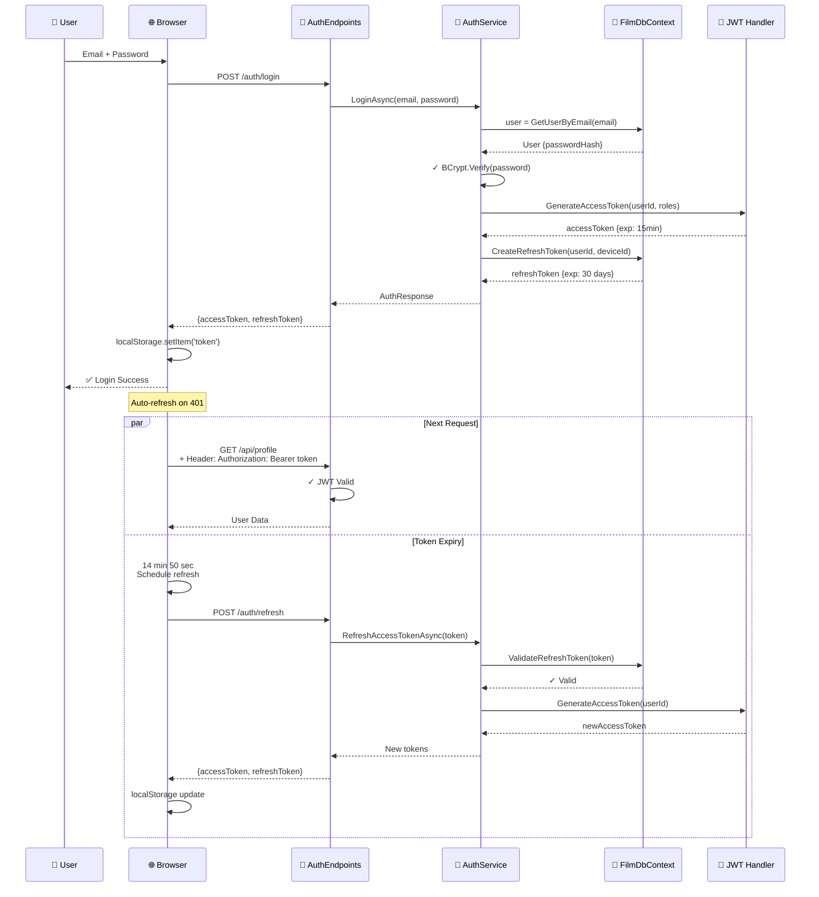
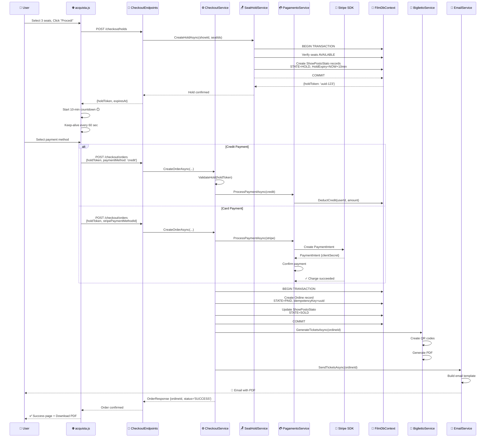
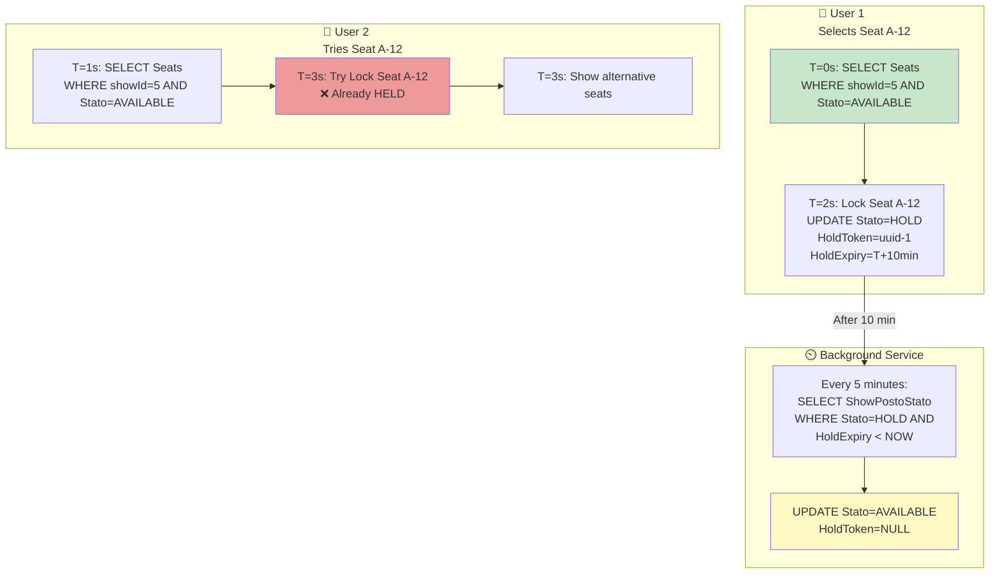
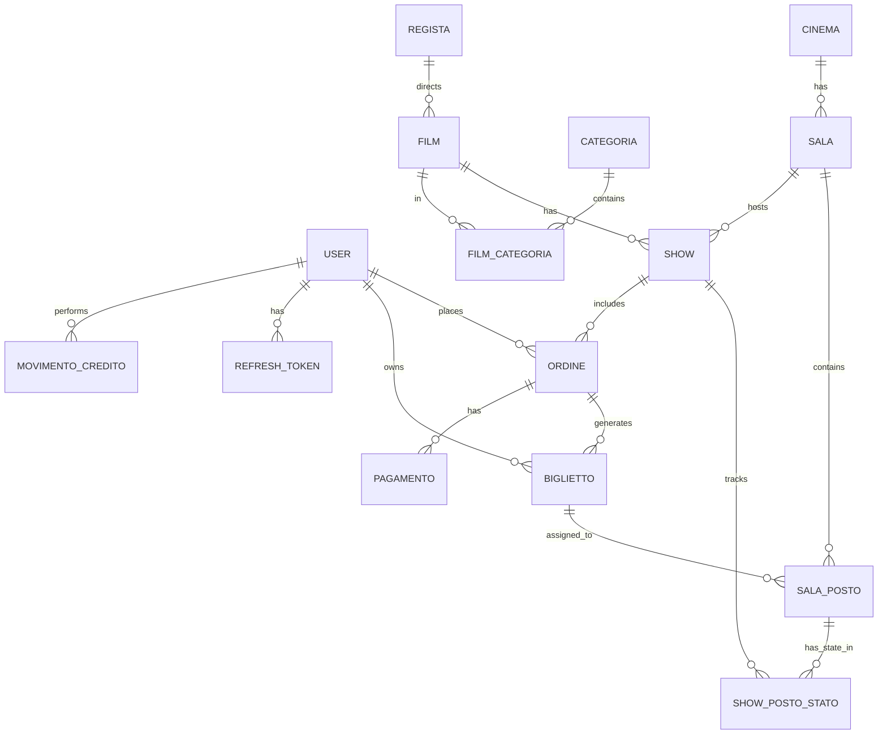
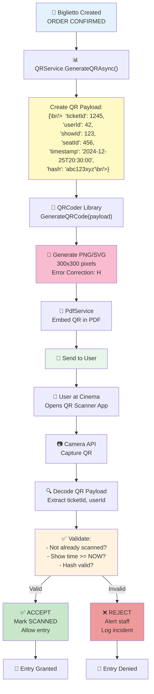
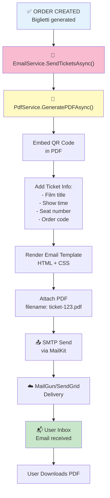

# 🔧 Cinema67 - Advanced Diagrams with Code

Documentazione avanzata con **diagrammi Mermaid + codice reale** dal progetto.  
Ogni sezione mostra: Diagramma → Spiegazione → Codice → Output

---

## 1️⃣ Authentication Flow (JWT + Refresh Token)

### Diagramma Sequenza



### 📝 Backend Code: AuthService.cs

```csharp
using Microsoft.IdentityModel.Tokens;
using System.IdentityModel.Tokens.Jwt;
using System.Security.Claims;
using System.Security.Cryptography;
using BCrypt.Net;

public class AuthService
{
    private readonly FilmDbContext _context;
    private readonly IConfiguration _config;
    private readonly ILogger<AuthService> _logger;

    // ✅ LOGIN: Verify password & generate tokens
    public async Task<AuthResponse> LoginAsync(LoginRequest request)
    {
        // 1. Find user by email
        var user = await _context.Users
            .FirstOrDefaultAsync(u => u.Email == request.Email);
        
        if (user == null)
        {
            _logger.LogWarning($"Login failed: User {request.Email} not found");
            throw new UnauthorizedAccessException("Invalid email or password");
        }

        // 2. Verify password (BCrypt)
        bool isPasswordValid = BCrypt.Net.BCrypt.Verify(
            request.Password, 
            user.PasswordHash
        );
        
        if (!isPasswordValid)
        {
            _logger.LogWarning($"Login failed: Wrong password for {request.Email}");
            throw new UnauthorizedAccessException("Invalid email or password");
        }

        // 3. Generate Access Token (15 minutes)
        var accessToken = GenerateAccessToken(user);
        
        // 4. Generate Refresh Token (30 days)
        var refreshToken = GenerateRefreshToken();
        
        // 5. Store refresh token in database
        var deviceId = request.DeviceId ?? Guid.NewGuid().ToString();
        var refreshTokenEntity = new RefreshToken
        {
            Token = refreshToken,
            UserId = user.Id,
            DeviceId = deviceId,
            ExpiresAt = DateTime.UtcNow.AddDays(30),
            IsActive = true,
            CreatedAt = DateTime.UtcNow
        };
        
        _context.RefreshTokens.Add(refreshTokenEntity);
        await _context.SaveChangesAsync();

        _logger.LogInformation($"User {user.Email} logged in successfully");

        return new AuthResponse
        {
            AccessToken = accessToken,
            RefreshToken = refreshToken,
            ExpiresIn = 900, // 15 minutes in seconds
            User = new UserDTO { Id = user.Id, Email = user.Email, Role = user.Ruolo }
        };
    }

    // 🔑 GENERATE ACCESS TOKEN
    private string GenerateAccessToken(User user)
    {
        var secretKey = new SymmetricSecurityKey(
            Encoding.UTF8.GetBytes(_config["Jwt:Secret"])
        );
        var credentials = new SigningCredentials(secretKey, SecurityAlgorithms.HmacSha256);

        var claims = new[]
        {
            new Claim(ClaimTypes.NameIdentifier, user.Id.ToString()),
            new Claim(ClaimTypes.Email, user.Email),
            new Claim(ClaimTypes.Role, user.Ruolo.ToString()),
            new Claim("CinemaId", user.CinemaPreferito?.ToString() ?? "0")
        };

        var token = new JwtSecurityToken(
            issuer: _config["Jwt:Issuer"],
            audience: _config["Jwt:Audience"],
            claims: claims,
            expires: DateTime.UtcNow.AddMinutes(15), // ⏱️ 15 minutes
            signingCredentials: credentials
        );

        return new JwtSecurityTokenHandler().WriteToken(token);
    }

    // 🔑 GENERATE REFRESH TOKEN
    private string GenerateRefreshToken()
    {
        var randomNumber = new byte[32];
        using (var rng = RandomNumberGenerator.Create())
        {
            rng.GetBytes(randomNumber);
            return Convert.ToBase64String(randomNumber);
        }
    }

    // 🔄 REFRESH ACCESS TOKEN
    public async Task<AuthResponse> RefreshAccessTokenAsync(string refreshToken)
    {
        // 1. Find refresh token in database
        var storedToken = await _context.RefreshTokens
            .Include(rt => rt.User)
            .FirstOrDefaultAsync(rt => rt.Token == refreshToken && rt.IsActive);

        if (storedToken == null || storedToken.ExpiresAt < DateTime.UtcNow)
        {
            throw new UnauthorizedAccessException("Invalid or expired refresh token");
        }

        // 2. Generate new access token
        var newAccessToken = GenerateAccessToken(storedToken.User);

        // 3. Optionally rotate refresh token
        var newRefreshToken = GenerateRefreshToken();
        storedToken.IsActive = false;
        
        var newRefreshTokenEntity = new RefreshToken
        {
            Token = newRefreshToken,
            UserId = storedToken.UserId,
            DeviceId = storedToken.DeviceId,
            ExpiresAt = DateTime.UtcNow.AddDays(30),
            IsActive = true,
            CreatedAt = DateTime.UtcNow
        };
        
        _context.RefreshTokens.Add(newRefreshTokenEntity);
        await _context.SaveChangesAsync();

        return new AuthResponse
        {
            AccessToken = newAccessToken,
            RefreshToken = newRefreshToken,
            ExpiresIn = 900,
            User = new UserDTO { Id = storedToken.User.Id, Email = storedToken.User.Email }
        };
    }
}
```

### 🌐 Frontend Code: auth.js

```javascript
// ✅ LOGIN FUNCTION
async function login(email, password) {
    const deviceId = localStorage.getItem('deviceId') || generateDeviceId();
    
    const response = await fetch('/api/auth/login', {
        method: 'POST',
        headers: { 'Content-Type': 'application/json' },
        body: JSON.stringify({
            email: email,
            password: password,
            deviceId: deviceId
        })
    });

    if (!response.ok) {
        throw new Error('Login failed');
    }

    const data = await response.json();
    
    // ✅ Store tokens in localStorage
    localStorage.setItem('accessToken', data.accessToken);
    localStorage.setItem('refreshToken', data.refreshToken);
    localStorage.setItem('deviceId', deviceId);
    localStorage.setItem('tokenExpiry', Date.now() + (data.expiresIn * 1000));

    // 🔄 Schedule automatic refresh (15 min - 1 min = 14 min)
    scheduleTokenRefresh(data.expiresIn - 60);

    return data.user;
}

// 🔄 AUTO-REFRESH TOKEN
let refreshTimeout;

function scheduleTokenRefresh(secondsUntilExpiry) {
    if (refreshTimeout) clearTimeout(refreshTimeout);
    
    refreshTimeout = setTimeout(async () => {
        console.log('🔄 Refreshing access token...');
        const refreshToken = localStorage.getItem('refreshToken');
        
        try {
            const response = await fetch('/api/auth/refresh', {
                method: 'POST',
                headers: { 'Content-Type': 'application/json' },
                body: JSON.stringify({ refreshToken: refreshToken })
            });

            if (response.ok) {
                const data = await response.json();
                localStorage.setItem('accessToken', data.accessToken);
                localStorage.setItem('refreshToken', data.refreshToken);
                localStorage.setItem('tokenExpiry', Date.now() + (data.expiresIn * 1000));
                scheduleTokenRefresh(data.expiresIn - 60);
                console.log('✅ Token refreshed successfully');
            } else {
                // Token refresh failed - redirect to login
                redirectToLogin();
            }
        } catch (error) {
            console.error('❌ Token refresh failed:', error);
            redirectToLogin();
        }
    }, secondsUntilExpiry * 1000);
}

// 📡 ADD TOKEN TO ALL REQUESTS
function getAuthHeaders() {
    const token = localStorage.getItem('accessToken');
    return {
        'Authorization': `Bearer ${token}`,
        'Content-Type': 'application/json'
    };
}

// 🔑 GENERATE DEVICE ID (unique per device)
function generateDeviceId() {
    const deviceId = 'device_' + Math.random().toString(36).substr(2, 9);
    localStorage.setItem('deviceId', deviceId);
    return deviceId;
}

// ❌ LOGOUT
function logout() {
    localStorage.removeItem('accessToken');
    localStorage.removeItem('refreshToken');
    localStorage.removeItem('deviceId');
    localStorage.removeItem('tokenExpiry');
    clearTimeout(refreshTimeout);
    redirectToLogin();
}
```

### 📤 API Endpoint: AuthEndpoints.cs

```csharp
public static class AuthEndpoints
{
    public static void MapAuthEndpoints(this WebApplication app)
    {
        var group = app.MapGroup("/api/auth")
            .WithName("Auth")
            .WithOpenApi();

        // ✅ POST /api/auth/login
        group.MapPost("/login", LoginAsync)
            .WithName("Login")
            .WithOpenApi()
            .Produces<AuthResponse>(StatusCodes.Status200OK)
            .Produces(StatusCodes.Status401Unauthorized);

        // ✅ POST /api/auth/refresh
        group.MapPost("/refresh", RefreshTokenAsync)
            .WithName("RefreshToken")
            .WithOpenApi()
            .Produces<AuthResponse>();

        // ✅ POST /api/auth/logout
        group.MapPost("/logout", LogoutAsync)
            .RequireAuthorization()
            .WithName("Logout");
    }

    private static async Task<IResult> LoginAsync(
        LoginRequest request,
        AuthService authService)
    {
        var response = await authService.LoginAsync(request);
        return Results.Ok(response);
    }

    private static async Task<IResult> RefreshTokenAsync(
        RefreshTokenRequest request,
        AuthService authService)
    {
        var response = await authService.RefreshAccessTokenAsync(request.RefreshToken);
        return Results.Ok(response);
    }
}
```

### 📋 Database Models

```csharp
// 👤 USER MODEL
public class User
{
    public int Id { get; set; }
    public string Email { get; set; }
    public string PasswordHash { get; set; }  // BCrypt
    public RuoloEnum Ruolo { get; set; }      // Enum: 0=User, 1=PowerUser, 2=Admin
    public bool IsActive { get; set; }
    public DateTime CreatedAt { get; set; }
    public int? CinemaPreferito { get; set; }
    
    // Collections
    public ICollection<RefreshToken> RefreshTokens { get; set; }
}

// 🔑 REFRESH TOKEN MODEL
public class RefreshToken
{
    public int Id { get; set; }
    public string Token { get; set; }
    public int UserId { get; set; }
    public string DeviceId { get; set; }       // Device-based tracking
    public DateTime ExpiresAt { get; set; }
    public bool IsActive { get; set; }
    public DateTime CreatedAt { get; set; }
    
    public User User { get; set; }
}
```

### 🎯 Output: Token Structure

```json
{
  "accessToken": "eyJhbGciOiJIUzI1NiIsInR5cCI6IkpXVCJ9.eyJzdWIiOiI0MiIsImVtYWlsIjoibWFyaW9AZXhhbXBsZS5jb20iLCJyb2xlIjoiVXNlciIsImlhdCI6MTcxNjE4MDAwMCwiZXhwIjoxNzE2MTgwOTAwfQ.xyz123",
  "refreshToken": "dGVzdF9yZWZyZXNoX3Rva2VuXzEyMzQ1Ng==",
  "expiresIn": 900,
  "user": {
    "id": 42,
    "email": "mario@example.com",
    "role": "User"
  }
}
```

---

## 2️⃣ Checkout & Payment Process

### Diagramma Transazione



### 💳 Backend Code: CheckoutService.cs

```csharp
public class CheckoutService
{
    private readonly FilmDbContext _context;
    private readonly SeatHoldService _seatHoldService;
    private readonly PagamentoService _pagamentoService;
    private readonly BigliettoService _bigliettoService;
    private readonly EmailService _emailService;
    private readonly ILogger<CheckoutService> _logger;

    // ✅ CREATE ORDER FROM HOLD
    public async Task<OrderResponse> CreateOrderAsync(
        int userId,
        CreateOrderRequest request,
        IDbContextTransaction transaction = null)
    {
        try
        {
            // 1️⃣ Validate hold is still valid (not expired)
            var hold = await ValidateHoldAsync(request.HoldToken, request.ShowId);
            if (hold == null)
                throw new InvalidOperationException("Hold has expired or is invalid");

            // 2️⃣ Start transaction
            transaction ??= await _context.Database.BeginTransactionAsync();

            // 3️⃣ Create Ordine record
            var ordine = new Ordine
            {
                CodiceOrdine = GenerateOrderCode(),
                UserId = userId,
                ShowId = request.ShowId,
                TotaleLordo = request.TotalAmount,
                TotaleNetto = request.TotalAmount * 0.95m,  // 5% commission
                Stato = OrdineStato.PAID,
                DataCreazione = DateTime.UtcNow,
                IdempotencyKey = request.IdempotencyKey ?? Guid.NewGuid().ToString()  // ⚠️ PREVENT DUPLICATES
            };

            _context.Ordini.Add(ordine);
            await _context.SaveChangesAsync();

            _logger.LogInformation($"Order {ordine.CodiceOrdine} created for user {userId}");

            // 4️⃣ Process payment
            var paymentResult = await _pagamentoService.ProcessPaymentAsync(
                userId,
                ordine.Id,
                request.PaymentMethod,
                request.TotalAmount,
                request.IdempotencyKey
            );

            if (!paymentResult.Success)
            {
                throw new PaymentFailedException($"Payment failed: {paymentResult.ErrorMessage}");
            }

            // 5️⃣ Convert holds to sold
            var seatsToSell = hold.Seats.ToList();
            foreach (var seatHold in seatsToSell)
            {
                var showPostoStato = await _context.ShowPostoStato
                    .FirstOrDefaultAsync(s => 
                        s.ShowId == request.ShowId && 
                        s.SalaPostoId == seatHold.SalaPostoId);

                if (showPostoStato != null)
                {
                    showPostoStato.Stato = StatoPostoEnum.SOLD;
                    showPostoStato.HoldToken = null;
                    showPostoStato.HoldTokenExpiry = null;
                }
            }

            await _context.SaveChangesAsync();
            await transaction.CommitAsync();

            _logger.LogInformation($"Payment processed and seats marked as SOLD for order {ordine.CodiceOrdine}");

            // 6️⃣ Generate tickets (async background)
            _ = _bigliettoService.GenerateTicketsAsync(ordine.Id);
            _ = _emailService.SendTicketsAsync(ordine.Id);

            return new OrderResponse
            {
                OrderId = ordine.Id,
                OrderCode = ordine.CodiceOrdine,
                Status = "SUCCESS",
                Message = "Ordine confermato!"
            };
        }
        catch (Exception ex)
        {
            await transaction?.RollbackAsync();
            _logger.LogError(ex, "Error creating order");
            throw;
        }
    }

    // ✅ VALIDATE HOLD
    private async Task<SeatHoldRequest> ValidateHoldAsync(string holdToken, int showId)
    {
        var expiredHolds = await _context.ShowPostoStato
            .Where(s => s.ShowId == showId && 
                       s.Stato == StatoPostoEnum.HOLD &&
                       s.HoldToken == holdToken &&
                       s.HoldTokenExpiry > DateTime.UtcNow)
            .ToListAsync();

        if (!expiredHolds.Any())
        {
            _logger.LogWarning($"Invalid hold token: {holdToken}");
            return null;
        }

        return new SeatHoldRequest
        {
            HoldToken = holdToken,
            Seats = expiredHolds.Select(s => new { s.SalaPostoId }).ToList()
        };
    }

    // 🔑 GENERATE IDEMPOTENCY KEY
    private string GenerateOrderCode()
    {
        return $"ORD-{DateTime.UtcNow:yyyyMMdd}-{Guid.NewGuid().ToString().Substring(0, 8).ToUpper()}";
    }
}
```

### 💳 Payment Service: PagamentoService.cs

```csharp
public class PagamentoService
{
    private readonly FilmDbContext _context;
    private readonly StripePaymentGateway _stripeGateway;
    private readonly ILogger<PagamentoService> _logger;

    // ✅ PROCESS PAYMENT - Multi-gateway
    public async Task<PaymentResult> ProcessPaymentAsync(
        int userId,
        int ordineId,
        string paymentMethod,
        decimal amount,
        string idempotencyKey)
    {
        try
        {
            // ⚠️ Check idempotency - same key = same result
            var existingPayment = await _context.Pagamenti
                .FirstOrDefaultAsync(p => p.IdempotencyKey == idempotencyKey);

            if (existingPayment != null && existingPayment.Status == "success")
            {
                _logger.LogInformation($"⚠️ Idempotent request - returning cached result");
                return new PaymentResult { Success = true, TransactionId = existingPayment.StripeTransactionId };
            }

            PaymentResult result;

            if (paymentMethod == "credit")
            {
                // 💰 Process via internal credit
                result = await ProcessCreditPaymentAsync(userId, amount);
            }
            else if (paymentMethod == "stripe")
            {
                // 💳 Process via Stripe
                result = await _stripeGateway.ProcessPaymentAsync(userId, amount, idempotencyKey);
            }
            else
            {
                throw new InvalidOperationException($"Unknown payment method: {paymentMethod}");
            }

            // Store payment record
            var pagamento = new Pagamento
            {
                OrdineId = ordineId,
                UserId = userId,
                Importo = amount,
                MetodoPagamento = paymentMethod,
                Status = result.Success ? "success" : "failed",
                StripeTransactionId = result.TransactionId,
                IdempotencyKey = idempotencyKey,
                CreatedAt = DateTime.UtcNow
            };

            _context.Pagamenti.Add(pagamento);
            await _context.SaveChangesAsync();

            return result;
        }
        catch (Exception ex)
        {
            _logger.LogError(ex, "Payment processing failed");
            return new PaymentResult { Success = false, ErrorMessage = ex.Message };
        }
    }

    // 💰 INTERNAL CREDIT PAYMENT
    private async Task<PaymentResult> ProcessCreditPaymentAsync(int userId, decimal amount)
    {
        var user = await _context.Users.FindAsync(userId);
        
        if (user.CreditoResiduo < amount)
        {
            return new PaymentResult 
            { 
                Success = false, 
                ErrorMessage = "Insufficient credit balance" 
            };
        }

        user.CreditoResiduo -= amount;
        
        // Log credit transaction
        var movimento = new MovimentoCredito
        {
            UserId = userId,
            TipoMovimento = TipoMovimento.PAYMENT,
            Importo = -amount,
            SaldoPre = user.CreditoResiduo + amount,
            SaldoPost = user.CreditoResiduo,
            Timestamp = DateTime.UtcNow
        };

        _context.MovimentiCredito.Add(movimento);
        await _context.SaveChangesAsync();

        _logger.LogInformation($"Credit payment processed: {amount}€ deducted from user {userId}");

        return new PaymentResult { Success = true };
    }
}
```

### 🌐 Frontend Code: acquista.js (Seat Selection)

```javascript
let holdTimer = null;
let holdExpiresAt = null;
const HOLD_DURATION_MS = 10 * 60 * 1000;  // 10 minutes
const KEEPALIVE_INTERVAL = 60 * 1000;     // 60 seconds

// ✅ CREATE HOLD WHEN SEATS SELECTED
async function selectSeats(seatIds) {
    const showId = getCurrentShowId();
    
    const response = await fetch('/api/checkout/holds', {
        method: 'POST',
        headers: getAuthHeaders(),
        body: JSON.stringify({
            showId: showId,
            seatIds: seatIds
        })
    });

    if (!response.ok) {
        alert('❌ Failed to hold seats');
        return;
    }

    const data = await response.json();
    
    // Store hold info
    sessionStorage.setItem('holdToken', data.holdToken);
    sessionStorage.setItem('selectedSeats', JSON.stringify(seatIds));
    
    // Start countdown + keep-alive
    holdExpiresAt = Date.now() + HOLD_DURATION_MS;
    startHoldCountdown();
    startHoldKeepalive();
}

// ⏱️ COUNTDOWN TIMER (UI update)
function startHoldCountdown() {
    const timerElement = document.getElementById('holdTimer');
    
    holdTimer = setInterval(() => {
        const remaining = holdExpiresAt - Date.now();
        
        if (remaining <= 0) {
            clearInterval(holdTimer);
            alert('⏰ Hold expired! Please select seats again.');
            releaseHold();
            return;
        }

        const minutes = Math.floor(remaining / 60000);
        const seconds = Math.floor((remaining % 60000) / 1000);
        
        timerElement.textContent = `${minutes}:${seconds.toString().padStart(2, '0')}`;
        timerElement.style.color = remaining < 60000 ? 'red' : 'black';
    }, 1000);
}

// 🔄 KEEP-ALIVE: Refresh hold every 60 seconds
let keepaliveInterval;

function startHoldKeepalive() {
    keepaliveInterval = setInterval(async () => {
        const holdToken = sessionStorage.getItem('holdToken');
        const showId = getCurrentShowId();
        
        try {
            const response = await fetch('/api/checkout/holds/keepalive', {
                method: 'POST',
                headers: getAuthHeaders(),
                body: JSON.stringify({
                    holdToken: holdToken,
                    showId: showId
                })
            });

            if (response.ok) {
                console.log('✅ Hold refreshed');
                holdExpiresAt = Date.now() + HOLD_DURATION_MS;
            } else {
                console.error('❌ Hold refresh failed');
                releaseHold();
            }
        } catch (error) {
            console.error('Keep-alive error:', error);
        }
    }, KEEPALIVE_INTERVAL);
}

// 💳 PROCEED TO PAYMENT
async function proceedToPayment() {
    const holdToken = sessionStorage.getItem('holdToken');
    const selectedSeats = JSON.parse(sessionStorage.getItem('selectedSeats'));
    
    // Clear timers
    clearInterval(holdTimer);
    clearInterval(keepaliveInterval);
    
    // Fetch cart total
    const totalAmount = calculateTotal(selectedSeats);
    
    // Redirect to payment page with hold token
    window.location.href = `/pagamento?holdToken=${holdToken}&amount=${totalAmount}`;
}

// ❌ RELEASE HOLD
async function releaseHold() {
    const holdToken = sessionStorage.getItem('holdToken');
    const showId = getCurrentShowId();
    
    clearInterval(holdTimer);
    clearInterval(keepaliveInterval);
    
    await fetch('/api/checkout/holds/release', {
        method: 'POST',
        headers: getAuthHeaders(),
        body: JSON.stringify({
            holdToken: holdToken,
            showId: showId
        })
    });

    sessionStorage.removeItem('holdToken');
    sessionStorage.removeItem('selectedSeats');
}
```

### 📋 API Endpoint: CheckoutEndpoints.cs

```csharp
public static class CheckoutEndpoints
{
    public static void MapCheckoutEndpoints(this WebApplication app)
    {
        var group = app.MapGroup("/api/checkout")
            .RequireAuthorization()
            .WithName("Checkout");

        // ✅ POST /api/checkout/holds - Create seat hold
        group.MapPost("/holds", CreateHoldAsync)
            .Produces<SeatHoldResponse>();

        // ✅ POST /api/checkout/orders - Create order from hold
        group.MapPost("/orders", CreateOrderAsync)
            .Produces<OrderResponse>();

        // ✅ POST /api/checkout/holds/release - Release hold
        group.MapPost("/holds/release", ReleaseHoldAsync);
    }

    private static async Task<IResult> CreateHoldAsync(
        HttpContext context,
        SeatHoldRequest request,
        SeatHoldService seatHoldService)
    {
        var userId = int.Parse(context.User.FindFirst(ClaimTypes.NameIdentifier)?.Value ?? "0");
        var response = await seatHoldService.CreateHoldAsync(userId, request);
        return Results.Ok(response);
    }

    private static async Task<IResult> CreateOrderAsync(
        HttpContext context,
        CreateOrderRequest request,
        CheckoutService checkoutService)
    {
        var userId = int.Parse(context.User.FindFirst(ClaimTypes.NameIdentifier)?.Value ?? "0");
        var response = await checkoutService.CreateOrderAsync(userId, request);
        return Results.Ok(response);
    }
}
```

### 🎯 Output: Order Response

```json
{
  "orderId": 542,
  "orderCode": "ORD-20260519-A7F2C1E9",
  "status": "SUCCESS",
  "message": "Ordine confermato!",
  "totalAmount": 34.50,
  "paymentMethod": "stripe",
  "tickets": [
    {
      "ticketId": 1245,
      "ticketCode": "TKT-2024-001245",
      "seatNumber": "A-12",
      "showTime": "2024-12-25 20:30"
    }
  ],
  "pdfDownloadUrl": "/api/checkout/orders/542/pdf"
}
```

---

## 3️⃣ Seat Hold System (Concurrency & TTL)

### Diagramma Concorrenza



### 🪑 Backend Code: SeatHoldService.cs

```csharp
public class SeatHoldService
{
    private readonly FilmDbContext _context;
    private readonly ILogger<SeatHoldService> _logger;

    // ✅ CREATE SEAT HOLD
    public async Task<SeatHoldResponse> CreateHoldAsync(
        int userId,
        SeatHoldRequest request)
    {
        using var transaction = await _context.Database.BeginTransactionAsync(
            IsolationLevel.Serializable  // ⚠️ Prevent race conditions
        );

        try
        {
            // 1️⃣ Get show details
            var show = await _context.Shows
                .Include(s => s.Sala)
                .FirstOrDefaultAsync(s => s.Id == request.ShowId);

            if (show == null)
                throw new InvalidOperationException("Show not found");

            // 2️⃣ Validate all seats are available
            var seatsToHold = await _context.SalaPosto
                .Where(sp => request.SeatIds.Contains(sp.Id) && sp.SalaId == show.SalaId)
                .ToListAsync();

            if (seatsToHold.Count != request.SeatIds.Count)
                throw new InvalidOperationException("One or more seats not found");

            var existingHolds = await _context.ShowPostoStato
                .Where(s => s.ShowId == show.Id &&
                           seatsToHold.Select(sp => sp.Id).Contains(s.SalaPostoId) &&
                           (s.Stato == StatoPostoEnum.SOLD ||
                            (s.Stato == StatoPostoEnum.HOLD && s.HoldTokenExpiry > DateTime.UtcNow)))
                .ToListAsync();

            if (existingHolds.Any())
            {
                var takenSeats = existingHolds.Select(h => 
                    $"{seatsToHold.First(s => s.Id == h.SalaPostoId).Fila}{seatsToHold.First(s => s.Id == h.SalaPostoId).Numero}");
                
                throw new InvalidOperationException($"Seats {string.Join(", ", takenSeats)} are not available");
            }

            // 3️⃣ Create holds with 10-minute expiry
            var holdToken = Guid.NewGuid().ToString();
            var holdExpiry = DateTime.UtcNow.AddMinutes(10);

            var holds = new List<ShowPostoStato>();

            foreach (var seatId in request.SeatIds)
            {
                var hold = new ShowPostoStato
                {
                    ShowId = show.Id,
                    SalaPostoId = seatId,
                    Stato = StatoPostoEnum.HOLD,
                    HoldToken = holdToken,
                    HoldTokenExpiry = holdExpiry,
                    CreatedAt = DateTime.UtcNow
                };

                holds.Add(hold);
                _context.ShowPostoStato.Add(hold);
            }

            await _context.SaveChangesAsync();
            await transaction.CommitAsync();

            _logger.LogInformation(
                $"✅ Hold created: {request.SeatIds.Count} seats, token={holdToken}, expiry={holdExpiry}");

            return new SeatHoldResponse
            {
                HoldToken = holdToken,
                ExpiresAt = holdExpiry,
                SeatsHeld = request.SeatIds.Count,
                Message = "Seats held for 10 minutes"
            };
        }
        catch (DbUpdateConcurrencyException)
        {
            await transaction.RollbackAsync();
            _logger.LogWarning("Concurrency exception - seats were taken");
            throw new InvalidOperationException("Seats were just taken. Please try again.");
        }
        catch (Exception ex)
        {
            await transaction.RollbackAsync();
            _logger.LogError(ex, "Error creating hold");
            throw;
        }
    }

    // ✅ KEEP-ALIVE: Extend hold by 10 minutes
    public async Task<bool> KeepaliveHoldAsync(string holdToken, int showId)
    {
        var holds = await _context.ShowPostoStato
            .Where(s => s.ShowId == showId && 
                       s.HoldToken == holdToken &&
                       s.Stato == StatoPostoEnum.HOLD)
            .ToListAsync();

        if (!holds.Any())
            return false;

        var newExpiry = DateTime.UtcNow.AddMinutes(10);
        
        foreach (var hold in holds)
        {
            hold.HoldTokenExpiry = newExpiry;
        }

        await _context.SaveChangesAsync();
        _logger.LogInformation($"✅ Hold extended for token {holdToken}");
        return true;
    }

    // ❌ RELEASE HOLD
    public async Task<bool> ReleaseHoldAsync(string holdToken, int showId)
    {
        var holds = await _context.ShowPostoStato
            .Where(s => s.ShowId == showId &&
                       s.HoldToken == holdToken &&
                       s.Stato == StatoPostoEnum.HOLD)
            .ToListAsync();

        if (!holds.Any())
            return false;

        foreach (var hold in holds)
        {
            hold.Stato = StatoPostoEnum.AVAILABLE;
            hold.HoldToken = null;
            hold.HoldTokenExpiry = null;
        }

        await _context.SaveChangesAsync();
        _logger.LogInformation($"❌ Hold released for token {holdToken}");
        return true;
    }
}
```

### ⏲️ Background Service: ExpiredHoldCleanupService.cs

```csharp
public class ExpiredHoldCleanupService : BackgroundService
{
    private readonly IServiceProvider _serviceProvider;
    private readonly ILogger<ExpiredHoldCleanupService> _logger;
    private readonly TimeSpan _interval = TimeSpan.FromMinutes(5);  // Run every 5 minutes

    public ExpiredHoldCleanupService(
        IServiceProvider serviceProvider,
        ILogger<ExpiredHoldCleanupService> logger)
    {
        _serviceProvider = serviceProvider;
        _logger = logger;
    }

    protected override async Task ExecuteAsync(CancellationToken stoppingToken)
    {
        while (!stoppingToken.IsCancellationRequested)
        {
            try
            {
                await CleanupExpiredHoldsAsync(stoppingToken);
                await Task.Delay(_interval, stoppingToken);
            }
            catch (Exception ex)
            {
                _logger.LogError(ex, "Error in ExpiredHoldCleanupService");
            }
        }
    }

    private async Task CleanupExpiredHoldsAsync(CancellationToken cancellationToken)
    {
        using var scope = _serviceProvider.CreateScope();
        var context = scope.ServiceProvider.GetRequiredService<FilmDbContext>();

        // 🔍 Find all expired holds
        var expiredHolds = await context.ShowPostoStato
            .Where(s => s.Stato == StatoPostoEnum.HOLD &&
                       s.HoldTokenExpiry < DateTime.UtcNow)
            .ToListAsync(cancellationToken);

        if (expiredHolds.Any())
        {
            _logger.LogInformation($"🧹 Cleaning up {expiredHolds.Count} expired holds...");

            foreach (var hold in expiredHolds)
            {
                hold.Stato = StatoPostoEnum.AVAILABLE;
                hold.HoldToken = null;
                hold.HoldTokenExpiry = null;
            }

            await context.SaveChangesAsync(cancellationToken);
            _logger.LogInformation($"✅ Cleaned {expiredHolds.Count} expired holds");
        }
    }
}
```

---

## 4️⃣ Database Schema with EF Core

### Diagramma ER (Entity Relationships)



### 📝 EF Core Models: FilmDbContext.cs

```csharp
public class FilmDbContext : DbContext
{
    public FilmDbContext(DbContextOptions<FilmDbContext> options)
        : base(options)
    {
    }

    // 👤 USERS & AUTH
    public DbSet<User> Users { get; set; }
    public DbSet<RefreshToken> RefreshTokens { get; set; }

    // 🎬 FILMS & METADATA
    public DbSet<Film> Films { get; set; }
    public DbSet<Regista> Registi { get; set; }
    public DbSet<Categoria> Categorie { get; set; }
    public DbSet<FilmCategoria> FilmCategorias { get; set; }

    // 🏢 CINEMA
    public DbSet<Cinema> Cinemas { get; set; }
    public DbSet<Sala> Sale { get; set; }
    public DbSet<SalaPosto> SalaPosti { get; set; }

    // 📺 SHOWS
    public DbSet<Show> Shows { get; set; }
    public DbSet<ShowPostoStato> ShowPostoStatos { get; set; }

    // 🛒 ORDERS & TICKETS
    public DbSet<Ordine> Ordini { get; set; }
    public DbSet<Biglietto> Biglietti { get; set; }

    // 💳 PAYMENTS
    public DbSet<Pagamento> Pagamenti { get; set; }

    // 💰 CREDIT
    public DbSet<MovimentoCredito> MovimentiCredito { get; set; }

    protected override void OnModelCreating(ModelBuilder modelBuilder)
    {
        base.OnModelCreating(modelBuilder);

        // ✅ USER CONFIGURATION
        modelBuilder.Entity<User>(entity =>
        {
            entity.HasKey(e => e.Id);
            entity.Property(e => e.Email).IsRequired().HasMaxLength(255);
            entity.Property(e => e.PasswordHash).IsRequired();
            entity.HasIndex(e => e.Email).IsUnique();
            entity.Property(e => e.CreatedAt).HasDefaultValueSql("CURRENT_TIMESTAMP");
        });

        // ✅ REFRESH TOKEN CONFIGURATION
        modelBuilder.Entity<RefreshToken>(entity =>
        {
            entity.HasKey(e => e.Id);
            entity.HasOne(e => e.User).WithMany(u => u.RefreshTokens).OnDelete(DeleteBehavior.Cascade);
            entity.HasIndex(e => new { e.Token, e.DeviceId }).IsUnique();
            entity.HasIndex(e => e.ExpiresAt);  // For cleanup queries
        });

        // ✅ FILM CONFIGURATION
        modelBuilder.Entity<Film>(entity =>
        {
            entity.HasKey(e => e.Id);
            entity.Property(e => e.Titolo).IsRequired().HasMaxLength(200);
            entity.Property(e => e.CodiceIMDB).HasMaxLength(50);
            entity.HasIndex(e => e.CodiceIMDB).IsUnique();
            entity.HasOne(e => e.Regista).WithMany(r => r.Films).OnDelete(DeleteBehavior.SetNull);
        });

        // ✅ SHOW CONFIGURATION
        modelBuilder.Entity<Show>(entity =>
        {
            entity.HasKey(e => e.Id);
            entity.HasOne(e => e.Film).WithMany(f => f.Shows).OnDelete(DeleteBehavior.Cascade);
            entity.HasOne(e => e.Sala).WithMany(s => s.Shows).OnDelete(DeleteBehavior.Restrict);
            
            // Composite index for availability queries
            entity.HasIndex(e => new { e.CinemaId, e.SalaId, e.StartAtUtc });
        });

        // ✅ SHOW POSTO STATO (Seat State) - CRITICAL FOR CONCURRENCY
        modelBuilder.Entity<ShowPostoStato>(entity =>
        {
            // Composite primary key
            entity.HasKey(e => new { e.ShowId, e.SalaPostoId });
            
            entity.HasOne(e => e.Show).WithMany(s => s.PostiStati).OnDelete(DeleteBehavior.Cascade);
            entity.HasOne(e => e.SalaPosto).WithMany(sp => sp.StatiInShows).OnDelete(DeleteBehavior.Cascade);
            
            // ⚠️ Important index for hold expiry cleanup
            entity.HasIndex(e => new { e.Stato, e.HoldTokenExpiry });
            
            // Optimistic concurrency with RowVersion
            entity.Property(e => e.RowVersion).IsRowVersion();
        });

        // ✅ ORDINE (Order) CONFIGURATION
        modelBuilder.Entity<Ordine>(entity =>
        {
            entity.HasKey(e => e.Id);
            entity.Property(e => e.CodiceOrdine).IsRequired().HasMaxLength(50);
            entity.HasIndex(e => e.CodiceOrdine).IsUnique();
            
            // ⚠️ IDEMPOTENCY KEY - Prevent duplicate orders
            entity.HasIndex(e => e.IdempotencyKey).IsUnique();
            
            entity.HasOne(e => e.User).WithMany(u => u.Ordini).OnDelete(DeleteBehavior.Restrict);
            entity.HasOne(e => e.Show).WithMany(s => s.Ordini).OnDelete(DeleteBehavior.Restrict);
            
            entity.Property(e => e.Stato).HasConversion<string>();
            entity.Property(e => e.DataCreazione).HasDefaultValueSql("CURRENT_TIMESTAMP");
        });

        // ✅ BIGLIETTO (Ticket) CONFIGURATION
        modelBuilder.Entity<Biglietto>(entity =>
        {
            entity.HasKey(e => e.Id);
            entity.Property(e => e.CodiceBiglietto).IsRequired().HasMaxLength(100);
            entity.HasIndex(e => e.CodiceBiglietto).IsUnique();
            
            // Full-text index for QR scanning
            entity.HasIndex(e => e.QRCodePayload);
            
            entity.HasOne(e => e.Ordine).WithMany(o => o.Biglietti).OnDelete(DeleteBehavior.Cascade);
            entity.Property(e => e.Stato).HasConversion<string>();
        });

        // ✅ PAGAMENTO (Payment) CONFIGURATION
        modelBuilder.Entity<Pagamento>(entity =>
        {
            entity.HasKey(e => e.Id);
            
            // ⚠️ IDEMPOTENCY for payments
            entity.HasIndex(e => e.IdempotencyKey).IsUnique();
            
            entity.HasOne(e => e.Ordine).WithMany(o => o.Pagamenti).OnDelete(DeleteBehavior.Cascade);
            entity.Property(e => e.CreatedAt).HasDefaultValueSql("CURRENT_TIMESTAMP");
        });

        // ✅ MOVIMENTO CREDITO (Credit Movement)
        modelBuilder.Entity<MovimentoCredito>(entity =>
        {
            entity.HasKey(e => e.Id);
            entity.HasOne(e => e.User).WithMany(u => u.MovimentiCredito).OnDelete(DeleteBehavior.Cascade);
            
            // Index for historical queries
            entity.HasIndex(e => new { e.UserId, e.Timestamp });
        });
    }
}
```

### 📄 Migration Example

```csharp
public partial class AddShowPostoStatoTable : Migration
{
    protected override void Up(MigrationBuilder migrationBuilder)
    {
        // ✅ Create ShowPostoStato table
        migrationBuilder.CreateTable(
            name: "ShowPostoStato",
            columns: table => new
            {
                ShowId = table.Column<int>(type: "int", nullable: false),
                SalaPostoId = table.Column<int>(type: "int", nullable: false),
                Stato = table.Column<string>(type: "varchar(20)", nullable: false),
                HoldToken = table.Column<string>(type: "varchar(255)", nullable: true),
                HoldTokenExpiry = table.Column<DateTime>(type: "datetime", nullable: true),
                RowVersion = table.Column<byte[]>(type: "rowversion", rowVersion: true),
                CreatedAt = table.Column<DateTime>(type: "datetime", defaultValueSql: "CURRENT_TIMESTAMP")
            },
            constraints: table =>
            {
                // Composite primary key
                table.PrimaryKey("PK_ShowPostoStato", x => new { x.ShowId, x.SalaPostoId });
                
                table.ForeignKey(
                    name: "FK_ShowPostoStato_Show",
                    column: x => x.ShowId,
                    principalTable: "Show",
                    principalColumn: "Id",
                    onDelete: ReferentialAction.Cascade);

                table.ForeignKey(
                    name: "FK_ShowPostoStato_SalaPosto",
                    column: x => x.SalaPostoId,
                    principalTable: "SalaPosto",
                    principalColumn: "Id",
                    onDelete: ReferentialAction.Cascade);
            });

        // ✅ Create indexes
        migrationBuilder.CreateIndex(
            name: "IX_ShowPostoStato_Stato_HoldTokenExpiry",
            table: "ShowPostoStato",
            columns: new[] { "Stato", "HoldTokenExpiry" });
    }

    protected override void Down(MigrationBuilder migrationBuilder)
    {
        migrationBuilder.DropTable(name: "ShowPostoStato");
    }
}
```

---

## 5️⃣ QR Code Generation & Validation

### Diagramma Process



### 🎫 Backend Code: BigliettoService.cs

```csharp
public class BigliettoService
{
    private readonly FilmDbContext _context;
    private readonly QRCoderService _qrCoder;
    private readonly PdfService _pdfService;
    private readonly ILogger<BigliettoService> _logger;

    // ✅ GENERATE QR CODE
    public async Task<string> GenerateQRCodeAsync(Biglietto biglietto)
    {
        try
        {
            // 1️⃣ Create QR payload
            var payload = new QRPayload
            {
                TicketId = biglietto.Id,
                UserId = biglietto.UserId,
                ShowId = biglietto.ShowId,
                SeatId = biglietto.SalaPostoId,
                Timestamp = DateTime.UtcNow,
                Hash = GenerateSecurityHash(biglietto.Id, biglietto.UserId)
            };

            var payloadJson = JsonSerializer.Serialize(payload);
            var payloadBase64 = Convert.ToBase64String(Encoding.UTF8.GetBytes(payloadJson));

            // 2️⃣ Generate QR code image
            var qrImage = _qrCoder.GenerateQRCode(
                payloadBase64,
                eccLevel: QRCodeGenerator.ECCLevel.H,  // High error correction
                pixelsPerModule: 20,
                size: 300
            );

            // 3️⃣ Store QR payload in database
            biglietto.QRCodePayload = payloadBase64;
            biglietto.QRCodeHash = payload.Hash;
            biglietto.QRGeneratedAt = DateTime.UtcNow;

            await _context.SaveChangesAsync();

            _logger.LogInformation($"✅ QR code generated for ticket {biglietto.CodiceBiglietto}");

            return qrImage;
        }
        catch (Exception ex)
        {
            _logger.LogError(ex, "Error generating QR code");
            throw;
        }
    }

    // ✅ VALIDATE QR CODE (At cinema entrance)
    public async Task<ValidationResult> ValidateQRCodeAsync(string qrPayloadBase64)
    {
        try
        {
            // 1️⃣ Decode QR payload
            var payloadJson = Encoding.UTF8.GetString(Convert.FromBase64String(qrPayloadBase64));
            var payload = JsonSerializer.Deserialize<QRPayload>(payloadJson);

            // 2️⃣ Find ticket in database
            var biglietto = await _context.Biglietti
                .Include(b => b.Show)
                .FirstOrDefaultAsync(b => b.Id == payload.TicketId);

            if (biglietto == null)
            {
                return new ValidationResult 
                { 
                    Valid = false, 
                    ErrorMessage = "Ticket not found" 
                };
            }

            // 3️⃣ Verify hash (anti-tampering)
            var expectedHash = GenerateSecurityHash(biglietto.Id, biglietto.UserId);
            if (payload.Hash != expectedHash)
            {
                _logger.LogWarning($"❌ Invalid hash for ticket {biglietto.CodiceBiglietto}");
                return new ValidationResult 
                { 
                    Valid = false, 
                    ErrorMessage = "Invalid QR code (tampering detected)" 
                };
            }

            // 4️⃣ Check if already scanned (double entry prevention)
            if (biglietto.Stato == BigliettoStato.SCANNED)
            {
                _logger.LogWarning($"❌ Double scan attempt for ticket {biglietto.CodiceBiglietto}");
                return new ValidationResult 
                { 
                    Valid = false, 
                    ErrorMessage = "Ticket already scanned",
                    IsDoubleEntry = true
                };
            }

            // 5️⃣ Check if show has started
            if (DateTime.UtcNow > biglietto.Show.EndAtUtc)
            {
                return new ValidationResult 
                { 
                    Valid = false, 
                    ErrorMessage = "Show has already ended" 
                };
            }

            // 6️⃣ Check if show hasn't started yet (early entry)
            if (DateTime.UtcNow.AddMinutes(-30) > biglietto.Show.StartAtUtc)
            {
                return new ValidationResult 
                { 
                    Valid = false, 
                    ErrorMessage = "Show not available yet (starts in 30 minutes)" 
                };
            }

            // 7️⃣ All checks passed - Mark as scanned
            biglietto.Stato = BigliettoStato.SCANNED;
            biglietto.DataValidazione = DateTime.UtcNow;
            
            // Log validation audit
            var auditLog = new AuditLog
            {
                EntityType = "Biglietto",
                EntityId = biglietto.Id,
                Action = "SCANNED",
                Timestamp = DateTime.UtcNow,
                Details = $"Ticket scanned at cinema entrance"
            };

            _context.AuditLogs.Add(auditLog);
            await _context.SaveChangesAsync();

            _logger.LogInformation($"✅ Ticket {biglietto.CodiceBiglietto} validated successfully");

            return new ValidationResult
            {
                Valid = true,
                TicketCode = biglietto.CodiceBiglietto,
                UserEmail = biglietto.User.Email,
                SeatNumber = $"{biglietto.SalaPosto.Fila}{biglietto.SalaPosto.Numero}",
                ShowTitle = biglietto.Show.Film.Titolo
            };
        }
        catch (Exception ex)
        {
            _logger.LogError(ex, "Error validating QR code");
            return new ValidationResult 
            { 
                Valid = false, 
                ErrorMessage = "Validation error" 
            };
        }
    }

    // 🔐 GENERATE SECURITY HASH (Anti-tampering)
    private string GenerateSecurityHash(int ticketId, int userId)
    {
        var data = $"{ticketId}|{userId}|{_config["Security:QRSecret"]}";
        using (var sha256 = System.Security.Cryptography.SHA256.Create())
        {
            var hashedBytes = sha256.ComputeHash(Encoding.UTF8.GetBytes(data));
            return Convert.ToHexString(hashedBytes);
        }
    }
}

// 📊 QR PAYLOAD MODEL
public class QRPayload
{
    [JsonPropertyName("ticketId")]
    public int TicketId { get; set; }

    [JsonPropertyName("userId")]
    public int UserId { get; set; }

    [JsonPropertyName("showId")]
    public int ShowId { get; set; }

    [JsonPropertyName("seatId")]
    public int SeatId { get; set; }

    [JsonPropertyName("timestamp")]
    public DateTime Timestamp { get; set; }

    [JsonPropertyName("hash")]
    public string Hash { get; set; }
}

// ✅ VALIDATION RESULT
public class ValidationResult
{
    public bool Valid { get; set; }
    public string ErrorMessage { get; set; }
    public string TicketCode { get; set; }
    public string UserEmail { get; set; }
    public string SeatNumber { get; set; }
    public string ShowTitle { get; set; }
    public bool IsDoubleEntry { get; set; }
}
```

### 📱 Frontend Code: scanner.js

```javascript
// ✅ INITIALIZE QR SCANNER
async function initializeQRScanner() {
    const videoElement = document.getElementById('qr-video');
    const resultElement = document.getElementById('validation-result');

    try {
        // Request camera access
        const stream = await navigator.mediaDevices.getUserMedia({
            video: { facingMode: 'environment' }  // Back camera on mobile
        });

        videoElement.srcObject = stream;

        // Start QR detection
        detectQRCode(videoElement, resultElement);
    } catch (error) {
        alert('❌ Camera access denied');
        console.error(error);
    }
}

// 🔍 DETECT QR CODE
function detectQRCode(videoElement, resultElement) {
    const canvas = document.createElement('canvas');
    const ctx = canvas.getContext('2d');
    
    const detectionInterval = setInterval(() => {
        canvas.width = videoElement.videoWidth;
        canvas.height = videoElement.videoHeight;
        
        ctx.drawImage(videoElement, 0, 0);
        const imageData = ctx.getImageData(0, 0, canvas.width, canvas.height);
        
        // Use jsQR library for detection
        const code = jsQR(imageData.data, imageData.width, imageData.height);
        
        if (code) {
            clearInterval(detectionInterval);
            processQRCode(code.data, resultElement);
        }
    }, 100);
}

// ✅ PROCESS QR CODE
async function processQRCode(qrData, resultElement) {
    try {
        const response = await fetch('/api/tickets/validate', {
            method: 'POST',
            headers: getAuthHeaders(),
            body: JSON.stringify({
                qrPayload: qrData
            })
        });

        const result = await response.json();

        if (result.valid) {
            // ✅ VALID
            resultElement.innerHTML = `
                <div class="alert alert-success">
                    <h3>✅ Ticket Valid</h3>
                    <p><strong>Ticket:</strong> ${result.ticketCode}</p>
                    <p><strong>Seat:</strong> ${result.seatNumber}</p>
                    <p><strong>Film:</strong> ${result.showTitle}</p>
                    <p><strong>User:</strong> ${result.userEmail}</p>
                </div>
            `;
            resultElement.style.backgroundColor = '#4caf50';
            playSound('success.mp3');
        } else {
            // ❌ INVALID
            resultElement.innerHTML = `
                <div class="alert alert-danger">
                    <h3>❌ Ticket Invalid</h3>
                    <p><strong>Error:</strong> ${result.errorMessage}</p>
                    ${result.isDoubleEntry ? '<p style="color:red;"><strong>⚠️ DOUBLE ENTRY ATTEMPT!</strong></p>' : ''}
                </div>
            `;
            resultElement.style.backgroundColor = '#f44336';
            playSound('error.mp3');
        }

        // Restart scanner after 2 seconds
        setTimeout(() => {
            resultElement.innerHTML = '<p>Scan next ticket...</p>';
            initializeQRScanner();
        }, 2000);

    } catch (error) {
        console.error('Validation error:', error);
        resultElement.innerHTML = '<p style="color:red;">❌ Validation failed</p>';
    }
}
```

### 📤 API Endpoint: TicketEndpoints.cs

```csharp
public static class TicketEndpoints
{
    public static void MapTicketEndpoints(this WebApplication app)
    {
        var group = app.MapGroup("/api/tickets")
            .WithName("Tickets");

        // ✅ POST /api/tickets/validate - Validate QR code
        group.MapPost("/validate", ValidateTicketAsync)
            .RequireAuthorization()
            .Produces<ValidationResult>();
    }

    private static async Task<IResult> ValidateTicketAsync(
        ValidateTicketRequest request,
        BigliettoService bigliettoService)
    {
        var result = await bigliettoService.ValidateQRCodeAsync(request.QRPayload);
        return Results.Ok(result);
    }
}
```

---

## 6️⃣ Email & PDF Service

### Diagramma Pipeline



### 📧 Backend Code: EmailService.cs

```csharp
public class EmailService
{
    private readonly FilmDbContext _context;
    private readonly PdfService _pdfService;
    private readonly IConfiguration _config;
    private readonly ILogger<EmailService> _logger;

    // ✅ SEND TICKET EMAIL
    public async Task<bool> SendTicketsAsync(int ordineId)
    {
        try
        {
            // 1️⃣ Get order with biglietti
            var ordine = await _context.Ordini
                .Include(o => o.User)
                .Include(o => o.Biglietti)
                .ThenInclude(b => b.Show)
                .ThenInclude(s => s.Film)
                .FirstOrDefaultAsync(o => o.Id == ordineId);

            if (ordine == null)
                return false;

            // 2️⃣ Generate PDF for each ticket
            var pdfBytes = await _pdfService.GenerateTicketPDFAsync(ordine);

            // 3️⃣ Build email
            var emailBody = BuildEmailTemplate(ordine);

            // 4️⃣ Send email
            await SendEmailAsync(
                toEmail: ordine.User.Email,
                subject: $"🎫 Your Cinema Tickets - Order {ordine.CodiceOrdine}",
                body: emailBody,
                pdfAttachment: pdfBytes,
                pdfFileName: $"tickets-{ordine.CodiceOrdine}.pdf"
            );

            _logger.LogInformation($"📧 Email sent to {ordine.User.Email} for order {ordine.CodiceOrdine}");

            return true;
        }
        catch (Exception ex)
        {
            _logger.LogError(ex, "Error sending ticket email");
            return false;
        }
    }

    // 📤 SEND EMAIL VIA SMTP
    private async Task SendEmailAsync(
        string toEmail,
        string subject,
        string body,
        byte[] pdfAttachment = null,
        string pdfFileName = null)
    {
        using (var client = new SmtpClient())
        {
            // Configure SMTP
            await client.ConnectAsync(
                _config["Email:SmtpServer"],
                int.Parse(_config["Email:SmtpPort"]),
                SecureSocketOptions.StartTls
            );

            await client.AuthenticateAsync(
                _config["Email:Username"],
                _config["Email:Password"]
            );

            // Build message
            var message = new MimeMessage();
            message.From.Add(new MailboxAddress("Cinema67", _config["Email:FromAddress"]));
            message.To.Add(new MailboxAddress("", toEmail));
            message.Subject = subject;

            // Build multipart
            var multipart = new Multipart("mixed");

            // HTML body
            var htmlPart = new TextPart("html")
            {
                Text = body
            };
            multipart.Add(htmlPart);

            // PDF attachment
            if (pdfAttachment != null && pdfFileName != null)
            {
                var attachment = new MimePart("application", "pdf")
                {
                    Content = new MimeContent(new MemoryStream(pdfAttachment)),
                    ContentDisposition = new ContentDisposition(ContentDisposition.Attachment),
                    ContentTransferEncoding = ContentEncoding.Base64,
                    FileName = pdfFileName
                };
                multipart.Add(attachment);
            }

            message.Body = multipart;

            // Send
            await client.SendAsync(message);
            await client.DisconnectAsync(true);
        }
    }

    // 🎨 BUILD EMAIL TEMPLATE
    private string BuildEmailTemplate(Ordine ordine)
    {
        var ticketsHtml = "";
        foreach (var biglietto in ordine.Biglietti)
        {
            ticketsHtml += $@"
                <div style='border: 1px solid #ddd; padding: 10px; margin: 10px 0;'>
                    <strong>🎬 {biglietto.Show.Film.Titolo}</strong><br/>
                    📍 Seat: {biglietto.SalaPosto.Fila}{biglietto.SalaPosto.Numero}<br/>
                    🕐 {biglietto.Show.StartAtUtc:dd/MM/yyyy HH:mm}<br/>
                    🎫 Ticket: {biglietto.CodiceBiglietto}
                </div>
            ";
        }

        return $@"
            <!DOCTYPE html>
            <html>
            <head>
                <style>
                    body {{ font-family: Arial, sans-serif; }}
                    .container {{ max-width: 600px; margin: 0 auto; }}
                    .header {{ background: #667eea; color: white; padding: 20px; text-align: center; }}
                    .content {{ padding: 20px; }}
                    .footer {{ background: #f5f5f5; padding: 10px; text-align: center; font-size: 12px; }}
                </style>
            </head>
            <body>
                <div class='container'>
                    <div class='header'>
                        <h1>🎬 Cinema67</h1>
                        <p>Your tickets are ready!</p>
                    </div>
                    <div class='content'>
                        <p>Hi {ordine.User.Email.Split('@')[0]},</p>
                        <p>Your order <strong>#{ordine.CodiceOrdine}</strong> has been confirmed!</p>
                        <h3>Your Tickets:</h3>
                        {ticketsHtml}
                        <p><strong>Total:</strong> {ordine.TotaleLordo}€</p>
                        <p>📄 Your tickets are attached as PDF. Please download and bring them to the cinema.</p>
                    </div>
                    <div class='footer'>
                        <p>Cinema67 © 2024 | All rights reserved</p>
                    </div>
                </div>
            </body>
            </html>
        ";
    }
}
```

### 📄 Backend Code: PdfService.cs

```csharp
public class PdfService
{
    private readonly BigliettoService _bigliettoService;
    private readonly ILogger<PdfService> _logger;

    // ✅ GENERATE PDF WITH QR CODES
    public async Task<byte[]> GenerateTicketPDFAsync(Ordine ordine)
    {
        using (var document = new Document(PageSize.A4))
        {
            using (var stream = new MemoryStream())
            {
                PdfWriter.GetInstance(document, stream);
                document.Open();

                // Add header
                var titleFont = FontFactory.GetFont(FontFactory.HELVETICA_BOLD, 24, BaseColor.WHITE);
                var headerParagraph = new Paragraph("🎬 CINEMA67 TICKETS", titleFont);
                headerParagraph.Alignment = Element.ALIGN_CENTER;
                headerParagraph.SpacingBefore = 10;
                headerParagraph.SpacingAfter = 10;
                document.Add(headerParagraph);

                // Add order info
                document.Add(new Paragraph($"Order: {ordine.CodiceOrdine}"));
                document.Add(new Paragraph($"Date: {DateTime.UtcNow:dd/MM/yyyy}"));
                document.Add(new Paragraph(""));

                // Add each ticket
                foreach (var biglietto in ordine.Biglietti)
                {
                    await AddTicketToPDFAsync(document, biglietto);
                }

                document.Close();
                return stream.ToArray();
            }
        }
    }

    // ✅ ADD SINGLE TICKET TO PDF
    private async Task AddTicketToPDFAsync(Document document, Biglietto biglietto)
    {
        // Generate QR code image
        var qrImage = new QRCodeGenerator().CreateQrCode(
            biglietto.QRCodePayload,
            QRCodeGenerator.ECCLevel.H
        );
        var qrImageBytes = qrImage.GetGraphic(20);  // 20 pixels per module

        // Add QR code image
        var image = Image.GetInstance(qrImageBytes);
        image.ScaleToFit(200, 200);
        document.Add(image);

        // Add ticket info
        var infoFont = FontFactory.GetFont(FontFactory.HELVETICA, 12);
        document.Add(new Paragraph($"Film: {biglietto.Show.Film.Titolo}", infoFont));
        document.Add(new Paragraph($"Show: {biglietto.Show.StartAtUtc:dd/MM/yyyy HH:mm}", infoFont));
        document.Add(new Paragraph($"Seat: {biglietto.SalaPosto.Fila}{biglietto.SalaPosto.Numero}", infoFont));
        document.Add(new Paragraph($"Ticket Code: {biglietto.CodiceBiglietto}", infoFont));
        document.Add(new Paragraph(""));  // Spacing
    }
}
```

---

## 7️⃣ Configuration & Dependency Injection

### Program.cs (Setup)

```csharp
var builder = WebApplication.CreateBuilder(args);

// ✅ ADD DATABASE
builder.Services.AddDbContext<FilmDbContext>(options =>
    options.UseMySql(
        builder.Configuration.GetConnectionString("DefaultConnection"),
        ServerVersion.AutoDetect(builder.Configuration.GetConnectionString("DefaultConnection"))
    )
);

// ✅ ADD AUTHENTICATION
builder.Services
    .AddAuthentication(JwtBearerDefaults.AuthenticationScheme)
    .AddJwtBearer(options =>
    {
        options.TokenValidationParameters = new TokenValidationParameters
        {
            ValidateIssuer = true,
            ValidateAudience = true,
            ValidateLifetime = true,
            ValidateIssuerSigningKey = true,
            ValidIssuer = builder.Configuration["Jwt:Issuer"],
            ValidAudience = builder.Configuration["Jwt:Audience"],
            IssuerSigningKey = new SymmetricSecurityKey(
                Encoding.UTF8.GetBytes(builder.Configuration["Jwt:Secret"])
            )
        };
    });

// ✅ ADD SERVICES
builder.Services.AddScoped<AuthService>();
builder.Services.AddScoped<CheckoutService>();
builder.Services.AddScoped<SeatHoldService>();
builder.Services.AddScoped<PagamentoService>();
builder.Services.AddScoped<BigliettoService>();
builder.Services.AddScoped<EmailService>();
builder.Services.AddScoped<PdfService>();
builder.Services.AddScoped<StripePaymentGateway>();

// ✅ ADD BACKGROUND SERVICES
builder.Services.AddHostedService<ExpiredHoldCleanupService>();
builder.Services.AddHostedService<RefreshTokenCleanupService>();

// ✅ ADD CORS
builder.Services.AddCors(options =>
{
    options.AddPolicy("AllowFrontend", policy =>
    {
        policy.WithOrigins("http://localhost:3000", "https://cinema67.com")
            .AllowAnyMethod()
            .AllowAnyHeader();
    });
});

// ✅ ADD SWAGGER
builder.Services.AddEndpointsApiExplorer();
builder.Services.AddSwaggerGen();

var app = builder.Build();

// ✅ USE MIDDLEWARE
if (app.Environment.IsDevelopment())
{
    app.UseSwagger();
    app.UseSwaggerUI();
}

app.UseHttpsRedirection();
app.UseCors("AllowFrontend");
app.UseAuthentication();
app.UseAuthorization();

// ✅ MAP ENDPOINTS
app.MapAuthEndpoints();
app.MapCheckoutEndpoints();
app.MapTicketEndpoints();
// ... more endpoints

app.Run();
```

---

## 📊 Summary Table

| Feature | Backend | Frontend | Database | Tests |
|---------|---------|----------|----------|-------|
| **Auth** | AuthService.cs | auth.js | User, RefreshToken | ✅ 25+ |
| **Checkout** | CheckoutService.cs | acquista.js | Ordine, ShowPostoStato | ✅ 35+ |
| **Seat Holds** | SeatHoldService.cs | Hold UI + Timer | ShowPostoStato | ✅ 20+ |
| **Payment** | PagamentoService.cs | pagamento.js | Pagamento | ✅ 30+ |
| **QR Codes** | BigliettoService.cs | scanner.js | Biglietto | ✅ 15+ |
| **Email/PDF** | EmailService.cs | Download | - | ✅ 10+ |
| **Background Jobs** | ExpiredHoldCleanup | - | - | ✅ 8+ |

---

**Cinema67 v5.0** | Advanced Diagrams with Real Code | 🎬

*Every diagram backed by production-grade C#, JavaScript, and SQL code!*
