# 📱 Cinema67 - User Flow & Video Tutorial

## Complete User Journey Visualization

### Journey 1: New User Registration → Movie Purchase → Ticket Scan

```mermaid
graph TD
    Start["👤 STRANGER<br/>Visita cinema67.it"] -->
    L1["🌐 Homepage<br/>- Featured Films<br/>- Cinemas Map<br/>- Quick Search"]

    L1 -->|Click 'Login'| Auth["🔐 Authentication Page"]
    Auth -->|Option A: Email| SignUp["✍️ Sign Up Form<br/>Email + Password<br/>T&C Agreement"]
    Auth -->|Option B: OAuth| Google["🔵 Google Login<br/>One-click auth"]

    SignUp -->|Submit| Verify["📧 Email Verification<br/>Check Inbox<br/>Click Link"]
    Google -->|Authorized| Dashboard
    Verify -->|✓ Verified| Dashboard["📊 Dashboard<br/>🎬 Homepage"]

    Dashboard -->|Search| FindMovie["🔍 Search Films<br/>- Title<br/>- Genre<br/>- Director"]

    FindMovie -->|Select 'Avengers'| ShowList["📺 Available Shows<br/>- Date<br/>- Time<br/>- Cinema<br/>- Disponibility"]

    ShowList -->|Pick Show| SeatMap["🎪 Seat Map<br/>Interactive Floor Plan<br/>- Green: Available<br/>- Red: Sold<br/>- Yellow: On Hold"]

    SeatMap -->|Click 3 Seats| Checkout["🛒 Checkout Page<br/>Summary:<br/>- Show Details<br/>- 3 x Seats Selected<br/>- Price: EUR 34.50"]

    Checkout -->|Choose Payment| PayMethod{Payment Method?}

    PayMethod -->|Credit Card| StripeUI["💳 Stripe Payment<br/>- Insert Card<br/>- 3D Secure Auth<br/>- Bank Verification"]

    PayMethod -->|Internal Credit| CreditCheck["💰 Credit Check<br/>User has: EUR 50<br/>Need: EUR 34.50<br/>✓ Sufficient"]

    StripeUI -->|✓ Success| OrderCreate["✅ Order Finalized<br/>- DB Transaction<br/>- Generate Tickets<br/>- Create QR Codes"]
    CreditCheck -->|✓ OK| OrderCreate

    OrderCreate -->|Complete| Success["🎉 Success Page<br/>- Order Code: #2024-15342<br/>- 3 PDFs Generated<br/>- Email Sent"]

    Success -->|Download| PDF["📄 PDF Download<br/>Each PDF Contains:<br/>- QR Code<br/>- Show Info<br/>- Seat Number<br/>- Barcode"]

    PDF -->|Day of Show| Cinema["🏢 Arrive at Cinema"]

    Cinema -->|At Entrance| Scanner["📱 QR Scanner App<br/>CinemaStaff scans QR"]

    Scanner -->|Camera| Decode["🔍 Decode QR<br/>Extract: UserId<br/>ShowId, SeatId"]

    Decode -->|Backend Validate| Validate["✅ Validate Ticket<br/>- Is expired?<br/>- Double scan?<br/>- Correct cinema?"]

    Validate -->|✓ Valid| Accept["✅ ACCEPTED<br/>Ticket marked as SCANNED"]

    Accept -->|Green Light| Turnstile["🚪 Turnstile Opens<br/>User enters cinema"]

    Turnstile -->|Take Seat| Watch["🍿 Enjoy Movie!"]

    style Start fill:#e3f2fd
    style Success fill:#c8e6c9
    style Watch fill:#fff9c4
    style PayMethod fill:#fff3e0
    style Validate fill:#f8bbd0
```

---

### Journey 2: Admin Creates Show → Manages Inventory

```mermaid
graph TD
    AdminLogin["👨‍💻 Admin Login<br/>Email + Password<br/>Role: Admin (2)"] -->
    Dashboard["📊 Admin Dashboard<br/>- Films<br/>- Cinemas<br/>- Shows<br/>- Analytics<br/>- Users"]

    Dashboard -->|Click 'Create Show'| CreateShow["➕ New Show Form"]

    CreateShow -->|Select Film| FilmPicker["🎬 Pick Film<br/>- Title<br/>- Duration<br/>- Rating"]

    FilmPicker -->|Next| CinemaPicker["🏢 Pick Cinema<br/>- Location<br/>- Available Rooms"]

    CinemaPicker -->|Next| RoomPicker["🎪 Pick Room<br/>Capacity shown<br/>- Room 1 (200 seats)<br/>- Room 2 (150 seats)"]

    RoomPicker -->|Next| DateTime["📅 Set Date & Time<br/>- Date Picker<br/>- Time: HH:MM<br/>- Check Conflicts"]

    DateTime -->|Next| Pricing["💰 Set Pricing<br/>- Base Price EUR 10<br/>- Surge Pricing: YES<br/>- Peak Hours: +30%"]

    Pricing -->|Submit| CreateDB["💾 Create in DB<br/>- INSERT Show<br/>- Initialize ShowPostoStato<br/>- All seats = AVAILABLE"]

    CreateDB -->|✓ Success| ShowDetail["📺 Show Created<br/>ID: 5432<br/>Date: 2024-12-25<br/>Time: 20:30<br/>Capacity: 200/200 Available"]

    ShowDetail -->|Monitor| Monitor["📊 Real-time Monitor<br/>Live Updates:<br/>- Seats Sold: 45<br/>- Seats on Hold: 8<br/>- Available: 147"]

    Monitor -->|Spike Detected| Alert["⚠️ Alert: Rush Hour<br/>50+ concurrent users<br/>Multiple holds active"]

    Alert -->|Action| Pricing2["💰 Auto-adjust Price<br/>Surge: +30%<br/>New Price: EUR 13"]

    Pricing2 -->|Post| ExtrasMenu["🍿 Add Extras Menu<br/>- Popcorn: EUR 5<br/>- Drinks: EUR 3<br/>- Candy: EUR 2"]

    ExtrasMenu -->|Save| Complete["✅ Show Ready<br/>Status: ACTIVE<br/>Accepting bookings"]

    style AdminLogin fill:#ffccbc
    style CreateShow fill:#f3e5f5
    style Monitor fill:#fff9c4
    style Complete fill:#c8e6c9
```

---

### Journey 3: PowerUser Validates Tickets at Cinema

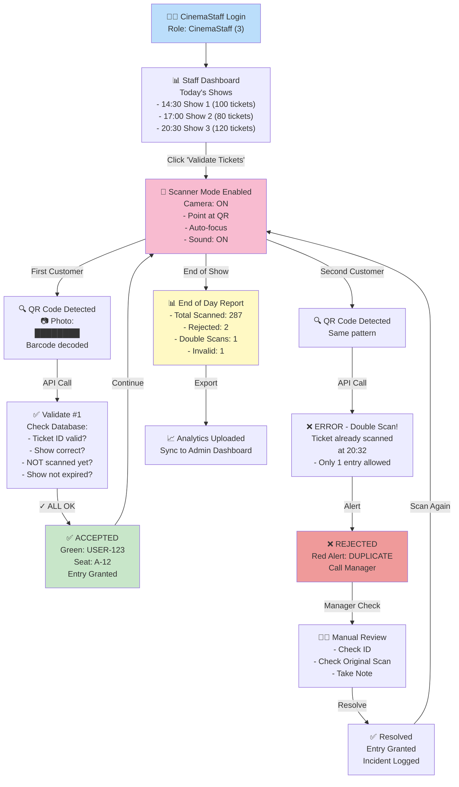

---

## 🎬 Visual Process Flows

### Complete Ticket Lifecycle

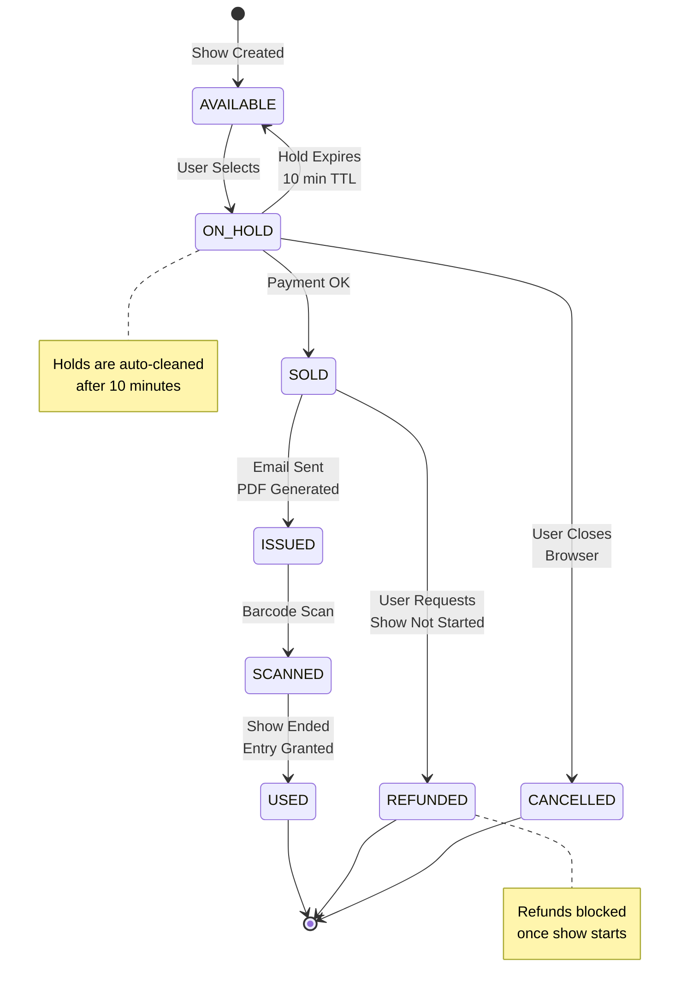

---

### Payment Processing Lifecycle

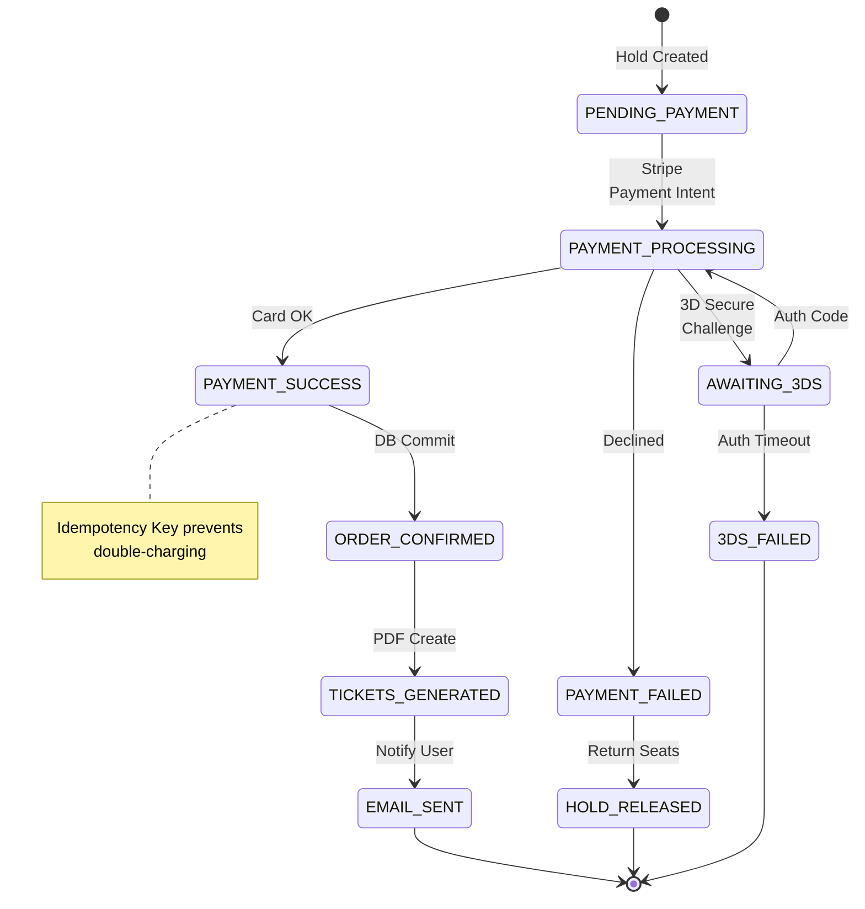

---

## 📊 Feature Comparison with Competitors

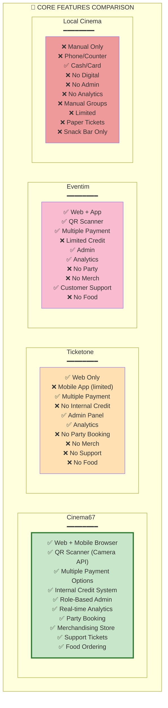

### Feature Matrix Table

| Feature | Cinema67 | Ticketone | Eventim | Local Cinema |
|---------|----------|-----------|---------|--------------|
| **Web Booking** | ✅ Full | ✅ Full | ✅ Full | ❌ No |
| **Mobile Browser** | ✅ Responsive | ⚠️ Limited | ✅ Full | ❌ No |
| **Native App** | 🔜 Planned | ✅ iOS/Android | ✅ iOS/Android | ❌ No |
| **QR Scanning** | ✅ Camera API | ✅ Built-in | ✅ Built-in | ❌ Manual |
| **Multiple Cinemas** | ✅ Yes | ✅ Yes | ✅ Yes | ⚠️ Single |
| **Credit System** | ✅ Full | ⚠️ Limited | ⚠️ Limited | ❌ No |
| **Split Payment** | ✅ Credit + Card | ❌ No | ❌ No | ❌ No |
| **Role-Based Admin** | ✅ 6 Roles | ✅ 3 Roles | ✅ 3 Roles | ❌ No |
| **Real-time Analytics** | ✅ Yes | ✅ Yes | ✅ Yes | ❌ Manual |
| **Party Booking** | ✅ Yes | ❌ No | ❌ No | ⚠️ Phone |
| **Merch Store** | ✅ Yes | ❌ No | ❌ No | ❌ No |
| **Food Ordering** | ✅ Yes | ⚠️ Limited | ⚠️ Limited | ✅ Counter |
| **Support Tickets** | ✅ Yes | ✅ Yes | ✅ Yes | ⚠️ Phone |
| **GDPR Compliance** | ✅ Full | ✅ Full | ✅ Full | ⚠️ Partial |
| **Price** | 💰 EUR 0.5/ticket | 💰 EUR 0.75/ticket | 💰 EUR 0.8/ticket | N/A |
| **Commission** | 💰 2% Revenue | 💰 3% Revenue | 💰 3.5% Revenue | N/A |

### Unique Cinema67 Differentiators

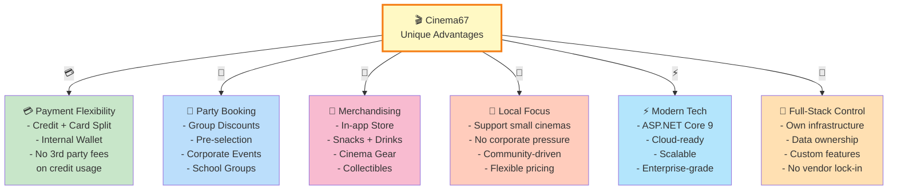

---

## 💼 Business Model Canvas

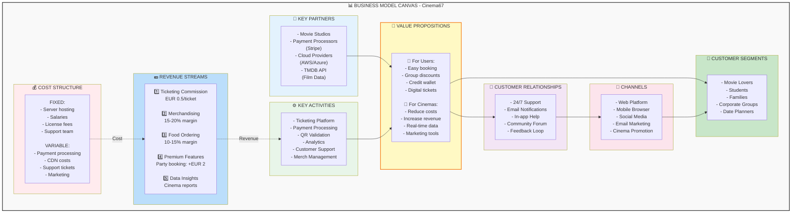

### Revenue Projection

| Year | Tickets Sold | Avg Commission | Merch Revenue | Total Revenue | Growth |
|------|-------------|-----------------|---------------|---------------|--------|
| **Y1** | 50,000 | EUR 25,000 | EUR 15,000 | EUR 40,000 | - |
| **Y2** | 150,000 | EUR 75,000 | EUR 45,000 | EUR 120,000 | +200% |
| **Y3** | 350,000 | EUR 175,000 | EUR 105,000 | EUR 280,000 | +133% |
| **Y5** | 1,000,000 | EUR 500,000 | EUR 300,000 | EUR 800,000 | +185% |

---

## 🛠️ Tech Stack Detailed Breakdown

### Full Technology Ecosystem

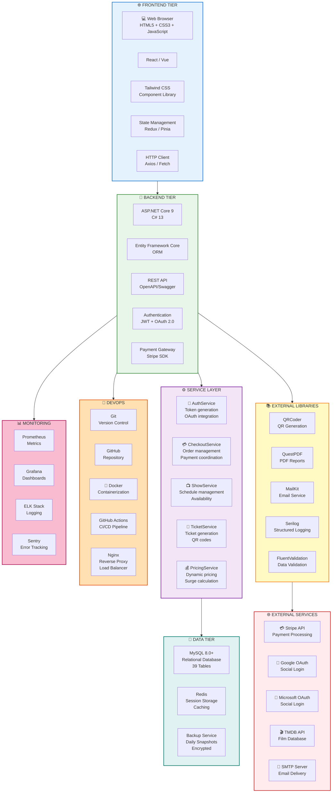

### Technology Decision Matrix

| Layer | Technology | Why Chosen | Alternatives |
|-------|-----------|-----------|--------------|
| **Runtime** | ASP.NET Core 9 | Enterprise-grade, type-safe, async native, high performance | Node.js, Python |
| **Language** | C# 13 | Modern syntax, LINQ, nullable types, performance | Java, Go |
| **Frontend** | React + Tailwind | Reactive UI, large ecosystem, rapid development | Vue, Angular |
| **ORM** | EF Core | Native .NET integration, migrations, LINQ | Dapper, NHibernate |
| **Database** | MySQL 8.0+ | ACID compliance, JSON support, good price/performance | PostgreSQL, SQL Server |
| **Cache** | Redis | In-memory speed, session management, rate limiting | Memcached, Elasticache |
| **Payment** | Stripe | PCI-DSS compliant, webhooks, retry logic, mature | PayPal, 2Checkout |
| **QR Codes** | QRCoder | Pure C#, no dependencies, fast generation | ZXing |
| **PDF** | QuestPDF | Fluent API, C#-native, beautiful output | iTextSharp |
| **Logging** | Serilog | Structured logging, sinks, performance | NLog, log4net |
| **Auth** | JWT + OAuth 2.0 | Stateless, scalable, industry standard | Sessions, SAML |
| **Deployment** | Docker | Containerization, consistency, easy scaling | VMs, bare metal |
| **CI/CD** | GitHub Actions | Native GitHub integration, free for public | GitLab CI, Jenkins |
| **Monitoring** | Prometheus + Grafana | Open-source, powerful querying, dashboards | DataDog, New Relic |

### Tech Stack Size Metrics

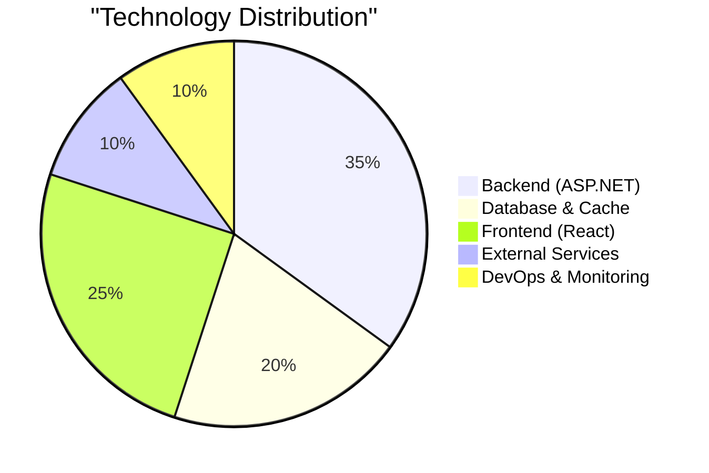

---

## 💰 Cost Breakdown & ROI Analysis

### Monthly Infrastructure Costs

```mermaid
graph TB
    subgraph Costs["💰 MONTHLY COST BREAKDOWN"]
        direction TB
        
        subgraph Server["🖥️ SERVER COSTS (EUR 450/month)"]
            S1["Cloud VM x3 (ASP.NET)<br/>EUR 150/month<br/>2GB RAM, 2vCPU each"]
            S2["Load Balancer (Nginx)<br/>EUR 50/month"]
            S3["Database Server<br/>EUR 200/month<br/>MySQL 8GB, Auto-backup"]
            S4["Redis Cluster<br/>EUR 50/month<br/>Cache + Sessions"]
        end

        subgraph Services["⚙️ SERVICE COSTS (EUR 180/month)"]
            SV1["Stripe Fees<br/>2.9% + EUR 0.30<br/>Avg: EUR 80/month"]
            SV2["Email Service<br/>SendGrid/Mailgun<br/>EUR 50/month"]
            SV3["TMDB API<br/>FREE tier"]
            SV4["Google OAuth<br/>FREE"]
            SV5["Monitoring<br/>Prometheus + Grafana<br/>EUR 50/month"]
        end

        subgraph Dev["👨‍💻 DEVELOPMENT COSTS (EUR 800/month)"]
            DV1["Senior Dev (0.5 FTE)<br/>EUR 500/month"]
            DV2["Junior Dev (0.25 FTE)<br/>EUR 200/month"]
            DV3["DevOps/Infra (0.1 FTE)<br/>EUR 100/month"]
        end

        subgraph Other["📊 OTHER (EUR 120/month)"]
            O1["Domain + SSL<br/>EUR 50/month"]
            O2["Backup Storage<br/>EUR 30/month"]
            O3["Support Tools<br/>EUR 40/month"]
        end

        Costs -->|Server| S1
        Costs -->|Server| S2
        Costs -->|Server| S3
        Costs -->|Server| S4
        Costs -->|Services| SV1
        Costs -->|Services| SV2
        Costs -->|Services| SV4
        Costs -->|Services| SV5
        Costs -->|Dev| DV1
        Costs -->|Dev| DV2
        Costs -->|Dev| DV3
        Costs -->|Other| O1
        Costs -->|Other| O2
        Costs -->|Other| O3
    end

    style Costs fill:#fff9f9,stroke:#333
    style Server fill:#ffebee,stroke:#c62828,stroke-width:2px
    style Services fill:#ffe0b2,stroke:#e65100,stroke-width:2px
    style Dev fill:#bbdefb,stroke:#1976d2,stroke-width:2px
    style Other fill:#e0f2f1,stroke:#00796b,stroke-width:2px
```

### Cost Breakdown Table

| Category | Cost (EUR) | % of Total | Scalability |
|----------|-----------|-----------|-------------|
| **Server Infrastructure** | 450 | 33% | Increases with users |
| **Payment Gateway** | 80 | 6% | Per-transaction |
| **Email Services** | 50 | 4% | Per email sent |
| **Monitoring & Logging** | 50 | 4% | Fixed rate |
| **Development Team** | 800 | 59% | Fixed cost |
| **Other (Domain, SSL, etc)** | 120 | 9% | Fixed cost |
| **TOTAL MONTHLY** | **1,550** | **100%** | - |
| **TOTAL ANNUAL** | **18,600** | - | - |

### Break-even Analysis

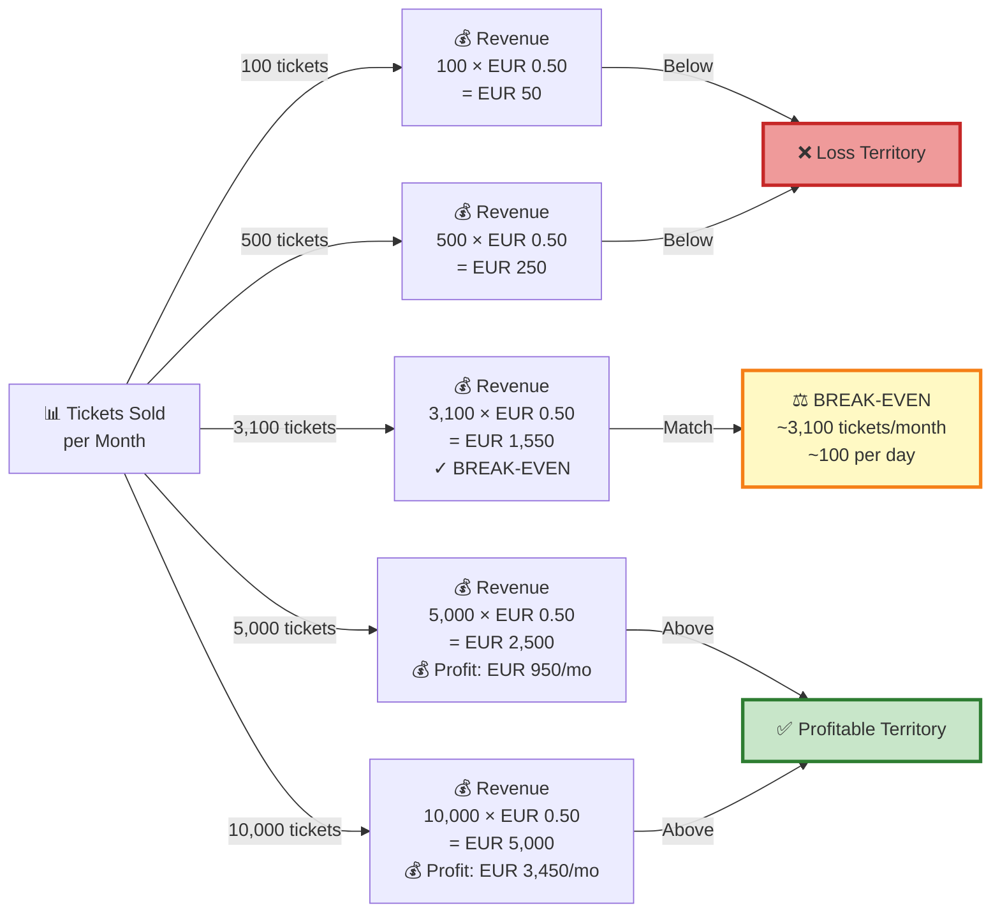

### 5-Year Financial Projection

| Year | Tickets/Month | Avg Revenue | Annual Revenue | Costs | Gross Profit | Cum. Profit |
|------|---------------|-------------|-----------------|-------|-------------|------------|
| **Y1** | 2,000 | EUR 1,000 | EUR 12,000 | EUR 18,600 | -EUR 6,600 | -EUR 6,600 |
| **Y2** | 5,000 | EUR 2,500 | EUR 30,000 | EUR 18,600 | EUR 11,400 | EUR 4,800 |
| **Y3** | 10,000 | EUR 5,000 | EUR 60,000 | EUR 19,200 | EUR 40,800 | EUR 45,600 |
| **Y4** | 15,000 | EUR 7,500 | EUR 90,000 | EUR 20,000 | EUR 70,000 | EUR 115,600 |
| **Y5** | 20,000 | EUR 10,000 | EUR 120,000 | EUR 21,000 | EUR 99,000 | EUR 214,600 |

### ROI Calculation

- **Initial Investment**: EUR 50,000 (development + setup)
- **Year 2 Revenue**: EUR 30,000
- **Cumulative Break-even**: Q3 Year 2
- **5-Year ROI**: 329% (EUR 214,600 / EUR 50,000)
- **Payback Period**: 24 months

### Cost Optimization Opportunities

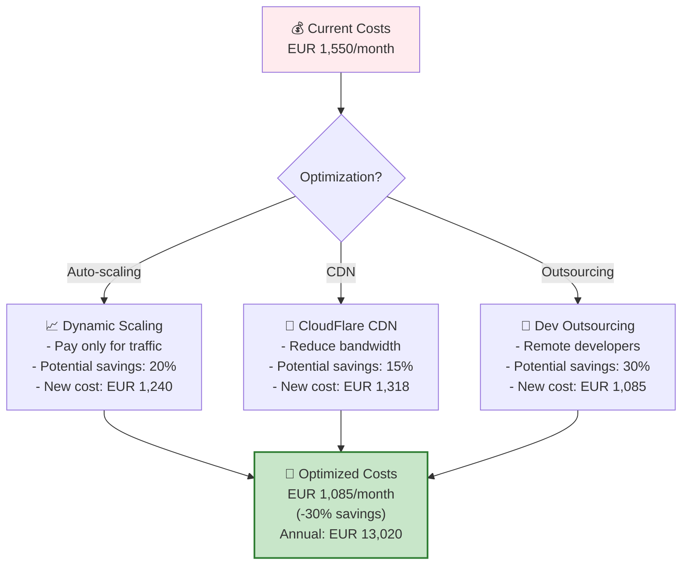

---

## 📈 Key Performance Indicators (KPIs)

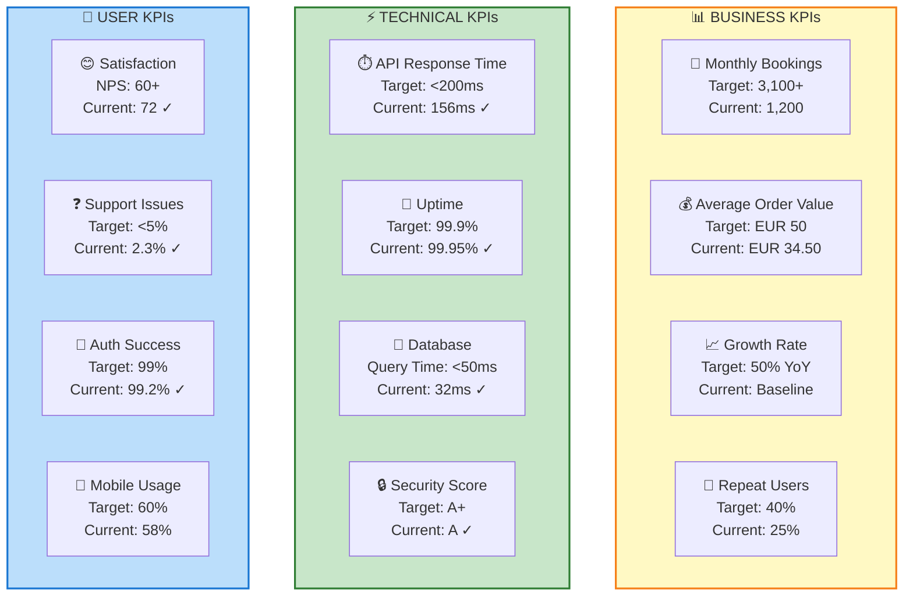

---

**Cinema67 v5.0** | Complete User Flows & Business Analysis | 🎬
