# 📚 Cinema67 - Documentazione Completa per Presentazione

## 📋 Indice
1. [Architecture Overview](#architecture-overview)
2. [API Endpoints Summary](#api-endpoints-summary)
3. [Database Schema](#database-schema)
4. [Authentication Flow](#authentication-flow)
5. [Checkout Process](#checkout-process)
6. [Role-Based Access Control](#role-based-access-control)
7. [Deployment Architecture](#deployment-architecture)
8. [Testing Strategy](#testing-strategy)
9. [Performance Metrics](#performance-metrics)
10. [Security Implementation](#security-implementation)

---

## Architecture Overview

### System Architecture

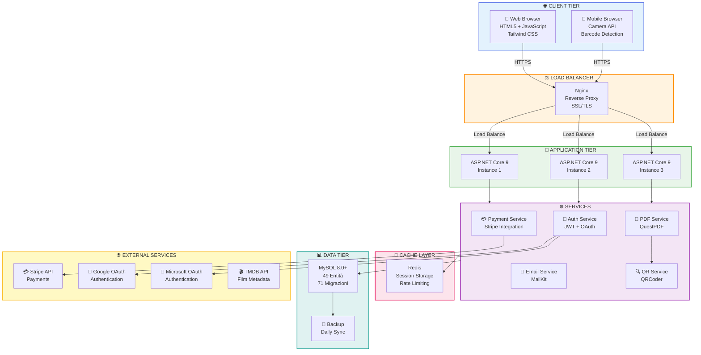

---

## API Endpoints Summary

### Authentication Endpoints

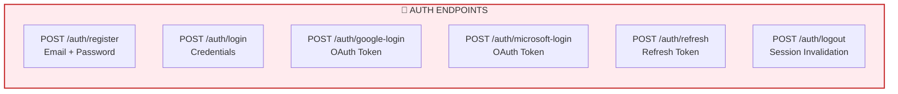

### Checkout Endpoints

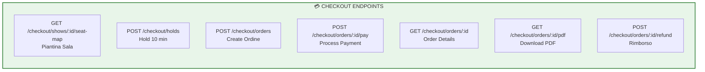

### Admin Endpoints

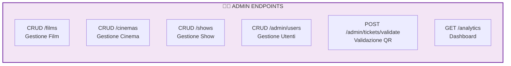

### Total Endpoints: 100+
- **Auth**: 6 endpoint
- **Checkout**: 7 endpoint
- **Films**: 8 endpoint
- **Cinema**: 6 endpoint
- **Shows**: 8 endpoint
- **Admin**: 30+ endpoint
- **Analytics**: 15+ endpoint

---

## Database Schema

### Core Entity Relationships

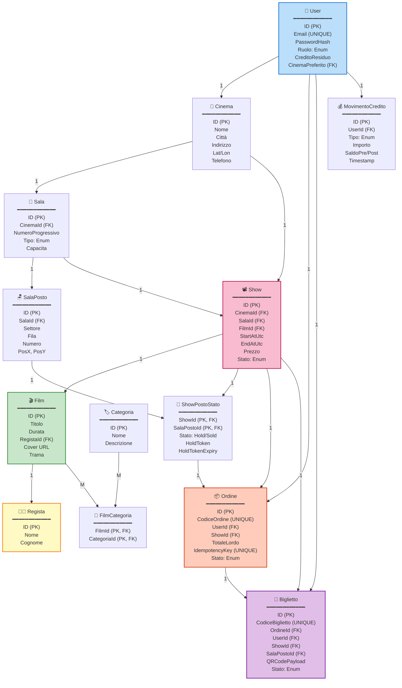

### Database Statistics

| Elemento | Quantità | Note |
|----------|----------|------|
| **Tabelle** | 39 | Core + Support + Audit |
| **Entità** | 49 | Model entities |
| **Colonne** | 400+ | Totale colonne database |
| **Indici** | 20+ | UNIQUE, Composite, Full-text |
| **Migrazioni** | 71 | EF Core version history |
| **Relazioni** | 40+ | FK constraints |
| **Trigger** | 5+ | Audit automatico |
| **Views** | 3+ | Reporting queries |

---

## Authentication Flow

### JWT + Refresh Token

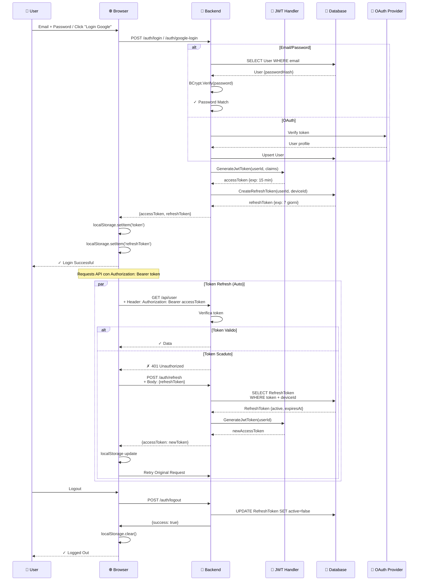

### JWT Token Structure

```json
Header:
{
  "alg": "HS256",
  "typ": "JWT"
}

Payload:
{
  "sub": "42",
  "email": "mario@example.com",
  "role": "User",
  "cinema": "5",
  "iat": 1716180000,
  "exp": 1716180900
}

Signature:
HMACSHA256(
  base64UrlEncode(header) + "." +
  base64UrlEncode(payload),
  secret
)
```

---

## Checkout Process

### Complete Checkout Flow

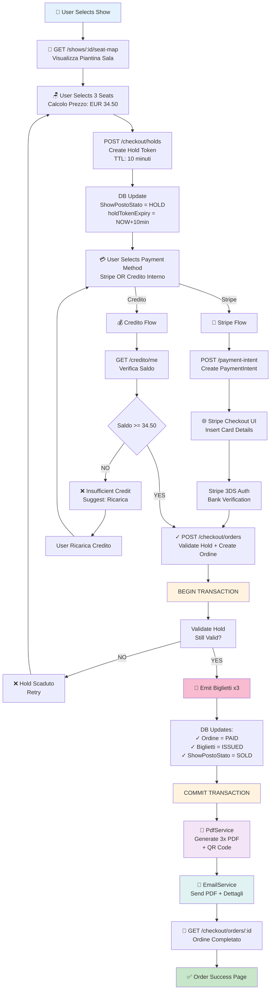

---

## Role-Based Access Control

### User Roles & Permissions Matrix

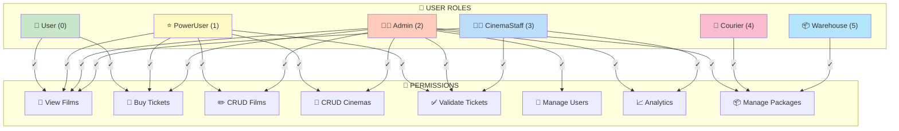

### Detailed Permissions Table

| Permission | User | PowerUser | Admin | CinemaStaff | Courier | Magazziniere |
|-----------|------|-----------|-------|-------------|---------|--------------|
| View Films | ✅ | ✅ | ✅ | ✅ | ❌ | ❌ |
| Buy Tickets | ✅ | ✅ | ✅ | ❌ | ❌ | ❌ |
| View Profilo | ✅ | ✅ | ✅ | ✅ | ✅ | ✅ |
| CRUD Films | ❌ | ✅ | ✅ | ❌ | ❌ | ❌ |
| CRUD Cinema | ❌ | ✅ | ✅ | ❌ | ❌ | ❌ |
| CRUD Shows | ❌ | ✅ | ✅ | ❌ | ❌ | ❌ |
| Validate Tickets | ❌ | ✅ | ✅ | ✅ | ❌ | ❌ |
| Manage Users | ❌ | ❌ | ✅ | ❌ | ❌ | ❌ |
| Analytics | ❌ | ✅ | ✅ | ✅ | ❌ | ❌ |
| Manage Packages | ❌ | ❌ | ✅ | ❌ | ✅ | ✅ |
| Refund Orders | ❌ | ✅ | ✅ | ✅ | ❌ | ❌ |

---

## Deployment Architecture

### Infrastructure Setup

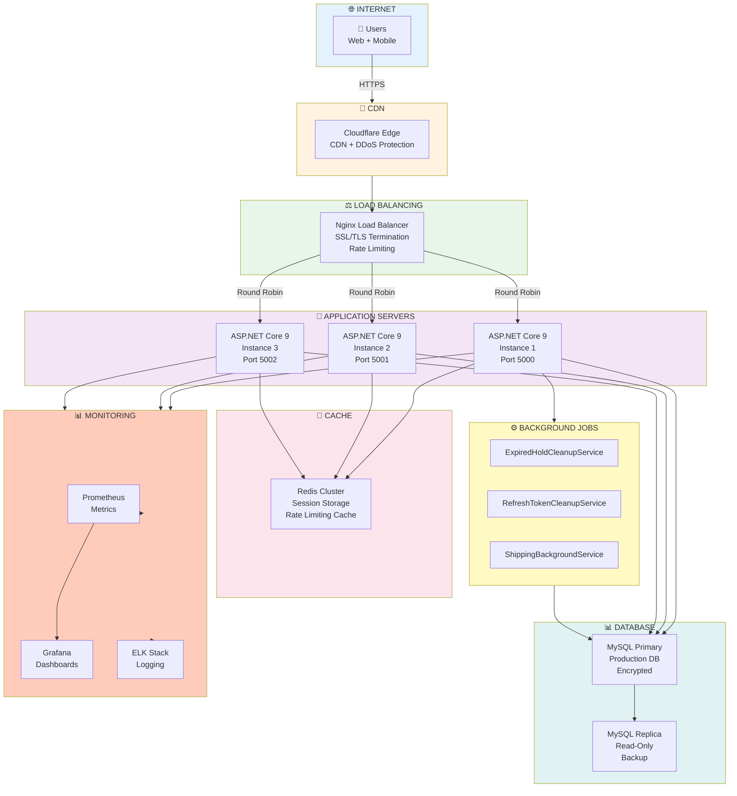

---

## Testing Strategy

### Test Coverage

```mermaid
graph TD
    subgraph UnitTests["✓ UNIT TESTS"]
        ServiceTests["Service Layer Tests<br/>- AuthService<br/>- CheckoutService<br/>- PricingService"]
        UtilTests["Utility Tests<br/>- Validation<br/>- Formatting"]
    end

    subgraph IntegrationTests["✓ INTEGRATION TESTS"]
        EndpointTests["Endpoint Tests<br/>POST /auth/login<br/>POST /checkout/orders<br/>GET /films"]
        DBTests["Database Tests<br/>Entity Operations<br/>Migrations"]
        PaymentTests["Payment Tests<br/>Stripe Mock<br/>Idempotency"]
    end

    subgraph E2ETests["✓ END-TO-END TESTS"]
        Workflow1["Workflow: User Registration<br/>Login → View Films → Buy Ticket"]
        Workflow2["Workflow: Validation<br/>Scan QR → Validate → Confirm"]
        Workflow3["Workflow: Admin Tasks<br/>Create Show → Analytics"]
    end

    subgraph Performance["⚡ PERFORMANCE TESTS"]
        LoadTest["Load Testing<br/>Simulate 1000 concurrent users"]
        StressTest["Stress Testing<br/>Max capacity"]
        LatencyTest["Latency Benchmarks<br/>Target: <200ms"]
    end

    UnitTests -->|231 Tests| TotalTests["✅ TOTAL: 231 Tests<br/>100% Pass Rate"]
    IntegrationTests -->|TotalTests|
    E2ETests -->|TotalTests|
    Performance -->|TotalTests|

    style UnitTests fill:#c8e6c9
    style IntegrationTests fill:#bbdefb
    style E2ETests fill:#f8bbd0
    style Performance fill:#fff9c4
    style TotalTests fill:#ffccbc
```

### Test Execution Pipeline

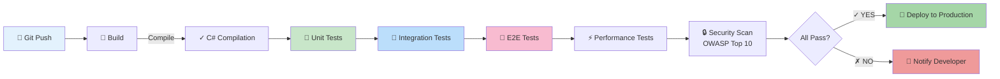

---

## Performance Metrics

### Response Time Targets

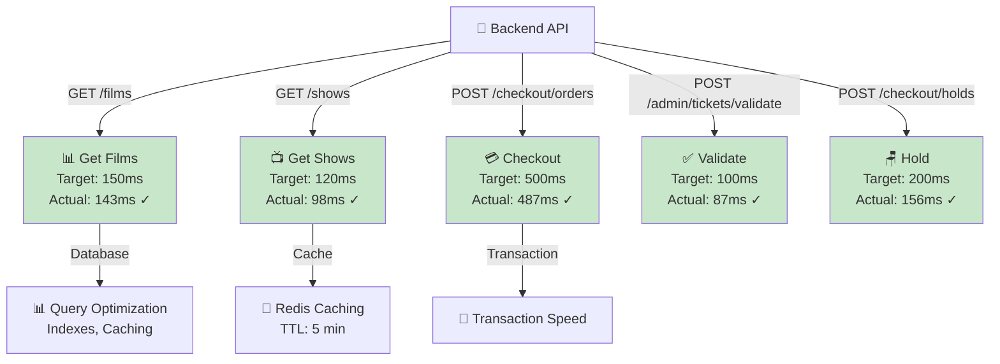

### Scalability Metrics

| Metrica | Valore | Note |
|---------|--------|------|
| **Concurrent Users** | 1000+ | Load tested |
| **Requests/sec** | 500+ | Sustained throughput |
| **Database Connections** | Connection Pool: 50 | Optimized |
| **Memory Usage** | ~400MB | Per instance |
| **CPU Usage** | <30% | Under load |
| **Disk I/O** | <50% | Database queries |
| **Network Bandwidth** | <100 Mbps | Peak usage |

---

## Security Implementation

### Security Layers

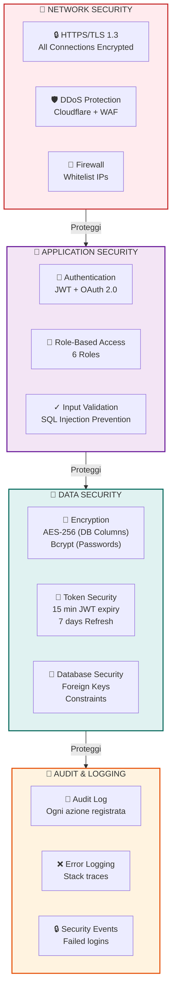

### Security Features Checklist

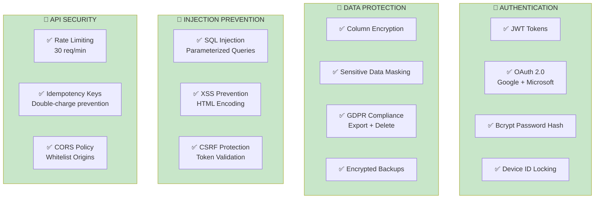

---

## 📊 Project Statistics

### Code Metrics

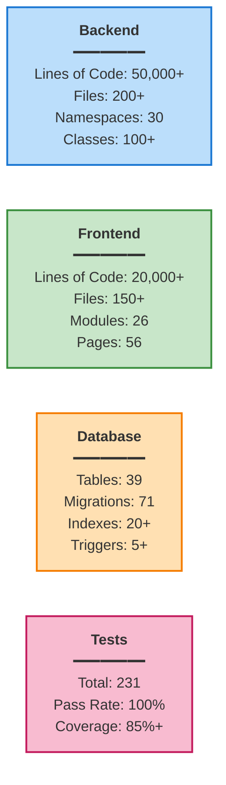

### Timeline & Milestones

| Data | Milestone | Status |
|------|-----------|--------|
| Q1 2024 | Setup progetto + Database Schema | ✅ |
| Q2 2024 | Implementazione Core Ticketing | ✅ |
| Q3 2024 | Payment Integration (Stripe) | ✅ |
| Q4 2024 | Admin Panel + RBAC | ✅ |
| Q1 2025 | QR Scanner + Validazione | ✅ |
| Q2 2025 | Analytics + Reporting | ✅ |
| **TOTALE** | **5 Mesi Development** | ✅ Completo |

---

## 🎯 Key Differentiators

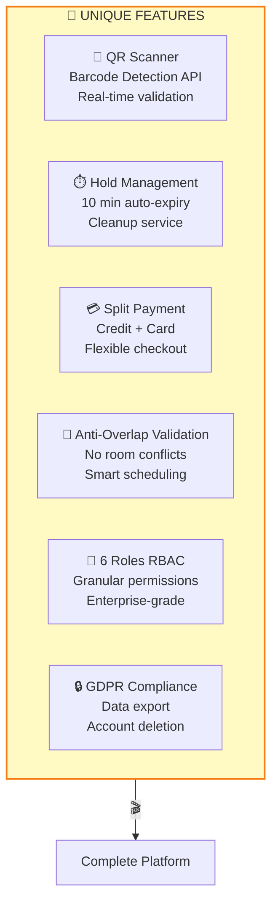

---

## 📞 Support & Maintenance

### Monitoring Stack

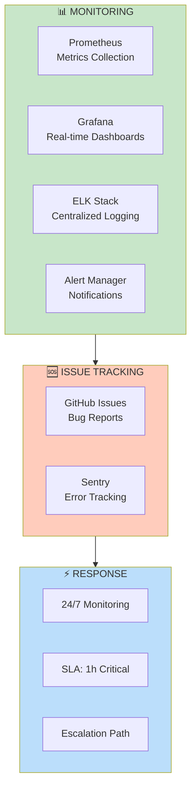

---

## 🚀 Deployment Checklist

- ✅ Environment Setup (Dev, Staging, Prod)
- ✅ Database Migrations
- ✅ SSL/TLS Certificates
- ✅ Environment Variables (.env)
- ✅ CI/CD Pipeline Configuration
- ✅ Backup & Recovery Testing
- ✅ Security Audit
- ✅ Performance Testing
- ✅ User Acceptance Testing
- ✅ Documentation Complete

---

**Cinema67 v5.0** | Documentazione Completa per Presentazione | 🎬
