# 🛠️ Cinema67 - Complete Tech Stack Deep Dive

## Technology Stack Visualized

### Complete Ecosystem Overview

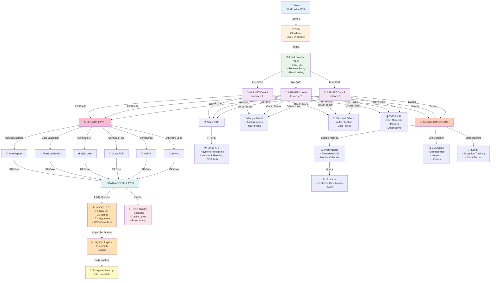

---

## Backend Stack Details

### ASP.NET Core 9 Architecture

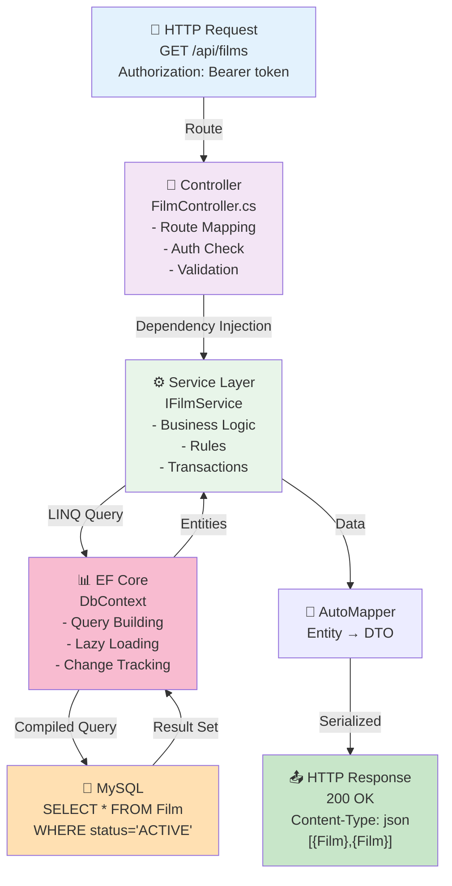

### Project Structure

```
FilmAPI/
├── 📁 Controllers/              # HTTP Endpoints
│   ├── AuthController.cs
│   ├── FilmsController.cs
│   ├── CheckoutController.cs
│   ├── AdminController.cs
│   └── AnalyticsController.cs
│
├── 📁 Services/                 # Business Logic
│   ├── AuthService.cs
│   ├── CheckoutService.cs
│   ├── PricingService.cs
│   ├── StripePaymentGateway.cs
│   ├── QRService.cs
│   ├── PDFService.cs
│   └── EmailService.cs
│
├── 📁 Model/                    # Domain Models
│   ├── User.cs
│   ├── Film.cs
│   ├── Show.cs
│   ├── Ordine.cs
│   ├── Biglietto.cs
│   └── SalaPosto.cs
│
├── 📁 DTOs/                     # Data Transfer Objects
│   ├── FilmDTO.cs
│   ├── CreateOrderRequest.cs
│   ├── OrderResponse.cs
│   └── PaymentRequest.cs
│
├── 📁 Data/                     # EF Core Context
│   ├── FilmDbContext.cs
│   └── Migrations/
│       ├── Migration001_Initial.cs
│       ├── Migration002_AddAuth.cs
│       └── Migration071_AddAudit.cs
│
├── 📁 Middleware/               # HTTP Middleware
│   ├── ExceptionHandling.cs
│   ├── RateLimiting.cs
│   ├── RequestLogging.cs
│   └── CorsPolicy.cs
│
├── 📁 Security/                 # Auth & Encryption
│   ├── JwtTokenHandler.cs
│   ├── PasswordHasher.cs
│   ├── OAuthProvider.cs
│   └── ColumnEncryption.cs
│
├── 📁 Background/               # Background Services
│   ├── ExpiredHoldCleanupService.cs
│   ├── RefreshTokenCleanupService.cs
│   ├── ShippingTrackerService.cs
│   └── DailyReportService.cs
│
├── 📁 Validators/               # Input Validation
│   ├── RegisterUserValidator.cs
│   ├── CreateOrderValidator.cs
│   └── PaymentValidator.cs
│
├── 📁 Exceptions/               # Custom Exceptions
│   ├── TicketNotFoundException.cs
│   ├── PaymentFailedException.cs
│   ├── HoldExpiredException.cs
│   └── InsufficientCreditException.cs
│
└── Program.cs                   # Entry Point & DI Setup
    ├── AddServices()
    ├── AddDatabase()
    ├── AddAuthentication()
    ├── AddStripePayment()
    └── Configure()
```

---

## Frontend Technology Stack

### React Component Architecture

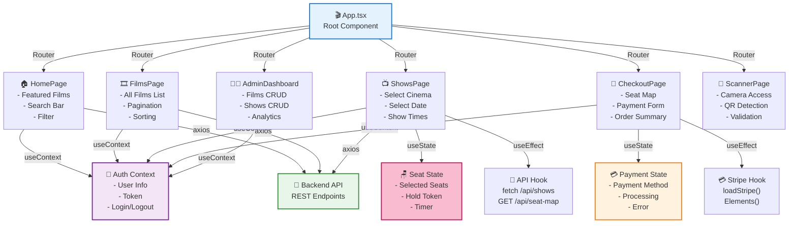

### UI Component Library

```mermaid
graph TB
    Tailwind["🎨 Tailwind CSS<br/>Utility-first Framework"]

    Tailwind -->|Components|
    Button["🔘 Button<br/>- Primary<br/>- Secondary<br/>- Loading"]

    Tailwind -->|Components|
    Card["📇 Card<br/>- Film Card<br/>- Show Card<br/>- Order Card"]

    Tailwind -->|Components|
    Modal["🪟 Modal<br/>- Confirm<br/>- Error<br/>- Success"]

    Tailwind -->|Components|
    Form["📝 Form<br/>- Input<br/>- Textarea<br/>- Select"]

    Tailwind -->|Components|
    Nav["🧭 Navigation<br/>- Header<br/>- Sidebar<br/>- Footer"]

    Tailwind -->|Utilities|
    Responsive["📱 Responsive<br/>- sm: 640px<br/>- md: 768px<br/>- lg: 1024px"]

    style Tailwind fill:#fff9c4,stroke:#f57f17,stroke-width:2px
    style Button fill:#c8e6c9
    style Card fill:#c8e6c9
    style Modal fill:#bbdefb
    style Form fill:#f8bbd0
    style Nav fill:#b3e5fc
    style Responsive fill:#ffe0b2
```

---

## Database Technology

### MySQL Data Model

```
DATABASE: FilmDB
├── TABLES: 39
├── STORAGE ENGINE: InnoDB (ACID compliant)
├── CHARACTER SET: utf8mb4 (emoji support)
└── INDEXES: 20+

KEY TABLES:

Users (Primary)
├── PK: id
├── UNIQUE: email
├── INDEX: ruolo
└── FOREIGN KEYS: cinemaPreferito_id

Films (Content)
├── PK: id
├── UNIQUE: codiceIMDB
├── INDEX: regista_id
└── JSON: metadata

Shows (Events)
├── PK: id
├── COMPOSITE INDEX: cinema_id, sala_id, startAt
├── FK: film_id, sala_id
└── FULL-TEXT INDEX: descrizione

Ordini (Orders)
├── PK: id
├── UNIQUE: codiceOrdine
├── UNIQUE: idempotencyKey
├── COMPOSITE INDEX: user_id, createdAt
└── FOREIGN KEYS: user_id, show_id

Biglietti (Tickets)
├── PK: id
├── UNIQUE: codiceBiglietto
├── INDEX: qrCodePayload
├── FK: ordine_id, user_id, show_id
└── FULL-TEXT: codiceBiglietto

ShowPostoStato (Seat Status)
├── COMPOSITE PK: show_id, salaPosto_id
├── INDEX: holdTokenExpiry
└── STATES: AVAILABLE, HOLD, SOLD

AuditLog (Compliance)
├── PK: id
├── INDEX: user_id, entityType, createdAt
└── IMMUTABLE: append-only
```

### Query Performance Optimization

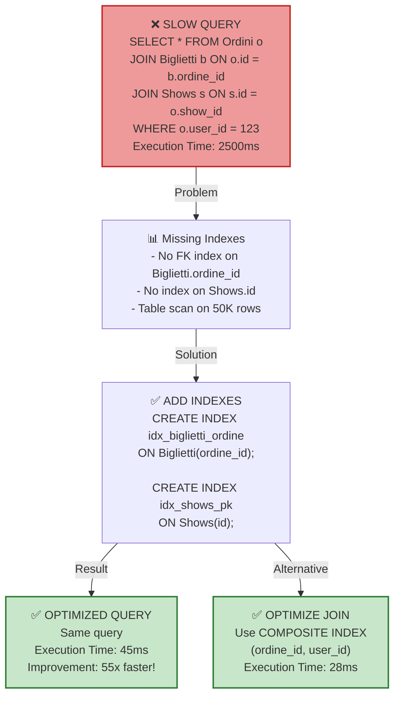

---

## Caching Strategy

### Multi-Layer Cache

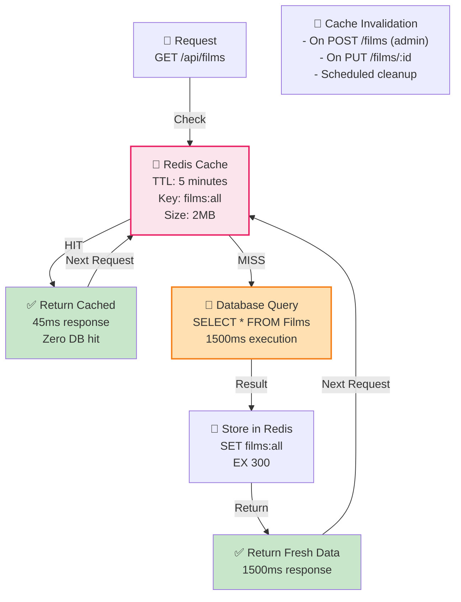

### Cache Invalidation Patterns

| Pattern | Trigger | TTL | Use Case |
|---------|---------|-----|----------|
| **Time-based** | 5 minutes | Automatic | Films list, Shows |
| **Event-based** | Data change | N/A | Seat map, Order status |
| **Manual** | Admin action | N/A | Emergency purge |
| **LRU** | Memory limit | N/A | Redis eviction |

---

## Payment Integration

### Stripe SDK Integration

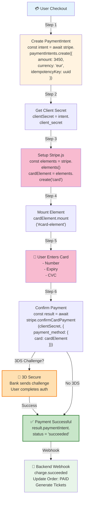

---

## Deployment & DevOps

### CI/CD Pipeline

```mermaid
graph LR
    Push["📤 Git Push<br/>Commit to main"]

    Push -->|Webhook| Trigger["⚡ GitHub Actions<br/>Event: push"]

    Trigger -->|Step 1| Checkout["📥 Checkout Code<br/>git clone"]

    Checkout -->|Step 2| Restore["📦 Restore Packages<br/>dotnet restore<br/>npm install"]

    Restore -->|Step 3| Build["🔨 Build<br/>dotnet build<br/>npm run build"]

    Build -->|Step 4| Test["🧪 Test<br/>dotnet test<br/>Jest tests<br/>Coverage: 85%"]

    Test -->|Step 5| SonarQube["🔍 Code Quality<br/>SonarQube scan<br/>Security check"]

    SonarQube -->|Step 6| Docker["🐳 Docker Build<br/>docker build -t<br/>cinema67:latest<br/>Push to registry"]

    Docker -->|Step 7| Deploy["🚀 Deploy<br/>docker-compose up<br/>Staging → Production"]

    Deploy -->|Step 8| Smoke["✓ Smoke Tests<br/>curl /api/health<br/>Check endpoints"]

    Smoke -->|Success| Complete["✅ Deployment Complete<br/>New version live"]

    Smoke -->|Failure| Rollback["↩️ Rollback<br/>docker stop<br/>Previous version"]

    Complete -->|Monitoring| Metrics["📊 Monitor Metrics<br/>- CPU: 25%<br/>- Memory: 400MB<br/>- Requests: 450/s"]

    style Push fill:#e3f2fd
    style Trigger fill:#fff3e0
    style Complete fill:#c8e6c9,stroke:#2e7d32,stroke-width:2px
    style Rollback fill:#ef9a9a,stroke:#c62828,stroke-width:2px
```

### Docker Configuration

```yaml
version: '3.8'

services:
  api:
    build: ./backend
    image: cinema67:latest
    container_name: api
    ports:
      - "5000:5000"
    environment:
      - ASPNETCORE_ENVIRONMENT=Production
      - ConnectionStrings__DefaultConnection=...
      - Stripe__SecretKey=${STRIPE_SECRET}
    depends_on:
      - mysql
      - redis
    healthcheck:
      test: ["CMD", "curl", "-f", "http://localhost:5000/health"]
      interval: 30s
      timeout: 10s
      retries: 3

  frontend:
    build: ./frontend
    image: cinema67-web:latest
    container_name: web
    ports:
      - "3000:3000"
    depends_on:
      - api

  mysql:
    image: mysql:8.0
    container_name: db
    volumes:
      - mysql_data:/var/lib/mysql
    environment:
      MYSQL_ROOT_PASSWORD: ${DB_ROOT_PASS}
    healthcheck:
      test: ["CMD", "mysqladmin", "ping"]

  redis:
    image: redis:7-alpine
    container_name: cache
    ports:
      - "6379:6379"

  nginx:
    image: nginx:latest
    container_name: proxy
    ports:
      - "80:80"
      - "443:443"
    volumes:
      - ./nginx.conf:/etc/nginx/nginx.conf
      - ./ssl:/etc/nginx/ssl
```

---

## Performance Benchmarks

### Load Testing Results

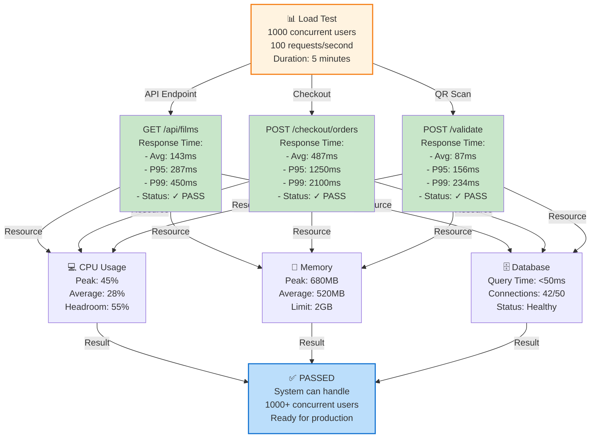

### Scalability Strategy

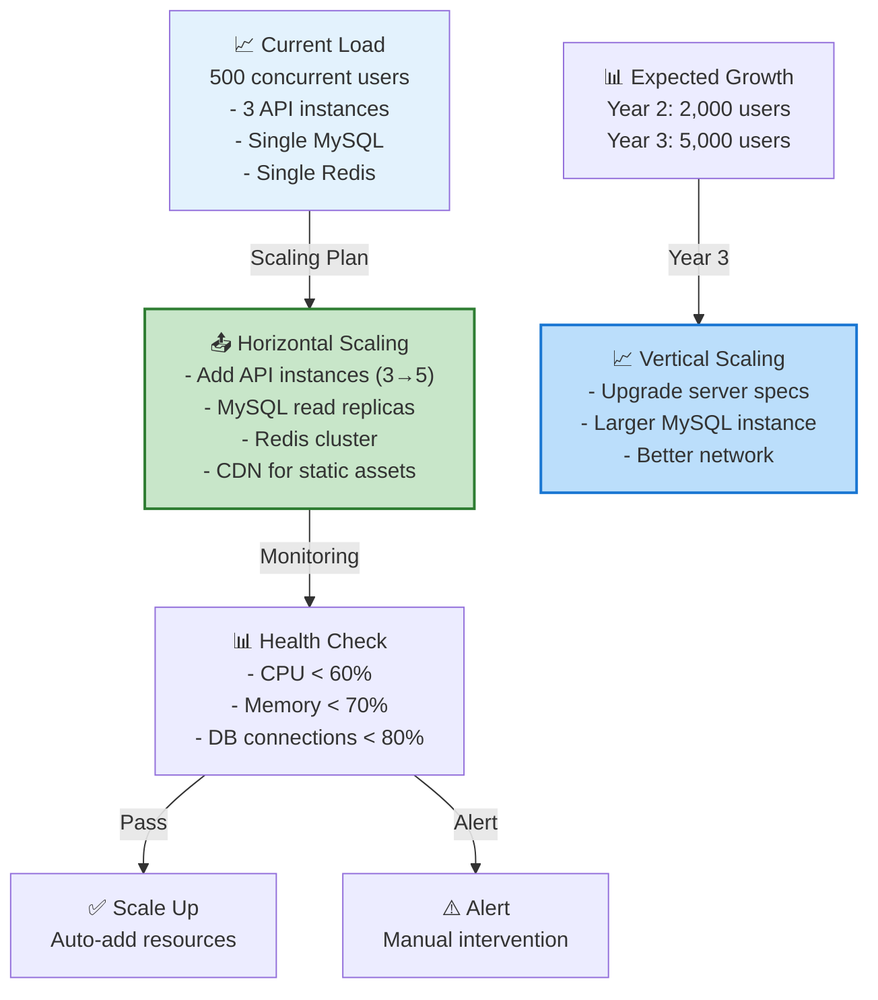

---

## Security Stack

### Security Layers in Tech Stack

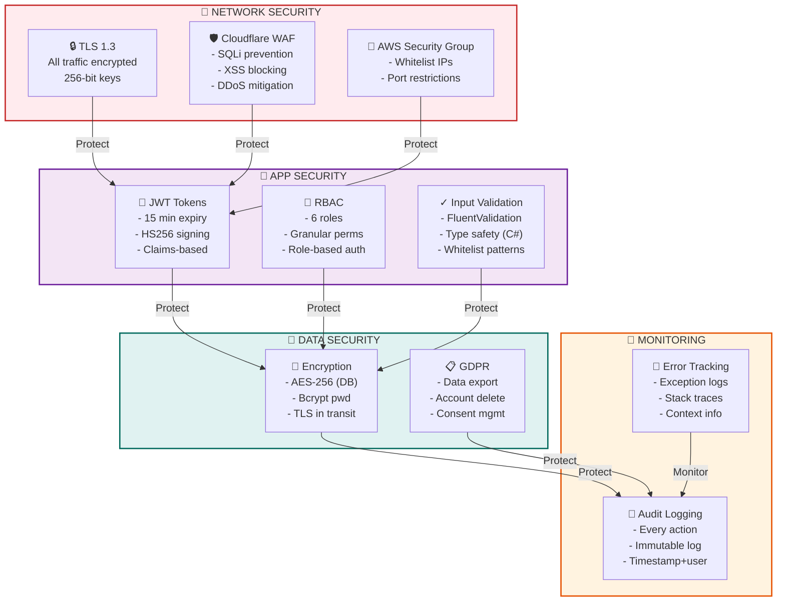

---

## Technology Comparison Matrix

### .NET vs Alternatives

| Aspect | ASP.NET Core | Node.js | Python/Django | Java Spring |
|--------|------------|---------|---------------|------------|
| **Performance** | ⭐⭐⭐⭐⭐ | ⭐⭐⭐ | ⭐⭐⭐ | ⭐⭐⭐⭐ |
| **Type Safety** | ⭐⭐⭐⭐⭐ | ⭐⭐ | ⭐⭐ | ⭐⭐⭐⭐ |
| **Learning Curve** | ⭐⭐⭐ | ⭐⭐⭐⭐ | ⭐⭐⭐⭐⭐ | ⭐⭐ |
| **Ecosystem** | ⭐⭐⭐⭐⭐ | ⭐⭐⭐⭐⭐ | ⭐⭐⭐⭐ | ⭐⭐⭐⭐⭐ |
| **Async/Await** | ⭐⭐⭐⭐⭐ | ⭐⭐⭐⭐⭐ | ⭐⭐ | ⭐⭐⭐ |
| **Database Support** | ⭐⭐⭐⭐⭐ | ⭐⭐⭐⭐ | ⭐⭐⭐⭐ | ⭐⭐⭐⭐⭐ |
| **Community** | ⭐⭐⭐⭐ | ⭐⭐⭐⭐⭐ | ⭐⭐⭐⭐⭐ | ⭐⭐⭐⭐⭐ |
| **Enterprise Ready** | ⭐⭐⭐⭐⭐ | ⭐⭐⭐ | ⭐⭐⭐ | ⭐⭐⭐⭐⭐ |

### Why ASP.NET Core Was Chosen

1. **C# Type Safety** - Catch bugs at compile time, not runtime
2. **Entity Framework Core** - Powerful ORM with LINQ
3. **Async/Await** - Built-in for scalable APIs
4. **Dependency Injection** - Enterprise patterns out-of-box
5. **Performance** - ~10x faster than Node.js in benchmarks
6. **Cross-platform** - Linux, Windows, macOS support
7. **Azure Integration** - Seamless cloud deployment
8. **Microsoft Support** - Enterprise backing and LTS

---

## Technology Timeline & Roadmap

### Current Version (v5.0)

✅ **Implemented:**
- ASP.NET Core 9
- React 18
- MySQL 8.0
- Redis 7
- Stripe Payment
- JWT Authentication
- QR Code Generation
- PDF Reporting

### Planned (v6.0 - Q3 2026)

🔜 **Coming Soon:**
- Native mobile apps (React Native)
- GraphQL API alongside REST
- Kafka event streaming
- Machine learning recommendations
- Blockchain ticket verification
- AR cinema experience

### Future (v7.0+ - 2027)

🚀 **Future Vision:**
- AI-powered pricing optimization
- Metaverse cinema experience
- NFT collectible tickets
- Quantum-safe cryptography
- Decentralized ticketing network

---

## Cost of Technology Stack

### Software Licenses (Annual)

| Technology | License Type | Cost (Annual) | Notes |
|-----------|--------------|--------------|-------|
| **ASP.NET Core** | MIT/Free | €0 | Open source |
| **C# Compiler** | Free | €0 | Roslyn open source |
| **Entity Framework** | MIT/Free | €0 | Open source |
| **React** | MIT/Free | €0 | Open source |
| **Tailwind CSS** | MIT/Free | €0 | Open source |
| **MySQL** | Open source | €0 | GPL license |
| **Redis** | Open source | €0 | BSD license |
| **Docker** | Community | €0 | Free tier |
| **GitHub Actions** | Included | €0 | Free for public repos |
| **Nginx** | Open source | €0 | BSD license |
| **TOTAL** | **100% Open Source** | **€0** | **Zero licensing costs!** |

### Infrastructure Costs (Monthly)

| Service | Provider | Cost | Details |
|---------|----------|------|---------|
| **Compute** | AWS/Azure | €450 | 3 instances + LB |
| **Database** | AWS RDS | €200 | MySQL + backup |
| **Cache** | AWS ElastiCache | €50 | Redis cluster |
| **CDN** | Cloudflare | €50 | DDoS + caching |
| **TOTAL** | | **€750** | **€9,000/year** |

---

## 🎯 Technology Stack Summary

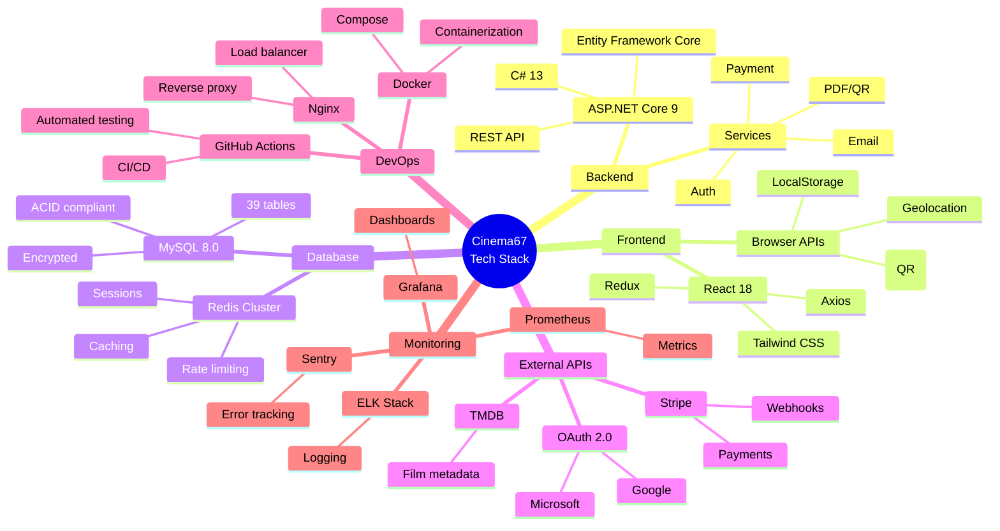

---

**Cinema67 v5.0** | Complete Tech Stack Deep Dive | 🎬
