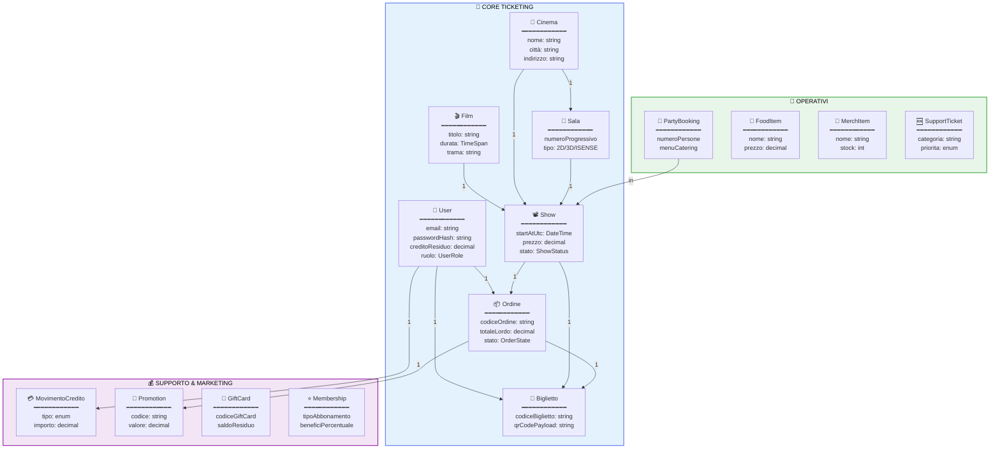
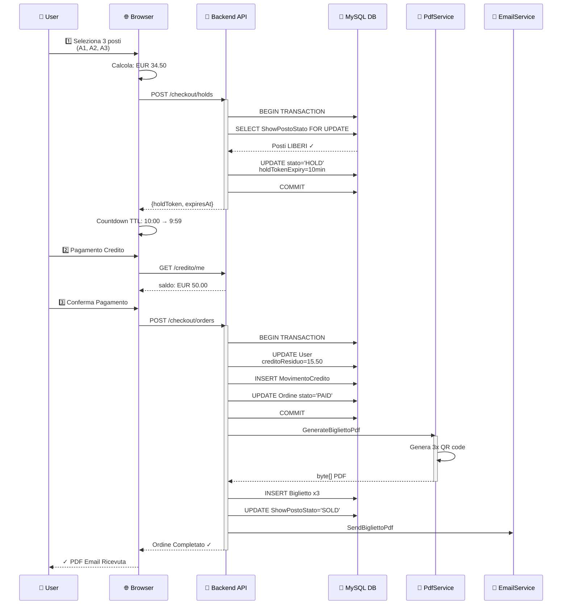
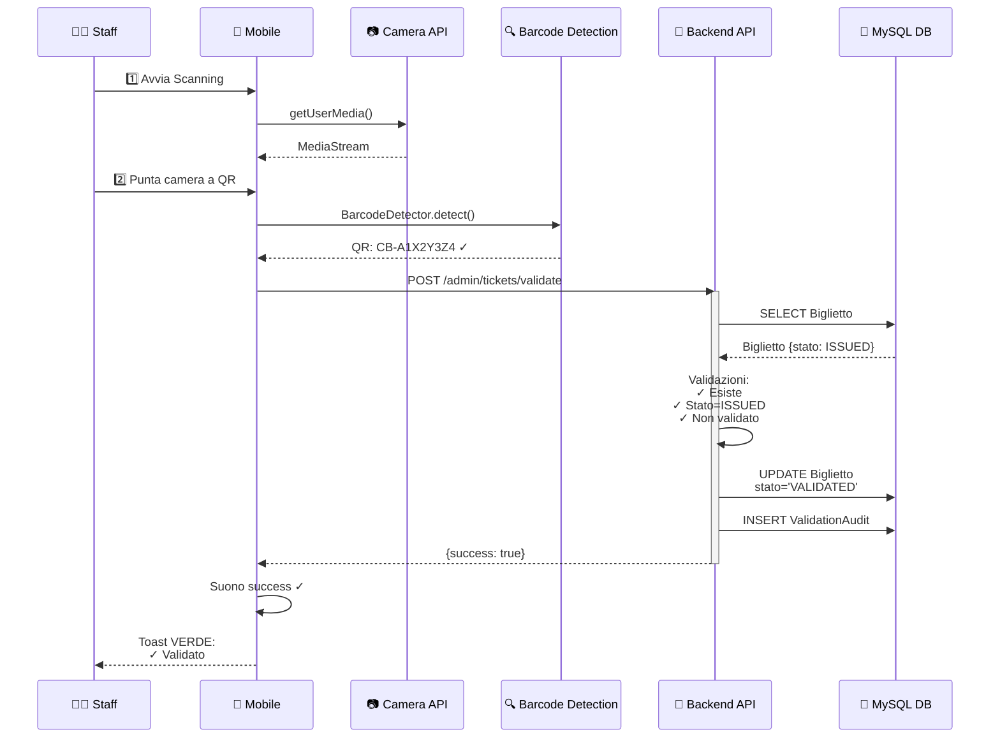
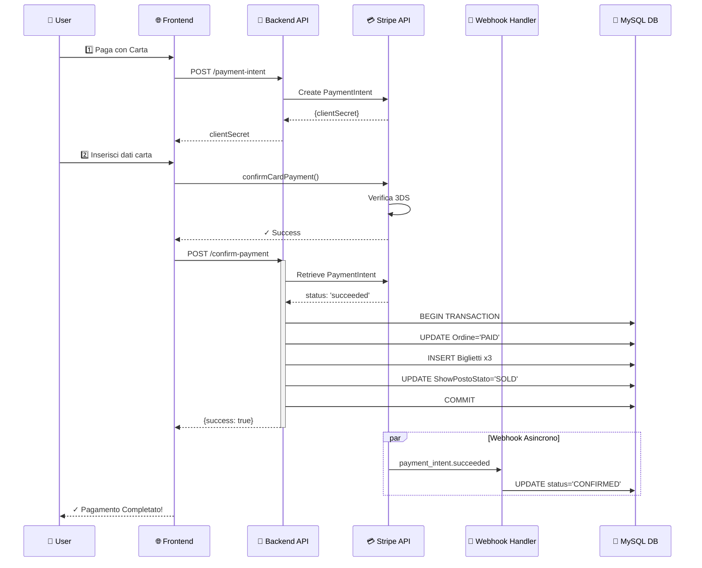
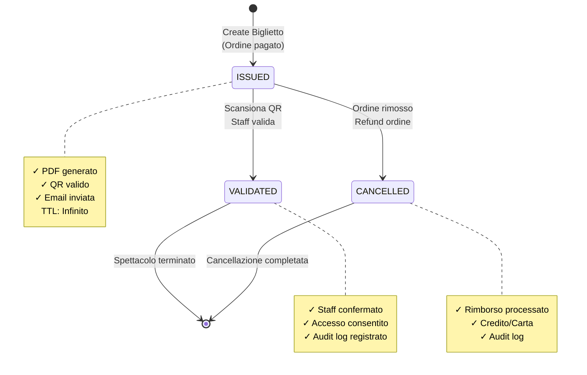
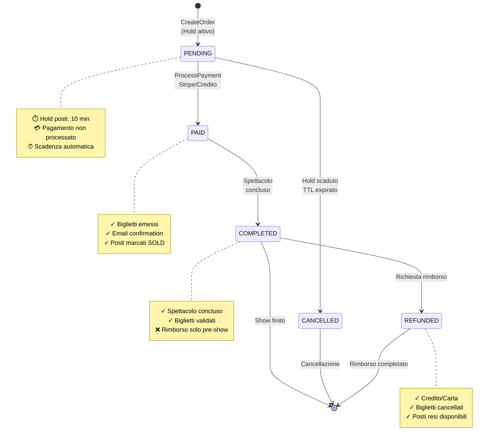
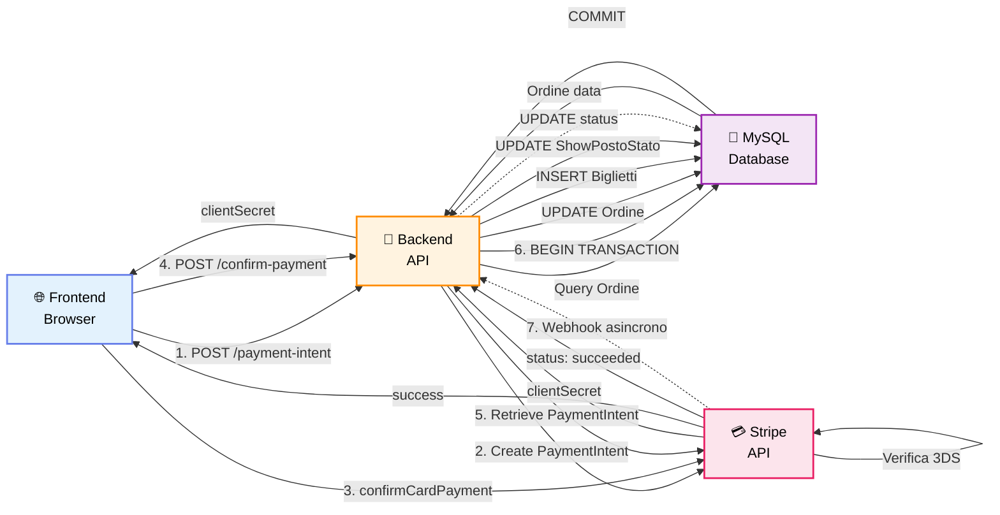

# 🎬 Cinema67 - Diagrammi UML

## 1. Class Diagram

---

## 2. Use-Case Diagram

```mermaid
graph TB
    subgraph Cinema67["🎬 Cinema67 System"]
        A["📖 Catalogo Film"]
        B["🔍 Ricerca Film"]
        C["📅 Programmazione"]
        D["🎫 Acquista Biglietti"]
        E["💳 Pagamento"]
        F["📊 Dashboard"]
        G["✅ Validazione QR"]
        H["👥 Gestione Utenti"]
        I["🎬 CRUD Film"]
        J["🎁 Promozioni"]
        K["📈 Analytics"]
        L["🚚 Traccia Pacchi"]
        M["📦 Prepara Pacchi"]
    end

    Guest["👤 Ospite"]
    User["👤 Utente"]
    Staff["👨‍💼 Staff"]
    Admin["👨‍💻 Admin"]
    Courier["🚚 Corriere"]
    Warehouse["📦 Magazziniere"]

    Guest -.-> A
    Guest -.-> B
    Guest -.-> C

    User -.-> A
    User -.-> D
    User -.-> E

    Staff -.-> F
    Staff -.-> G
    Staff -.-> J

    Admin -.-> H
    Admin -.-> I
    Admin -.-> J
    Admin -.-> K

    Courier -.-> L
    Warehouse -.-> M

    style Cinema67 fill:#f0f4c3,stroke:#9e9e9e,stroke-width:2px,color:#000
```

---

## 3. Sequence Diagram: Acquisto Biglietto Completo

---

## 4. Sequence Diagram: Validazione QR Code

---

## 5. Sequence Diagram: Stripe Payment

---

## 6. State Machine: Ciclo Vita Biglietto

---

## 7. State Machine: Ciclo Vita Ordine

---

## 8. Data Flow: Pagamento Stripe

---

## 📊 Sommario dei Diagrammi

| Diagramma | Tipo | Complessità | Elementi |
|-----------|------|------------|----------|
| **Class** | Strutturale | ⭐⭐⭐⭐ | 49 entità, 15+ servizi |
| **Use-Case** | Comportamentale | ⭐⭐⭐⭐ | 6 attori, 70+ use case |
| **Seq: Acquisto** | Interazione | ⭐⭐⭐⭐⭐ | 9 attori, 40+ step |
| **Seq: Validazione** | Interazione | ⭐⭐⭐⭐ | 8 attori, API browser |
| **Seq: Stripe** | Interazione | ⭐⭐⭐ | Payment + webhook |
| **State: Biglietto** | Comportamentale | ⭐⭐ | 4 stati |
| **State: Ordine** | Comportamentale | ⭐⭐ | 6 stati |
| **Data Flow** | Strutturale | ⭐⭐⭐ | Flusso pagamento |

---

## 🚀 Stack Tecnologico

### Backend
- **Runtime**: .NET 9.0 (LTS)
- **Framework**: ASP.NET Core 9 Minimal API
- **ORM**: Entity Framework Core 9
- **Database**: MySQL 8.0+ / MariaDB
- **Servizi**: 64 servizi business logic
- **Endpoints**: 33 route groups (100+ endpoint)

### Frontend
- **Markup**: HTML5 Semantico
- **Styling**: Tailwind CSS + Custom CSS
- **Script**: JavaScript ES2020+ (zero-build)
- **Pagine**: 56 pagine HTML
- **Moduli**: 26+ moduli JavaScript

### Database
- **DBMS**: MySQL 8.0+
- **Tabelle**: 39 entità
- **Migrazioni**: 71 migrazioni EF Core
- **Indici**: 20+ indici ottimizzati
- **Relazioni**: M:1, 1:M, M:M junction tables

---

## 🎯 Funzionalità Principali

### Ticketing
- ✅ Acquisto biglietti con selezione grafica posti
- ✅ Hold posti con TTL 10 minuti
- ✅ Biglietti digitali con QR code
- ✅ Validazione QR scanner con camera
- ✅ PDF biglietti generati automaticamente

### Pagamenti
- ✅ Stripe integrato (PaymentIntent + 3DS)
- ✅ Credito interno piattaforma
- ✅ Split payment (credito + carta)
- ✅ Idempotency protection
- ✅ Webhook handling

### Gestione
- ✅ 6 ruoli RBAC (User → Admin)
- ✅ CRUD film, cinema, sale
- ✅ Editor piantina interattivo
- ✅ Anti-overlap validazione show
- ✅ Rimborsi ordini

### Features Aggiuntive
- ✅ Party booking con catering
- ✅ E-commerce merchandise
- ✅ Food & beverage ordering
- ✅ Membership abbonamenti
- ✅ Promozioni e coupon
- ✅ Support ticket system
- ✅ Newsletter marketing
- ✅ Analytics dashboard
- ✅ GDPR compliance (export/delete)

---

**Generato con Mermaid.js** | Cinema67 v5.0 | 🎬
