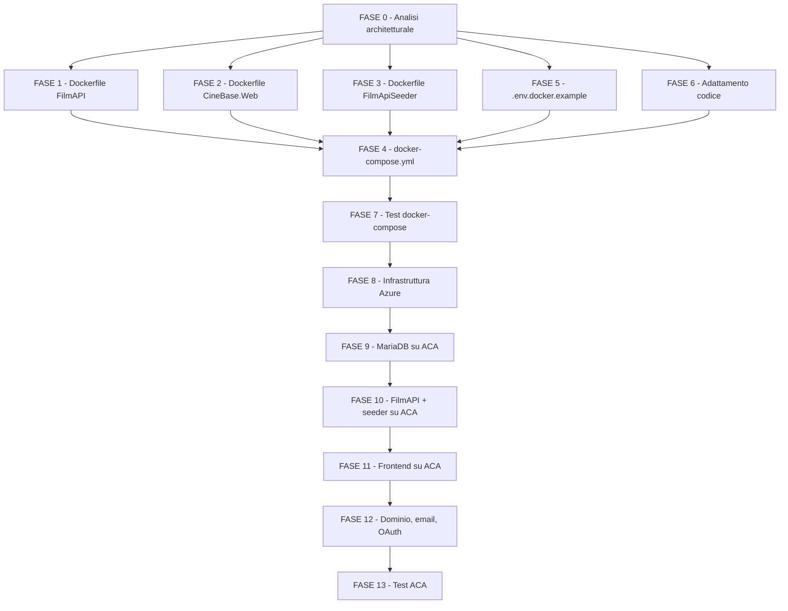

# Piano di Lavoro - Iterazione 6

Autore: OpenCode con ChatGPT-5.4 xHigh

## Obiettivo

Portare CineBase a uno stato in cui:

- esista una topologia locale completamente containerizzata, avviabile in modo riproducibile tramite `docker compose up -d`, senza dipendere dal database locale già presente sulla macchina dello sviluppatore;
- backend `FilmAPI`, frontend `CineBase.Web` e `FilmApiSeeder` siano eseguibili come container con Dockerfile multistage e configurazione coerente con le best practices operative;
- il bootstrap locale produca un'app utilizzabile con database inizializzato, account admin creato, dati seedati e servizi accessori di sviluppo pronti;
- l'applicazione containerizzata sia distribuibile su Azure Container Apps (ACA) con artefatti, configurazione e verifiche adattate all'architettura reale di CineBase;
- il piano operativo sia abbastanza dettagliato da guidare sia l'implementazione sia la validazione finale, senza lasciare ambiguità sui file da toccare, sui criteri di accettazione e sui test da sviluppare.

## Decisioni Guida della 6

- il target locale della 6 è un setup `clone-and-run` realmente riproducibile: il compose base non deve appoggiarsi a bind mount del database locale esistente né a porte host già occupate dal MariaDB di sviluppo;
- il compose base includerà `mariadb`, `filmapi`, `cinebase-web`, `seeder` e un servizio SMTP locale di sviluppo come `mailpit`, così i flussi email sono verificabili senza dipendere subito da un relay esterno;
- il database del compose partirà da volume Docker named pulito; l'utente deve poter distruggere e ricreare tutto con `docker compose down -v` e `docker compose up -d` ottenendo sempre uno stato coerente;
- il backend deve diventare self-bootstrapping: prima applica le migrazioni EF Core, poi esegue il `DataSeeder` idempotente, e solo dopo deve risultare `ready`;
- il `FilmApiSeeder` non deve dipendere dalla presenza della root Git o del file `backend/.env` dentro il container; deve funzionare con sole variabili d'ambiente e deve supportare una modalità snapshot/offline per soddisfare il requisito di bootstrap realistico da clone repository;
- il frontend non deve più dipendere da un `runtime-config.js` statico hardcoded su `localhost`; la configurazione runtime deve essere generata dal server ASP.NET in base alle env var del container;
- nei container il database server version deve essere esplicito e `DB_USE_AUTODETECT` deve essere disabilitato di default, per evitare dipendenze premature dal DB durante il bootstrap dell'applicazione;
- la persistenza locale deve coprire almeno i dati MariaDB e gli upload media modificabili a runtime; la persistenza ACA deve coprire almeno MariaDB e media caricati;
- l'autenticazione esterna reale con Google e Microsoft, così come Stripe e SMTP reale, non può essere materializzata dal solo repository senza segreti di terze parti: il piano deve quindi distinguere tra bootstrap locale zero-crash e validazione end-to-end con credenziali reali;
- per ACA si segue l'approccio della guida `EducationalGames`, ma adattandolo a CineBase: due container app pubbliche separate (`FilmAPI` e `CineBase.Web`), database containerizzato interno, seeder come job, storage persistente Azure Files, manifest e script di deploy versionati;
- per il pull da ACR su ACA si preferisce Managed Identity con ruolo `AcrPull`; l'uso dell'admin user di ACR va mantenuto solo come fallback documentato, non come percorso primario;
- `Data Protection` condivisa e `session affinity` non vanno introdotte per imitazione della guida di riferimento: vanno abilitate solo se la FASE 0 conferma un bisogno concreto nel modello auth attuale di CineBase.

## Sintesi di Consolidamento delle Proposte

- `proposal1` porta una buona copertura end-to-end del percorso locale + ACA, con fasi chiare su Dockerfile, compose, `.env.docker.example` e verifiche operative.
- `proposal2` è utile per l'impostazione `12-factor`, per l'attenzione a segreti, utente non-root, storage esterno e robustezza cloud.
- `proposal3` è la base migliore per il piano definitivo perché è la più allineata al codice reale: riconosce `runtime-config.js`, il seeder come progetto separato, i media upload, l'architettura `direct-backend`, il job ACA e la struttura test.
- il piano definitivo aggiunge correzioni che nelle tre proposte mancavano o erano solo accennate: root `.dockerignore` condiviso, disattivazione di `ServerVersion.AutoDetect` nei container, migrazioni prima del `DataSeeder`, compatibilità del seeder senza repository root, SMTP locale senza autenticazione obbligatoria, niente porta host MariaDB nel compose base, seed snapshot/offline per il clone-and-run, distinzione esplicita tra integrazioni locali simulate e integrazioni cloud con credenziali reali.

## Stato Avanzamento Fasi

| Fase | Stato | Note |
| --- | --- | --- |
| FASE 0 - Analisi architetturale e chiusura decisioni | **Completata** | Deliverable: `docs/project/dev_iteration/6/FASE0_AnalisiArchitetturaleEChiusuraDecisioni.md`; chiusi bootstrap `MigrateAsync()` -> `SeedAsync()` -> readiness, seeder `snapshot/live` env-only, `runtime-config.js` dinamico, email locale `mailpit`, persistenza DB/media e topologia ACA; `Data Protection` e `session affinity` escluse dal perimetro |
| FASE 1 - Dockerfile FilmAPI | **Completata** | Creati `backend/FilmAPI/Dockerfile` e root `.dockerignore`; build Docker root-based verificata, runtime non-root su `8080` con `HEALTHCHECK` su `/api/health/live`; bootstrap DB/readiness completo resta in FASE 6 |
| FASE 2 - Dockerfile CineBase.Web | **Completata** | Creato `frontend/CineBase.Web/Dockerfile`; build Docker root-based verificata con stage asset npm/Tailwind, runtime non-root su `8080` e `HEALTHCHECK` HTTP su `/`; clean URLs e asset self-hosted verificati, `runtime-config.js` dinamico resta in FASE 6 |
| FASE 3 - Dockerfile FilmApiSeeder | **Completata** | Creati `backend/scripts/FilmApiSeeder/Dockerfile` e `backend/scripts/FilmApiSeeder/data/catalog-snapshot.json`; il seeder supporta ora `SEED_SOURCE_MODE=snapshot` (default offline) e `live` con `TMDB_BEARER_TOKEN`, senza dipendere più da repository root o `backend/.env` per il bootstrap containerizzato; retry DB esplicito rinviato alla FASE 6 |
| FASE 4 - docker-compose.yml e orchestrazione locale completa | **Da avviare** | Stack locale `mariadb + filmapi + cinebase-web + seeder + mailpit`, senza dipendenze dal DB host |
| FASE 5 - `.env.docker.example` e normalizzazione configurazione | **Da avviare** | Baseline locale committata e realmente eseguibile; override locale opzionale non tracciato |
| FASE 6 - Adattamento codice per ambiente containerizzato | **Da avviare** | Migrazioni automatiche, health endpoints, runtime config dinamico, SMTP locale, seeder offline/env-safe |
| FASE 7 - Test docker-compose e simulazione clone | **Da avviare** | Smoke automatici e report di bootstrap locale completo |
| FASE 8 - Infrastruttura Azure di base | **Da avviare** | Resource group, ACR, Managed Identity, Log Analytics, ACA Environment, Storage Account, Azure Files |
| FASE 9 - MariaDB su ACA | **Da avviare** | Container app interna con storage persistente, utente applicativo dedicato e validazione persistenza |
| FASE 10 - FilmAPI e seeder su ACA | **Da avviare** | Backend pubblico, job seeder, secret mapping, media share, probe e bootstrap verificabile |
| FASE 11 - Frontend su ACA | **Da avviare** | Frontend pubblico con `runtime-config.js` coerente con backend ACA e header verificabili |
| FASE 12 - Dominio, email, OAuth e Stripe su ACA | **Da avviare** | Dominio personalizzato, certificati, SMTP reale, redirect OAuth, webhook Stripe |
| FASE 13 - Test e verifica finale ACA | **Da avviare** | Test E2E, resilienza, persistenza, osservabilità e checklist finale |

---

## FASE 0 - Analisi architetturale e chiusura decisioni

## Scopo

Fissare tutte le decisioni architetturali prima di implementare Dockerfile, compose e deployment cloud, usando il codice reale come sorgente di verità e chiudendo esplicitamente i punti che nelle proposte risultavano troppo generici o ancora ambigui.

## Attività

- censire il comportamento attuale del backend in `backend/FilmAPI/Program.cs`, con particolare attenzione a caricamento `.env`, costruzione della connection string, uso di `ServerVersion.AutoDetect`, assenza di `MigrateAsync()` all'avvio e invocazione diretta del `DataSeeder`;
- censire il comportamento attuale del seeder in `backend/scripts/FilmApiSeeder/Program.cs`, verificando la dipendenza dalla root del repository, il fallback su `backend/.env`, l'uso di TMDB come prerequisito forte e il fatto che oggi il seeder applica le migrazioni ma non è container-safe per il bootstrap da publish output;
- censire il comportamento del frontend in `frontend/CineBase.Web/Program.cs` e `wwwroot/js/runtime-config.js`, fissando come scelta architetturale definitiva la generazione runtime del file JS da env var invece della mutazione via shell script all'avvio;
- confermare che il compose locale base includa anche un SMTP catcher (`mailpit`) per rendere verificabili registrazione, reset password e notifiche email senza credenziali esterne;
- chiudere la strategia di seed locale: snapshot seed committato nel repository come baseline clone-and-run, TMDB live come modalità opzionale per refresh o arricchimento dati quando il token è disponibile;
- chiudere la politica delle porte: backend e frontend su `8080` internamente ai container, pubblicati localmente rispettivamente su `5000` e `5001`; MariaDB non esposto di default sull'host nel compose base per evitare conflitti con setup locali già esistenti;
- chiudere la politica di persistenza: volume named Docker per MariaDB e per `wwwroot/media/covers`; su ACA Azure Files per dati DB e media upload; eventuale share Data Protection solo se l'analisi conferma un uso reale nella soluzione attuale;
- chiudere la strategia di segreti e configurazione: baseline locale committata in `.env.docker.example` con valori di sviluppo sicuri solo per demo locale, override non tracciato in `.env.docker`, segreti ACA separati per ambiente cloud;
- chiudere la topologia ACA adattata a CineBase: `mariadb` interno, `filmapi` esterno, `cinebase-web` esterno, `filmapi-seeder` come job manuale o on-demand; ACR con tag immutabili, Log Analytics, file share, identità gestite e manifest YAML versionati;
- documentare i limiti non aggirabili: OAuth Google/Microsoft reale e Stripe reale richiedono credenziali esterne; il compose base deve quindi restare pienamente avviabile senza queste integrazioni, mentre i relativi test completi vanno collocati nelle fasi cloud o nelle verifiche locali con override dedicati.

## File da creare/modificare

| File | Modifica |
| --- | --- |
| `docs/project/dev_iteration/6/FASE0_AnalisiArchitetturaleEChiusuraDecisioni.md` | **Nuovo** - documento di analisi e decisioni finali |
| `docs/project/dev_iteration/6/TutorialAuthMultiContainerCookieRefreshEAntiforgery.md` | **Nuovo** - tutorial di supporto su auth multi-container, refresh cookie e antiforgery |

## Criteri di accettazione

- esiste un documento che fotografa lo stato reale del codice prima della containerizzazione, senza assumere comportamenti non presenti;
- è documentata la differenza tra bootstrap locale zero-config, bootstrap locale con override e verifiche cloud con credenziali reali;
- sono chiuse senza ambiguità le decisioni su storage, porte, `runtime-config.js`, seed snapshot, email locale, naming dei servizi e topologia ACA;
- è esplicitato se `Data Protection` e `session affinity` siano davvero necessari in CineBase o se vadano rimossi dal perimetro della 6 come complessità non giustificata.

## Test strutturati

| ID | Test | Risultato atteso |
| --- | --- | --- |
| F0-1 | Analisi `backend/FilmAPI/Program.cs` | Documentato che oggi manca `Database.MigrateAsync()` prima di `DataSeeder.SeedAsync()` |
| F0-2 | Analisi `backend/scripts/FilmApiSeeder/Program.cs` | Documentato che oggi il seeder dipende da repository root e `backend/.env` |
| F0-3 | Analisi `frontend/CineBase.Web/wwwroot/js/runtime-config.js` | Documentato che oggi gli URL sono hardcoded su `localhost` |
| F0-4 | Revisione configurazione email | Documentato che l'implementazione attuale richiede auth SMTP e `StartTls`, quindi non è pronta per `mailpit` |
| F0-5 | Revisione strategia seed locale | Approvata una modalità snapshot/offline per soddisfare il requisito clone-and-run |
| F0-6 | Revisione topologia ACA | Definite risorse, volumi, ingress e politica segreti coerenti con CineBase |

## Esito

- Deliverable della fase: `docs/project/dev_iteration/6/FASE0_AnalisiArchitetturaleEChiusuraDecisioni.md`
- Backend: chiusa la decisione di bootstrap `Database.MigrateAsync()` -> `DataSeeder.SeedAsync()` -> readiness con retry e `DB_USE_AUTODETECT=false` nei container.
- Seeder: chiusa la strategia `snapshot` default + `live` TMDB opzionale, senza dipendere da repository root o `backend/.env`.
- Frontend: `runtime-config.js` verrà generato dinamicamente da `Program.cs`; `GET /api/config/frontend` resta separato per Stripe e versioni legali.
- Email locale: `mailpit` confermato con SMTP senza autenticazione obbligatoria e socket options configurabili via env, da applicare sia a `EmailService` sia ad `AccountEmailService`.
- Persistenza e topologia: volumi solo per MariaDB e media upload; `Data Protection` e `session affinity` esclusi dal perimetro perché non richiesti dal modello auth attuale.
- Documentazione di supporto: estratto il tutorial `TutorialAuthMultiContainerCookieRefreshEAntiforgery.md`, con diagrammi Mermaid compatibilizzati per l'anteprima Markdown.

---

## FASE 1 - Dockerfile FilmAPI

## Scopo

Produrre un'immagine backend multistage, piccola, ripetibile e pronta per l'orchestrazione locale e cloud, eliminando dipendenze accidentali dal filesystem di sviluppo e dal toolchain SDK in runtime.

## Attività

- creare `backend/FilmAPI/Dockerfile` con build context uguale alla root del repository, così da poter riusare correttamente solution, project reference e `.dockerignore` condiviso;
- aggiungere un root `.dockerignore` che escluda `**/bin`, `**/obj`, `frontend/CineBase.Web/node_modules`, `.git`, `.vs`, `.vscode`, `TestResults`, `.env`, `.env.docker` e altri artefatti non necessari ai build Docker;
- strutturare il Dockerfile in almeno due stage: restore/publish con `mcr.microsoft.com/dotnet/sdk:10.0` e runtime con `mcr.microsoft.com/dotnet/aspnet:10.0`;
- ottimizzare il caching della build copiando prima solution e `.csproj`, poi il resto dei sorgenti, e usare `dotnet publish -c Release -o /app/publish -p:UseAppHost=false`;
- configurare il runtime per ascoltare su `http://+:8080`, girare con utente non-root e includere soltanto i file pubblicati necessari all'app;
- predisporre un healthcheck Docker che usi un endpoint backend dedicato, lasciando alla FASE 6 l'aggiunta del probe applicativo effettivo;
- verificare che l'immagine contenga `wwwroot` e gli asset media statici che il backend deve poter servire anche in container;
- evitare di introdurre segreti o file `.env` dentro l'immagine.

## File da creare/modificare

| File | Modifica |
| --- | --- |
| `backend/FilmAPI/Dockerfile` | **Nuovo** - Dockerfile multistage del backend |
| `.dockerignore` | **Nuovo** - `.dockerignore` condiviso per tutti i build context root-based |
| `docs/project/dev_iteration/6/TutorialDockerfileFilmAPI_PassoPasso.md` | **Nuovo** - tutorial didattico passo passo del Dockerfile backend |

## Criteri di accettazione

- `docker build -f backend/FilmAPI/Dockerfile .` completa con successo dalla root repository;
- l'immagine finale non contiene SDK, sorgenti inutili o file di configurazione sensibili;
- il container backend espone la porta `8080` e può essere orchestrato da compose/ACA senza patch manuali post-build;
- il root `.dockerignore` è coerente con tutti i Dockerfile della soluzione e non lascia entrare materiale inutile nel context.

## Test strutturati

| ID | Test | Risultato atteso |
| --- | --- | --- |
| F1-1 | `docker build -t cinebase-filmapi -f backend/FilmAPI/Dockerfile .` | Build completata senza errori |
| F1-2 | `docker image inspect cinebase-filmapi` | Entry point, porta `8080` e env runtime coerenti |
| F1-3 | Avvio container backend con env minime | Il processo parte senza cercare file `.env` interni all'immagine |
| F1-4 | Verifica contenuto immagine | Nessun file `.env`, `.git`, `node_modules`, `bin`, `obj` presenti |
| F1-5 | Verifica utente runtime | Il processo non gira come root |

## Esito

- Creati `backend/FilmAPI/Dockerfile` e root `.dockerignore` come baseline condivisa per i build Docker root-based della soluzione.
- Il Dockerfile usa `mcr.microsoft.com/dotnet/sdk:10.0` per `restore` e `publish`, copia prima `CineBase.slnx` e `backend/FilmAPI/FilmAPI.csproj` per ottimizzare il caching, poi pubblica `FilmAPI` in `Release` con `UseAppHost=false`.
- L'immagine finale usa `mcr.microsoft.com/dotnet/aspnet:10.0`, espone `8080`, imposta `ASPNETCORE_URLS=http://+:8080`, installa `curl` per il probe Docker, mantiene `wwwroot/media/covers` nel publish output e gira come utente non-root (`APP_UID`, verificato come `User 1654`).
- In `backend/FilmAPI/Program.cs` è stato aggiunto l'endpoint anonimo `GET /api/health/live`, sufficiente al `HEALTHCHECK` della FASE 1 senza anticipare ancora la readiness DB-backed della FASE 6.
- Verifiche eseguite: `docker build -t cinebase-filmapi -f backend/FilmAPI/Dockerfile .` riuscita; `docker image inspect` coerente con entrypoint/porta/utente/healthcheck; assenza nell'immagine finale di `.env`, `.git`, `node_modules`, `bin`, `obj`; `dotnet --list-sdks` vuoto nell'immagine runtime finale.
- Limite residuo esplicito: il bootstrap completo dell'app containerizzata resta dipendente dal comportamento attuale di `Program.cs` (`DataSeeder` immediato, nessun `MigrateAsync()`, nessun retry readiness DB) e verrà chiuso nella FASE 6.
- Documentazione di supporto: aggiunto `docs/project/dev_iteration/6/TutorialDockerfileFilmAPI_PassoPasso.md`, che spiega il Dockerfile backend riga per riga, inclusi caching, multistage build, `APP_UID`, `HEALTHCHECK` e relazione con il root `.dockerignore`.

---

## FASE 2 - Dockerfile CineBase.Web

## Scopo

Produrre un'immagine frontend multistage che costruisca asset npm/Tailwind in modo ripetibile e serva il sito statico ASP.NET con clean URLs, security headers e configurazione runtime non hardcodata.

## Attività

- creare `frontend/CineBase.Web/Dockerfile` con tre momenti logici: build asset npm, publish .NET, runtime finale ASP.NET;
- eseguire `npm ci` e `npm run build:assets` dentro la build Docker, così l'immagine non dipende dagli asset già presenti localmente né da `node_modules` host;
- pubblicare il progetto con `dotnet publish` in release, riusando il root `.dockerignore` introdotto nella FASE 1;
- configurare il runtime su porta `8080`, utente non-root, nessun toolchain SDK, healthcheck HTTP semplice e solo i file necessari alla host app;
- tenere il Dockerfile indipendente da script shell di mutazione file runtime: la decisione finale è demandare la generazione di `runtime-config.js` a `Program.cs` nella FASE 6;
- verificare che l'immagine finale serva correttamente le pagine HTML, gli asset CSS self-hosted e i file vendor già introdotti nelle iterazioni precedenti.

## File da creare/modificare

| File | Modifica |
| --- | --- |
| `frontend/CineBase.Web/Dockerfile` | **Nuovo** - Dockerfile multistage del frontend |
| `docs/project/dev_iteration/6/TutorialDockerfileCineBaseWeb_PassoPasso.md` | **Nuovo** - tutorial didattico passo passo del Dockerfile frontend |

## Criteri di accettazione

- `docker build -f frontend/CineBase.Web/Dockerfile .` completa con successo;
- l'immagine finale non contiene `node_modules` né toolchain SDK;
- l'app serve correttamente `/`, `/programmazione`, `/accedi` e le altre clean URLs sul runtime containerizzato;
- gli asset build-time (`tailwind.css`, font, Font Awesome, bundle JS) sono presenti e risolti senza dipendere dal filesystem host.

## Test strutturati

| ID | Test | Risultato atteso |
| --- | --- | --- |
| F2-1 | `docker build -t cinebase-web -f frontend/CineBase.Web/Dockerfile .` | Build completata |
| F2-2 | `docker run -p 8081:8080 cinebase-web` + `GET /` | Home servita con status `200` |
| F2-3 | `GET /programmazione` sul container frontend | Clean URL funzionante |
| F2-4 | `GET /css/tailwind.css` e vendor self-hosted | Nessun `404`, nessun riferimento a CDN rimossi |
| F2-5 | `GET /js/runtime-config.js` dopo FASE 6 | Configurazione runtime servita dal container e non hardcoded |

## Esito

- Creato `frontend/CineBase.Web/Dockerfile` come immagine multistage root-based con stage `assets` su `node:20-bookworm-slim`, `restore`/`publish` su `mcr.microsoft.com/dotnet/sdk:10.0` e runtime finale `mcr.microsoft.com/dotnet/aspnet:10.0`.
- Lo stage asset esegue `npm ci` e `npm run build:assets` dentro Docker, con `PLAYWRIGHT_SKIP_BROWSER_DOWNLOAD=1`, generando `wwwroot/css/tailwind.css` e `wwwroot/vendor/*` senza dipendere da `node_modules` o asset già presenti sull'host.
- L'immagine finale espone `8080`, imposta `ASPNETCORE_URLS=http://+:8080`, installa `curl` per il probe Docker e gira come utente non-root (`APP_UID`, verificato come `User 1654`).
- Dopo il publish vengono rimossi dal runtime i file di build frontend non necessari (`package.json`, `package-lock.json`, `copy-static-assets.mjs`, `tailwind.config.cjs`, `tailwind.input.css`), lasciando solo l'host ASP.NET e gli asset statici necessari.
- Verifiche eseguite: `docker build -t cinebase-web -f frontend/CineBase.Web/Dockerfile .` riuscita; `docker image inspect` coerente con entrypoint/porta/utente/healthcheck; assenza nell'immagine finale di `node_modules`, `.git`, sorgenti `.cs`, `.csproj` e manifest npm; `dotnet --list-sdks` vuoto nell'immagine runtime finale.
- Smoke runtime eseguito con container pubblicato su `8081`: `GET /`, `GET /programmazione`, `GET /accedi`, `GET /css/tailwind.css`, `GET /vendor/fontawesome/css/all.min.css`, `GET /vendor/inter/inter.css` e `GET /vendor/chartjs/chart.umd.js` tutti `200 OK`; CSP presente sulla home.
- Limite residuo esplicito: il frontend è già containerizzato e serve correttamente clean URLs e asset self-hosted, ma `wwwroot/js/runtime-config.js` resta ancora hardcoded su `localhost` e l'endpoint dedicato `/healthz` non esiste ancora; entrambi verranno chiusi nella FASE 6.
- Documentazione di supporto: aggiunto `docs/project/dev_iteration/6/TutorialDockerfileCineBaseWeb_PassoPasso.md`, che spiega il Dockerfile frontend passo passo, inclusi stage `assets`, `npm ci`, build Tailwind/vendor, cleanup del runtime finale e motivazioni del probe HTTP temporaneo su `/`.

---

## FASE 3 - Dockerfile FilmApiSeeder

## Scopo

Produrre un container one-shot per `FilmApiSeeder`, eseguibile sia in locale sia come ACA Job, capace di lavorare con sole env var e con una modalità offline/snapshot compatibile con il requisito clone-and-run.

## Attività

- creare `backend/scripts/FilmApiSeeder/Dockerfile` con build context root, perché il progetto ha `ProjectReference` verso `backend/FilmAPI`;
- costruire e pubblicare il seeder in release, copiando anche eventuali asset snapshot/dati seed necessari al bootstrap offline;
- mantenere il runtime leggero, usando il runtime ASP.NET se sufficiente alle migrazioni EF e alla logica applicativa;
- predisporre l'entrypoint per accettare argomenti come `--reset-shows`, `--reset-all` e `--force`, mantenendo il container riusabile anche oltre il primo bootstrap;
- allineare il container alla futura logica FASE 6: retry di connessione DB, funzionamento senza `.env`, fallback snapshot se TMDB non è configurato, log espliciti sulla sorgente dati usata;
- assicurarsi che il Dockerfile includa gli eventuali file dati committati per il seed snapshot/offline.

## File da creare/modificare

| File | Modifica |
| --- | --- |
| `backend/scripts/FilmApiSeeder/Dockerfile` | **Nuovo** - Dockerfile multistage del seeder |
| `backend/scripts/FilmApiSeeder/data/catalog-snapshot.json` | **Nuovo** - dataset snapshot baseline per bootstrap locale |
| `docs/project/dev_iteration/6/TutorialDockerfileFilmApiSeeder_PassoPasso.md` | **Nuovo** - tutorial didattico passo passo del Dockerfile seeder |

## Criteri di accettazione

- `docker build -f backend/scripts/FilmApiSeeder/Dockerfile .` completa con successo;
- il container seeder può essere eseguito con sole env var, senza dipendere dal repository root o da `backend/.env`;
- il seeder supporta almeno due modalità: snapshot/offline e live TMDB;
- in caso di prerequisiti mancanti, il seeder termina con messaggio chiaro e codice di uscita coerente.

## Test strutturati

| ID | Test | Risultato atteso |
| --- | --- | --- |
| F3-1 | `docker build -t cinebase-seeder -f backend/scripts/FilmApiSeeder/Dockerfile .` | Build completata |
| F3-2 | Esecuzione seeder con `SEED_SOURCE_MODE=snapshot` e senza TMDB token | Exit code `0`, dati seedati |
| F3-3 | Esecuzione seeder con TMDB token valido | Exit code `0`, seed live riuscito |
| F3-4 | Esecuzione seeder senza snapshot né TMDB token | Exit code `1`, errore esplicito |
| F3-5 | Doppia esecuzione seeder sullo stesso DB | Nessuna duplicazione incoerente dei dati |

## Esito

- Creati `backend/scripts/FilmApiSeeder/Dockerfile` e `backend/scripts/FilmApiSeeder/data/catalog-snapshot.json` come baseline della containerizzazione one-shot del seeder.
- Il Dockerfile usa build root-based con `mcr.microsoft.com/dotnet/sdk:10.0` per `restore` e `publish`, runtime finale `mcr.microsoft.com/dotnet/aspnet:10.0`, entrypoint `dotnet FilmApiSeeder.dll` e utente non-root (`APP_UID`, verificato come `User 1654`).
- Il runtime container imposta di default `DB_USE_AUTODETECT=false`, `DB_SERVER_VERSION=10.11.0-mariadb`, `SEED_SOURCE_MODE=snapshot` e `SEED_SNAPSHOT_FILE=/app/data/catalog-snapshot.json`, così l'immagine è pronta per il bootstrap locale offline senza dipendere da TMDB o da file `.env` interni.
- `backend/scripts/FilmApiSeeder/Program.cs` è stato riallineato al perimetro della FASE 3: il caricamento di `.env` è ora best-effort, il repository root non è più un prerequisito e la sorgente dati è selezionabile con `SEED_SOURCE_MODE=snapshot|live`.
- In modalità `snapshot`, il seeder legge il dataset JSON committato, costruisce film/registi/categorie/cinema/sale/posti/show con la logica esistente e completa il seed senza `TMDB_BEARER_TOKEN`; in modalità `live`, il seeder continua a usare TMDB e fallisce con messaggio esplicito solo se il token richiesto manca davvero.
- `backend/scripts/FilmApiSeeder/FilmApiSeeder.csproj` copia il dataset snapshot sia nell'output locale sia nel publish output, così il comportamento resta coerente tra `dotnet run`, `dotnet publish` e runtime containerizzato.
- `backend/scripts/FilmApiSeeder/README.md` è stato aggiornato per documentare le due modalità `snapshot/live`, le nuove env `SEED_SOURCE_MODE` e `SEED_SNAPSHOT_FILE`, e il fatto che `.env` non è più obbligatorio per il bootstrap base.
- Documentazione di supporto: aggiunto `docs/project/dev_iteration/6/TutorialDockerfileFilmApiSeeder_PassoPasso.md`, che spiega il Dockerfile del seeder passo passo, inclusi build root-based, `ProjectReference` verso `FilmAPI`, publish del dataset snapshot, variabili default `snapshot` e uso come container one-shot.
- Verifiche eseguite: `dotnet build backend/scripts/FilmApiSeeder/FilmApiSeeder.csproj` riuscita; `dotnet test tests/backend/FilmAPI.Tests.csproj --filter "FullyQualifiedName~FilmApiSeederIntegrationTests"` con **5/5 PASS**; `docker build -t cinebase-seeder -f backend/scripts/FilmApiSeeder/Dockerfile .` riuscita; `docker image inspect` coerente con entrypoint/utente/env; `dotnet --list-sdks` vuoto nell'immagine runtime; snapshot presente nell'immagine finale; smoke reale con MariaDB temporaneo riuscito due volte con conteggi invariati (`Films=50`, `Cinemas=20`, `Shows=7968`, `ShowSeatPrices=31872`), quindi seed snapshot idempotente sullo stesso DB; esecuzione `SEED_SOURCE_MODE=live` senza token fallita con messaggio esplicito coerente.
- Limite residuo esplicito: il retry dedicato di connessione DB previsto dal piano resta ancora fuori dal perimetro di questa fase e verrà chiuso nella FASE 6 insieme agli altri adattamenti container-aware del bootstrap.

---

## FASE 4 - docker-compose.yml e orchestrazione locale completa

## Scopo

Definire lo stack locale completo di CineBase in modo che il bootstrap standard sia riproducibile, idempotente e realmente utile a uno sviluppatore che parte da clone pulito del repository.

## Attività

- creare `docker-compose.yml` nella root repository con i servizi `mariadb`, `filmapi`, `cinebase-web`, `seeder` e `mailpit`;
- configurare `mariadb` con volume named dedicato, utente applicativo separato da `root`, healthcheck MySQL e nessuna esposizione host della porta `3306` nel compose base;
- configurare `filmapi` con build dal Dockerfile della FASE 1, dipendenza da `mariadb` healthy, porte `5000:8080`, env coerenti con compose, volume per `wwwroot/media/covers` e healthcheck verso il probe readiness del backend;
- configurare `cinebase-web` con build dal Dockerfile della FASE 2, porta `5001:8080`, dipendenza da backend avviato, env `API_BASE_URL` e `MEDIA_BASE_URL` rivolte agli endpoint browser-visible locali;
- configurare `seeder` come one-shot con `restart: "no"`, dipendente da backend ready, modalità snapshot di default, possibilità di rilancio manuale con `docker compose run --rm seeder ...`;
- definire la strategia di configurazione compose in modo che `.env.docker.example` sia sufficiente al bootstrap base e che un eventuale `.env.docker` resti un override opzionale documentato, senza diventare un prerequisito obbligatorio per l'avvio;
- configurare `mailpit` con porta SMTP locale interna verso il backend e UI pubblica, così da poter verificare dal browser le email generate dal sistema;
- definire i volumi named minimi `mariadb-data` e `media-uploads`; introdurre altri volumi solo se realmente necessari dopo la FASE 0;
- documentare i comandi base: bootstrap, teardown, reset volumi, rilancio seeder, verifica log, ispezione stato servizi;
- evitare qualsiasi dipendenza dal MariaDB locale host o da file DB preesistenti.

## File da creare/modificare

| File | Modifica |
| --- | --- |
| `docker-compose.yml` | **Nuovo** - orchestrazione locale completa |

## Criteri di accettazione

- `docker compose up -d --build` dalla root avvia l'intero stack locale senza richiedere MariaDB host;
- `docker compose ps` mostra `mariadb` healthy, `filmapi` healthy/ready, `cinebase-web` running, `seeder` completato con exit `0`, `mailpit` running;
- la home pubblica, la programmazione, l'area login e l'admin risultano raggiungibili dopo il completamento del seeder;
- `docker compose down -v` rimuove lo stato persistente e un successivo `up` ricrea tutto coerentemente;
- il compose base non entra in conflitto con la porta `3306` già occupata da setup locali preesistenti.

## Test strutturati

| ID | Test | Risultato atteso |
| --- | --- | --- |
| F4-1 | `docker compose up -d --build` | Stack avviato senza errori |
| F4-2 | `docker compose ps` | Stato coerente dei 5 servizi |
| F4-3 | `GET http://localhost:5000/api/health/ready` | `200 OK` dopo bootstrap backend |
| F4-4 | `GET http://localhost:5001/` | Home raggiungibile |
| F4-5 | `GET http://localhost:5001/programmazione` | Pagina raggiungibile con dati seedati |
| F4-6 | Login admin su `http://localhost:5001/accedi` | Accesso consentito con credenziali seedate |
| F4-7 | `GET http://localhost:8025/` | UI Mailpit raggiungibile |
| F4-8 | `docker compose down -v && docker compose up -d --build` | Ricreazione completa e idempotente |
| F4-9 | `docker compose restart filmapi` | Dati DB e media persistono |

---

## FASE 5 - `.env.docker.example` e normalizzazione configurazione

## Scopo

Definire una baseline locale realmente eseguibile e committata, distinguendo in modo netto tra valori di sviluppo sicuri per il bootstrap locale e override sensibili o reali non tracciati.

## Attività

- creare `.env.docker.example` nella root con valori di sviluppo coerenti con il compose base e sufficienti al bootstrap locale senza passaggi manuali obbligatori;
- distinguere le variabili in gruppi chiari: database, bootstrap admin, JWT locale, URL/CORS, seed, email locale, provider esterni opzionali, Stripe opzionale, parametri applicativi, flag ACA non usati localmente;
- introdurre valori locali coerenti con il compose base, ad esempio `DB_HOST=mariadb`, `DB_PORT=3306`, `DB_USE_AUTODETECT=false`, `DB_SERVER_VERSION` esplicito, `FRONTEND_PUBLIC_BASE_URL=http://localhost:5001`, `SMTP_HOST=mailpit`, `SMTP_PORT=1025`, `SMTP_REQUIRE_AUTH=false`, `SEED_SOURCE_MODE=snapshot`;
- mantenere `.env.docker` come override locale non tracciato, usato solo attraverso la strategia di override documentata per compose, per chi vuole SMTP reale, OAuth reale, Stripe test mode reale o TMDB live;
- aggiungere `.env.docker` a `.gitignore` e allineare `backend/.env.example` alle nuove variabili condivise introdotte per containerizzazione ed email locale;
- documentare nella stessa intestazione del file quali variabili sono realmente necessarie al bootstrap base e quali attivano integrazioni opzionali.

## File da creare/modificare

| File | Modifica |
| --- | --- |
| `.env.docker.example` | **Nuovo** - baseline locale committata e realmente eseguibile |
| `.gitignore` | **Modifica** - ignorare `.env.docker` |
| `backend/.env.example` | **Modifica** - allineamento variabili condivise (`DB_USE_AUTODETECT`, SMTP locale opzionale, seed mode) |

## Criteri di accettazione

- la baseline in `.env.docker.example` consente il bootstrap locale senza dover prima copiare o compilare segreti reali di terze parti;
- i valori sensibili reali restano confinati in `.env.docker` o nei secret ACA, mai committati;
- il file distingue chiaramente cosa è obbligatorio per il core stack e cosa abilita integrazioni opzionali;
- backend e seeder condividono una nomenclatura di env var coerente e non divergente.

## Test strutturati

| ID | Test | Risultato atteso |
| --- | --- | --- |
| F5-1 | Bootstrap con la sola `.env.docker.example` | Stack locale funzionante |
| F5-2 | Override con `.env.docker` contenente TMDB token | Seeder usa modalità live senza rompere il compose |
| F5-3 | Override con SMTP reale | Email instradate verso relay esterno configurato |
| F5-4 | Assenza di `.env.docker` | Nessun errore, compose usa la baseline committata |
| F5-5 | Revisione `.gitignore` | `.env.docker` non tracciato dal repository |

---

## FASE 6 - Adattamento codice per ambiente containerizzato

## Scopo

Rendere backend, frontend e seeder realmente compatibili con container, compose e ACA, correggendo i punti in cui il codice attuale presuppone un'esecuzione locale non containerizzata.

## Attività

- modificare `backend/FilmAPI/Program.cs` perché il caricamento di `.env` sia opzionale: se nessun file esiste, il backend deve usare semplicemente le env var già presenti, senza chiamare `Env.Load()` senza argomento;
- introdurre nel bootstrap del backend una sequenza robusta `MigrateAsync()` -> `DataSeeder.SeedAsync()` -> disponibilità del probe readiness, così un DB vuoto non faccia fallire l'app al primo avvio containerizzato;
- aggiungere endpoint di health chiari in backend, almeno `GET /api/health/live` e `GET /api/health/ready`, con readiness legata alla raggiungibilità del DB e al completamento del bootstrap minimo;
- introdurre un retry limitato e loggato nel bootstrap backend per gestire piccole latenze di disponibilità del DB in compose e soprattutto in ACA;
- modificare il seeder in `backend/scripts/FilmApiSeeder/Program.cs` perché non dipenda più da `FindRepositoryRoot()` o da `backend/.env` come prerequisiti di esecuzione; la lettura di file env deve essere best-effort e mai bloccante nel container;
- introdurre nel seeder una modalità snapshot/offline con dataset committato e una modalità live TMDB opzionale, selezionabile da env o argomento;
- introdurre nel seeder retry di connessione DB prima di applicare migrazioni o iniziare il seed;
- modificare `frontend/CineBase.Web/Program.cs` per servire `/js/runtime-config.js` dinamicamente sulla base di `API_BASE_URL`, `MEDIA_BASE_URL` e `DEPLOYMENT_MODE`, con header cache controllato e senza shell script esterni;
- aggiungere nel frontend un endpoint leggero come `/healthz` per il probe dei container;
- estendere `EmailService` per supportare SMTP locale senza autenticazione obbligatoria e con `SecureSocketOptions` configurabile via env, mantenendo il comportamento sicuro predefinito per gli ambienti reali;
- verificare che i provider OAuth già esistenti continuino a risultare opzionali: il bootstrap deve funzionare senza credenziali, mentre l'endpoint `/api/auth/external/providers` deve esporre solo i provider effettivamente configurati;
- riallineare o aggiungere test automatici backend/frontend coerenti con il nuovo comportamento.

## File da creare/modificare

| File | Modifica |
| --- | --- |
| `backend/FilmAPI/Program.cs` | **Modifica** - bootstrap env-safe, migrazioni automatiche, health endpoints, retry startup |
| `backend/FilmAPI/FilmAPI.csproj` | **Modifica** - eventuali pacchetti per healthcheck DB se necessari |
| `backend/FilmAPI/Services/EmailService.cs` | **Modifica** - supporto SMTP locale senza auth obbligatoria e socket options configurabili |
| `backend/scripts/FilmApiSeeder/Program.cs` | **Modifica** - env-safe, snapshot mode, retry DB, eliminazione dipendenza dalla root repository |
| `backend/scripts/FilmApiSeeder/README.md` | **Modifica** - documentazione nuove modalità snapshot/live |
| `frontend/CineBase.Web/Program.cs` | **Modifica** - endpoint dinamico `runtime-config.js` e `/healthz` |
| `tests/backend/Integration/FilmApiSeederIntegrationTests.cs` | **Modifica** - copertura snapshot mode, fallback env, idempotenza |
| `tests/backend/Integration/FrontendHostedSmokeTests.cs` | **Modifica** - copertura `runtime-config.js` dinamico e health endpoint frontend |
| `tests/backend/Integration/ContainerBootstrapIntegrationTests.cs` | **Nuovo** - test bootstrap DB, migrazioni e readiness backend |
| `tests/backend/Unit/EmailServiceTests.cs` | **Nuovo** - test configurazione SMTP locale/no-auth e SMTP reale |

## Criteri di accettazione

- il backend può partire su DB vuoto containerizzato senza crashare per mancanza di schema;
- il backend non richiede file `.env` all'interno del container per funzionare;
- il seeder funziona da publish output containerizzato senza conoscere la root del repository;
- il frontend espone un `runtime-config.js` coerente con l'ambiente in cui gira;
- l'invio email locale verso `mailpit` funziona senza account SMTP reale;
- i provider OAuth non configurati non bloccano il bootstrap e non vengono esposti come disponibili.

## Test strutturati

| ID | Test | Risultato atteso |
| --- | --- | --- |
| F6-1 | Avvio backend su DB vuoto con `DB_USE_AUTODETECT=false` | Migrazioni applicate, admin seedato, readiness `200` |
| F6-2 | Avvio backend senza file `.env` nel container | Nessuna eccezione `DotNetEnv`, uso delle env var di sistema |
| F6-3 | `GET /js/runtime-config.js` con env override frontend | JS restituito con `apiBaseUrl` e `mediaBaseUrl` corretti |
| F6-4 | Esecuzione seeder da container published | Nessun errore legato a repository root o `.env` |
| F6-5 | Email di test verso `mailpit` con `SMTP_REQUIRE_AUTH=false` | Invio riuscito senza autenticazione SMTP |
| F6-6 | `GET /api/auth/external/providers` senza credenziali OAuth | Lista vuota o solo provider realmente configurati |
| F6-7 | Suite `dotnet test tests/backend/FilmAPI.Tests.csproj` | Nessuna regressione introdotta dal bootstrap container-aware |

---

## FASE 7 - Test docker-compose e simulazione clone

## Scopo

Verificare end-to-end il percorso che interessa davvero l'iterazione 6: partenza da repository clonato, bootstrap completo dello stack containerizzato, corretto seed dei dati e corretto comportamento dei flussi base dell'app.

## Attività

- eseguire un bootstrap pulito con rimozione volumi/artefatti del compose e rilancio completo dello stack dalla root repository;
- verificare che il backend risulti `ready` solo dopo migrazioni e `DataSeeder`, e che il seeder parta solo dopo il readiness del backend;
- verificare che il seed snapshot/offline popoli l'app con dataset realistico sufficiente per home, programmazione, cinema, schede film e area admin;
- verificare login admin, navigazione pubblica, lista cinema, schede film, dashboard admin e disponibilità dei dati principali;
- verificare almeno un flusso email locale, ad esempio registrazione o reset password, confermando l'arrivo del messaggio in `mailpit`;
- verificare che i provider esterni risultino nascosti o disabilitati in modo coerente quando le credenziali non sono configurate;
- verificare la persistenza di DB e media upload tra restart dei container;
- verificare la distruzione e ricreazione completa dello stack con `down -v`;
- documentare risultati, tempi di bootstrap, problemi incontrati e fix necessari in un report dedicato.

## File da creare/modificare

| File | Modifica |
| --- | --- |
| `docs/project/dev_iteration/6/FASE7_ReportTestDockerCompose.md` | **Nuovo** - report dei test end-to-end locali |
| `tests/frontend/docker-compose.smoke.spec.cjs` | **Nuovo** - smoke browser contro stack compose |
| `scripts/docker/compose-smoke.ps1` | **Nuovo** - script PowerShell di smoke e raccolta evidenze |

## Criteri di accettazione

- lo scenario `clone repository -> docker compose up -d --build` produce un'app usabile senza DB locale preesistente;
- l'account admin seedato funziona e l'interfaccia pubblica mostra dati reali del seed;
- almeno un flusso email è verificabile tramite `mailpit`;
- il seeder è idempotente e il reset completo dello stack produce di nuovo uno stato coerente;
- il report documenta in modo ripetibile i risultati della simulazione clone-and-run.

## Test strutturati

| ID | Test | Risultato atteso |
| --- | --- | --- |
| F7-1 | `docker compose down -v && docker compose up -d --build` | Stack ricreato da zero correttamente |
| F7-2 | `GET http://localhost:5001/` | Home con film seedati |
| F7-3 | `GET http://localhost:5000/api/films` | JSON non vuoto coerente col seed |
| F7-4 | Login `admin@cinebase.it` / password seedata | Accesso riuscito all'area admin |
| F7-5 | Registrazione o reset password | Email presente in Mailpit |
| F7-6 | Upload copertina film + restart backend | File ancora disponibile dopo restart |
| F7-7 | `docker compose run --rm seeder -- --reset-shows --force` | Reseed programmato senza incoerenze |
| F7-8 | Verifica UI login con OAuth non configurato | Nessun provider mostrato come disponibile se non configurato |

---

## FASE 8 - Infrastruttura Azure di base

## Scopo

Preparare tutte le risorse Azure necessarie a ospitare CineBase su ACA in modo coerente con la sua architettura reale, evitando scorciatoie pensate per un solo progetto ASP.NET monolitico.

## Attività

- creare un resource group dedicato all'ambiente ACA di CineBase;
- creare un Azure Container Registry e definire la politica di tagging immagini con tag immutabili, preferibilmente `git-sha` o `versione + sha` invece del solo `latest`;
- creare Log Analytics Workspace e ACA Environment;
- creare uno Storage Account con Azure File Shares almeno per `mariadb-data` e `media-uploads`; creare una share per Data Protection solo se la FASE 0 ha confermato che serve davvero;
- configurare le associazioni storage a livello ACA Environment;
- predisporre Managed Identity e ruolo `AcrPull` per le container app che dovranno scaricare immagini da ACR;
- buildare e pushare su ACR le immagini di backend, frontend e seeder;
- versionare script e manifest sotto una cartella dedicata, così il deployment non resti documentazione verbale ma diventi eseguibile e revisionabile.

## File da creare/modificare

| File | Modifica |
| --- | --- |
| `azure/aca/README.md` | **Nuovo** - overview deployment ACA CineBase |
| `azure/aca/00-variables.example.ps1` | **Nuovo** - variabili base di provisioning |
| `azure/aca/01-provision-infra.ps1` | **Nuovo** - provisioning RG, ACR, Log Analytics, ACA Environment, Storage |
| `docs/project/dev_iteration/6/GuidaDeploymentACA.md` | **Nuovo** - guida operativa adattata a CineBase |

## Criteri di accettazione

- tutte le risorse Azure di base esistono e sono documentate con naming, region e dipendenze chiare;
- le immagini CineBase sono presenti in ACR con tag riproducibili;
- le file share necessarie a DB e media sono create e associate all'ambiente ACA;
- il pull da ACR via Managed Identity è il percorso principale documentato e verificato.

## Test strutturati

| ID | Test | Risultato atteso |
| --- | --- | --- |
| F8-1 | Esecuzione script `01-provision-infra.ps1` su subscription pulita | Risorse create senza errori |
| F8-2 | `az acr repository list` | Repository immagini CineBase presenti |
| F8-3 | Verifica file share Azure | Share `mariadb-data` e `media-uploads` presenti |
| F8-4 | Verifica role assignment `AcrPull` | Identity ACA autorizzata al pull immagini |
| F8-5 | Verifica documentazione `GuidaDeploymentACA.md` | Comandi, prerequisiti e output attesi documentati |

---

## FASE 9 - MariaDB su ACA

## Scopo

Distribuire MariaDB come container app interna e persistente, esplicitando che questa scelta è coerente con il perimetro didattico/architetturale della 6 ma non sostituisce la raccomandazione generale verso un database gestito in scenari enterprise.

## Attività

- creare il manifest YAML della container app MariaDB con ingress interno TCP, singola replica e storage persistente montato su `/var/lib/mysql`;
- configurare sia la password `root` sia un utente applicativo dedicato per CineBase, da usare in backend e seeder al posto di `root`;
- configurare env e secret per `MYSQL_ROOT_PASSWORD`, `MYSQL_DATABASE`, `MYSQL_USER`, `MYSQL_PASSWORD`;
- aggiungere probe appropriati per startup, readiness e liveness, preferendo TCP/DB health compatibili con ACA;
- validare che il DB sia raggiungibile dal mesh interno ACA ma non esposto pubblicamente;
- documentare esplicitamente i limiti della soluzione `MariaDB + Azure Files + ACA`, inclusa la natura single-replica e le implicazioni prestazionali rispetto a un DB PaaS.

## File da creare/modificare

| File | Modifica |
| --- | --- |
| `azure/aca/10-mariadb.containerapp.yaml` | **Nuovo** - manifest MariaDB ACA |
| `docs/project/dev_iteration/6/GuidaDeploymentACA.md` | **Modifica** - sezione MariaDB su ACA |

## Criteri di accettazione

- MariaDB è in esecuzione come container app interna con storage persistente montato correttamente;
- backend e seeder possono collegarsi usando l'utente applicativo dedicato;
- i dati persistono tra restart/revision restart della container app;
- il database non è esposto su internet.

## Test strutturati

| ID | Test | Risultato atteso |
| --- | --- | --- |
| F9-1 | Deploy manifest MariaDB | Container app creata e running |
| F9-2 | Connessione dal backend/seeder verso host interno MariaDB | Connessione riuscita |
| F9-3 | Restart controllato della container app DB | Dati ancora presenti |
| F9-4 | Verifica ingress | Solo internal, nessun endpoint pubblico |
| F9-5 | Verifica utente applicativo | Backend non usa `root` per accesso ordinario |

---

## FASE 10 - FilmAPI e seeder su ACA

## Scopo

Distribuire il backend pubblico di CineBase e il job di seeding in cloud, mantenendo separati bootstrap minimo dell'applicazione e popolamento esteso del catalogo.

## Attività

- creare il manifest YAML di `filmapi` con ingress esterno HTTP/HTTPS, probe di startup/readiness/liveness, env vars, secret mapping, mount del volume `media-uploads` e accesso al DB interno ACA;
- configurare `FRONTEND_PUBLIC_BASE_URL`, `CORS_ALLOWED_ORIGINS`, parametri JWT, email, OAuth, Stripe e tutte le altre variabili applicative lato backend;
- applicare la stessa logica di bootstrap locale: il backend deve poter migrare il DB e creare admin/settings anche in cloud senza dipendere dal job seeder;
- creare il manifest del job ACA `filmapi-seeder`, parametrizzato per snapshot o live mode, con riuso delle stesse env del backend per DB e seed;
- eseguire il job seeder e verificarne completamento, log e idempotenza;
- verificare che l'endpoint provider esterni continui a mostrare solo le integrazioni configurate realmente nell'ambiente cloud.

## File da creare/modificare

| File | Modifica |
| --- | --- |
| `azure/aca/20-filmapi.containerapp.yaml` | **Nuovo** - manifest backend ACA |
| `azure/aca/30-filmapi-seeder.job.yaml` | **Nuovo** - manifest job ACA del seeder |
| `docs/project/dev_iteration/6/GuidaDeploymentACA.md` | **Modifica** - sezione backend + seeder |

## Criteri di accettazione

- `FilmAPI` è raggiungibile via HTTPS sull'FQDN ACA e risponde ai probe di health;
- il backend si connette al DB interno, applica bootstrap minimo e resta operativo anche prima del seed esteso;
- il job seeder termina con stato `Succeeded` e popola il catalogo previsto;
- il backend pubblica API, auth locale e provider list coerenti con la configurazione effettiva del cloud.

## Test strutturati

| ID | Test | Risultato atteso |
| --- | --- | --- |
| F10-1 | Deploy manifest backend | Container app pubblica disponibile |
| F10-2 | `GET https://<filmapi-fqdn>/api/health/ready` | `200 OK` |
| F10-3 | Login admin seedato | Autenticazione locale funzionante |
| F10-4 | Esecuzione ACA Job seeder | Stato `Succeeded` |
| F10-5 | `GET /api/films` dopo il job | Catalogo popolato |
| F10-6 | `GET /api/auth/external/providers` | Solo provider realmente configurati |

---

## FASE 11 - Frontend su ACA

## Scopo

Distribuire il frontend pubblico di CineBase su ACA in modo che le pagine HTML, gli asset statici e il `runtime-config.js` siano coerenti con il backend cloud e con la topologia `direct-backend`.

## Attività

- creare il manifest YAML di `cinebase-web` con ingress esterno, probe HTTP, env `API_BASE_URL`, `MEDIA_BASE_URL`, `DEPLOYMENT_MODE` e pull immagini da ACR via identity;
- verificare che `runtime-config.js` generato a runtime punti agli endpoint pubblici corretti del backend cloud;
- verificare che le clean URLs e gli header di sicurezza del frontend rimangano coerenti in ambiente ACA;
- verificare che il browser possa chiamare direttamente il backend senza errori CORS nella topologia scelta;
- documentare le variabili specifiche del frontend ACA e il loro legame con la FQDN pubblica del backend.

## File da creare/modificare

| File | Modifica |
| --- | --- |
| `azure/aca/40-cinebase-web.containerapp.yaml` | **Nuovo** - manifest frontend ACA |
| `docs/project/dev_iteration/6/GuidaDeploymentACA.md` | **Modifica** - sezione frontend ACA |

## Criteri di accettazione

- il frontend è raggiungibile via HTTPS sull'FQDN ACA;
- le pagine pubbliche principali caricano dati dal backend cloud senza errori CORS;
- `runtime-config.js` riflette correttamente gli URL pubblici di API e media;
- i security headers principali restano presenti anche in cloud.

## Test strutturati

| ID | Test | Risultato atteso |
| --- | --- | --- |
| F11-1 | Deploy manifest frontend | Container app pubblica disponibile |
| F11-2 | `GET https://<frontend-fqdn>/` | Home raggiungibile |
| F11-3 | `GET https://<frontend-fqdn>/js/runtime-config.js` | URL backend/media corretti |
| F11-4 | Navigazione `/programmazione` e `/cinema` | Dati letti correttamente dal backend |
| F11-5 | Verifica header frontend | CSP, `X-Frame-Options`, `nosniff`, `Referrer-Policy` presenti |

---

## FASE 12 - Dominio, email, OAuth e Stripe su ACA

## Scopo

Chiudere le integrazioni esterne reali che non possono far parte del bootstrap locale zero-config, portando l'istanza ACA a un livello di completamento funzionale quasi-produzione.

## Attività

- configurare dominio personalizzato e certificati gestiti ACA per frontend e backend, preferibilmente con topologia esplicita tipo `app.<dominio>` e `api.<dominio>`;
- riallineare tutte le env cloud che dipendono dai domini finali: `FRONTEND_PUBLIC_BASE_URL`, `CORS_ALLOWED_ORIGINS`, redirect URL OAuth, eventuali callback email e validazione biglietti;
- configurare SMTP reale nei secret ACA e verificare invio email con provider effettivo compatibile con ACA;
- aggiornare Google Cloud Console e Microsoft Entra ID con i redirect URI reali del backend ACA;
- configurare Stripe webhook verso il backend ACA, aggiornando secret e verificando il flusso in test mode;
- documentare i passaggi manuali che non possono essere automatizzati interamente dal codice repository, come creazione delle credenziali provider e setup DNS.

## File da creare/modificare

| File | Modifica |
| --- | --- |
| `docs/project/dev_iteration/6/GuidaDeploymentACA.md` | **Modifica** - dominio, SMTP reale, OAuth, Stripe |
| `azure/aca/50-post-deploy-checklist.md` | **Nuovo** - checklist operativa manuale post-deploy |

## Criteri di accettazione

- dominio personalizzato e certificati HTTPS risultano correttamente configurati;
- email reali vengono inviate e ricevute dal backend ACA;
- login Google e Microsoft funzionano con i redirect finali;
- Stripe webhook raggiunge il backend ACA e il test mode è validato.

## Test strutturati

| ID | Test | Risultato atteso |
| --- | --- | --- |
| F12-1 | Verifica DNS e HTTPS dominio frontend/backend | Dominio valido con certificato attivo |
| F12-2 | Registrazione o reset password su ACA | Email reale ricevuta |
| F12-3 | Login Google | Redirect e callback completati |
| F12-4 | Login Microsoft | Redirect e callback completati |
| F12-5 | Checkout Stripe test mode + webhook | Evento ricevuto e flusso applicativo completato |

---

## FASE 13 - Test e verifica finale ACA

## Scopo

Consolidare il deployment su Azure Container Apps con una batteria di verifiche funzionali, di resilienza e di osservabilità che dimostri che l'architettura containerizzata è davvero pronta all'uso.

## Attività

- eseguire test funzionali sulle pagine pubbliche, login admin, registrazione utente, programmazione, cinema, schede film, dashboard admin e principali CRUD backoffice;
- verificare i flussi email reali, i provider OAuth configurati, i pagamenti Stripe test mode e le eventuali funzionalità amministrative che dipendono da notifiche o callback;
- verificare la persistenza di DB e media uploads attraverso restart delle revision/container app;
- eseguire test di resilienza: restart backend, restart DB, nuova esecuzione job seeder, verifica riconnessioni e comportamento frontend;
- verificare osservabilità e troubleshooting: Log Analytics, log stream, metriche CPU/RAM, revision history e diagnosi dei probe;
- documentare risultati, evidenze, gap residui e decisioni di rilascio finale.

## File da creare/modificare

| File | Modifica |
| --- | --- |
| `docs/project/dev_iteration/6/FASE13_ReportTestACA.md` | **Nuovo** - report finale test ACA |
| `tests/frontend/aca.smoke.spec.cjs` | **Nuovo** - smoke browser parametrico su URL ACA |
| `azure/aca/99-smoke.ps1` | **Nuovo** - smoke script operativo per ACA |

## Criteri di accettazione

- i flussi utente e admin principali funzionano sull'istanza ACA pubblica;
- il sistema resiste a restart controllati dei componenti senza perdere dati persistenti;
- i log e le metriche permettono diagnosi operative concrete;
- il report finale rende espliciti i punti verificati, quelli condizionati da segreti esterni e gli eventuali limiti ancora aperti.

## Test strutturati

| ID | Test | Risultato atteso |
| --- | --- | --- |
| F13-1 | Home pubblica su ACA | Dati visibili, asset corretti |
| F13-2 | Login admin su ACA | Accesso area admin riuscito |
| F13-3 | Registrazione utente + email reale | Flusso completato |
| F13-4 | Programmazione e scheda film | Dati corretti dal seed cloud |
| F13-5 | Restart backend | Frontend recupera dopo il disservizio temporaneo |
| F13-6 | Restart MariaDB | Persistenza confermata, backend riconnesso |
| F13-7 | Riesecuzione seeder job | Nessuna corruzione o duplicazione incoerente |
| F13-8 | Verifica Log Analytics e log stream | Evidenze operative disponibili |

---

## Riepilogo completo file da creare/modificare

| File | Fase | Tipo |
| --- | --- | --- |
| `docs/project/dev_iteration/6/FASE0_AnalisiArchitetturaleEChiusuraDecisioni.md` | 0 | Nuovo |
| `.dockerignore` | 1 | Nuovo |
| `backend/FilmAPI/Dockerfile` | 1 | Nuovo |
| `docs/project/dev_iteration/6/TutorialDockerfileFilmAPI_PassoPasso.md` | 1 | Nuovo |
| `frontend/CineBase.Web/Dockerfile` | 2 | Nuovo |
| `docs/project/dev_iteration/6/TutorialDockerfileCineBaseWeb_PassoPasso.md` | 2 | Nuovo |
| `backend/scripts/FilmApiSeeder/Dockerfile` | 3 | Nuovo |
| `backend/scripts/FilmApiSeeder/data/catalog-snapshot.json` | 3, 6 | Nuovo |
| `docs/project/dev_iteration/6/TutorialDockerfileFilmApiSeeder_PassoPasso.md` | 3 | Nuovo |
| `docker-compose.yml` | 4 | Nuovo |
| `.env.docker.example` | 5 | Nuovo |
| `.gitignore` | 5 | Modifica |
| `backend/.env.example` | 5 | Modifica |
| `backend/FilmAPI/Program.cs` | 6 | Modifica |
| `backend/FilmAPI/FilmAPI.csproj` | 6 | Modifica |
| `backend/FilmAPI/Services/EmailService.cs` | 6 | Modifica |
| `backend/scripts/FilmApiSeeder/Program.cs` | 6 | Modifica |
| `backend/scripts/FilmApiSeeder/README.md` | 6 | Modifica |
| `frontend/CineBase.Web/Program.cs` | 6 | Modifica |
| `tests/backend/Integration/FilmApiSeederIntegrationTests.cs` | 6 | Modifica |
| `tests/backend/Integration/FrontendHostedSmokeTests.cs` | 6 | Modifica |
| `tests/backend/Integration/ContainerBootstrapIntegrationTests.cs` | 6 | Nuovo |
| `tests/backend/Unit/EmailServiceTests.cs` | 6 | Nuovo |
| `docs/project/dev_iteration/6/FASE7_ReportTestDockerCompose.md` | 7 | Nuovo |
| `tests/frontend/docker-compose.smoke.spec.cjs` | 7 | Nuovo |
| `scripts/docker/compose-smoke.ps1` | 7 | Nuovo |
| `azure/aca/README.md` | 8 | Nuovo |
| `azure/aca/00-variables.example.ps1` | 8 | Nuovo |
| `azure/aca/01-provision-infra.ps1` | 8 | Nuovo |
| `docs/project/dev_iteration/6/GuidaDeploymentACA.md` | 8-12 | Nuovo/Modifica progressiva |
| `azure/aca/10-mariadb.containerapp.yaml` | 9 | Nuovo |
| `azure/aca/20-filmapi.containerapp.yaml` | 10 | Nuovo |
| `azure/aca/30-filmapi-seeder.job.yaml` | 10 | Nuovo |
| `azure/aca/40-cinebase-web.containerapp.yaml` | 11 | Nuovo |
| `azure/aca/50-post-deploy-checklist.md` | 12 | Nuovo |
| `docs/project/dev_iteration/6/FASE13_ReportTestACA.md` | 13 | Nuovo |
| `tests/frontend/aca.smoke.spec.cjs` | 13 | Nuovo |
| `azure/aca/99-smoke.ps1` | 13 | Nuovo |

---

## Dipendenze tra fasi

