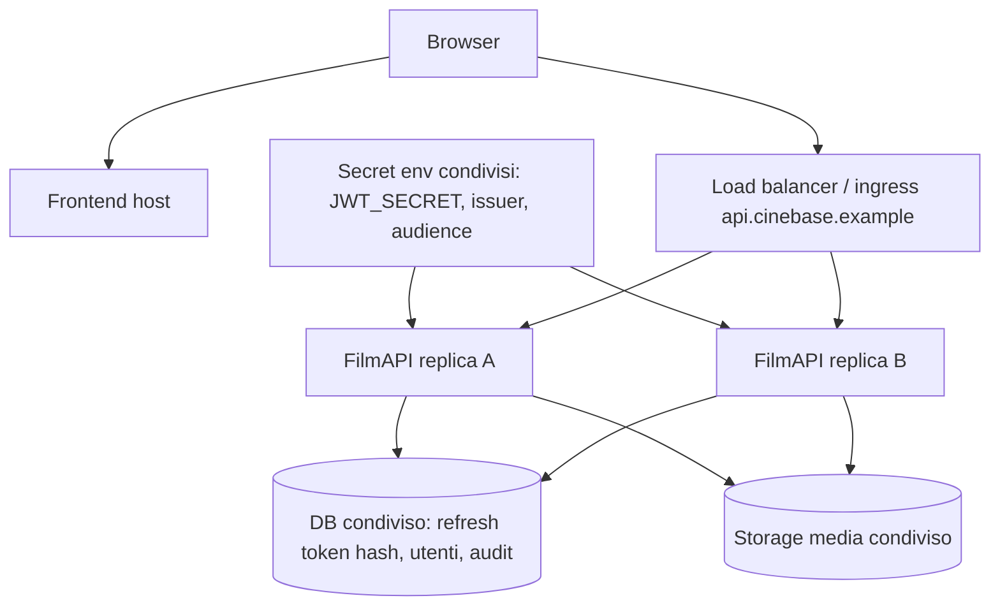
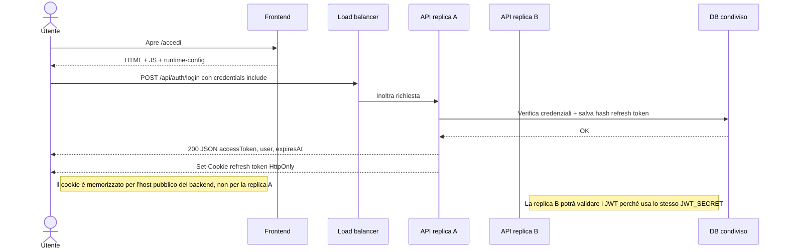
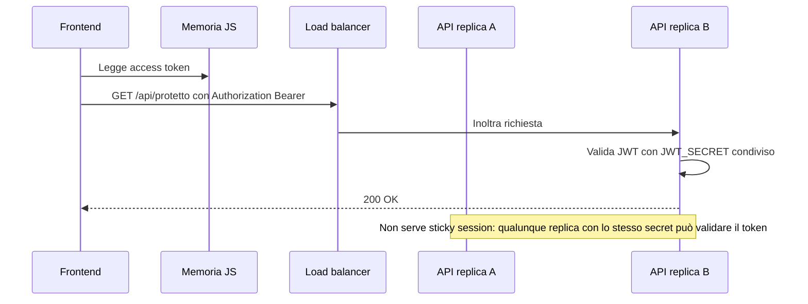
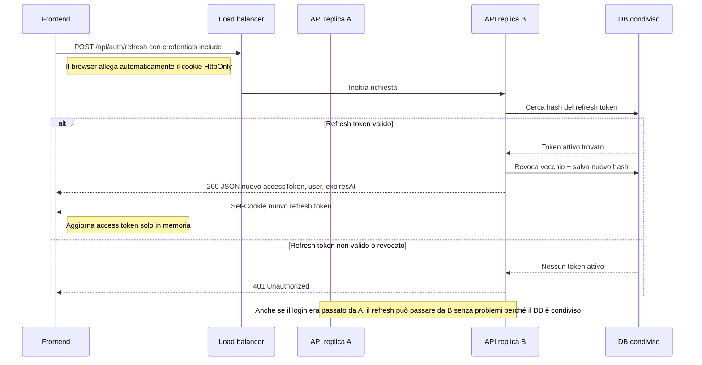
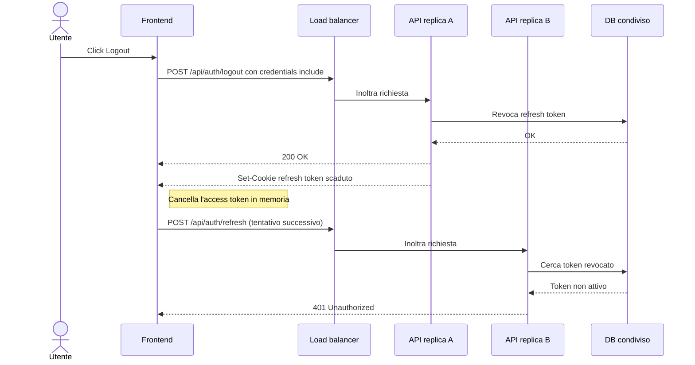
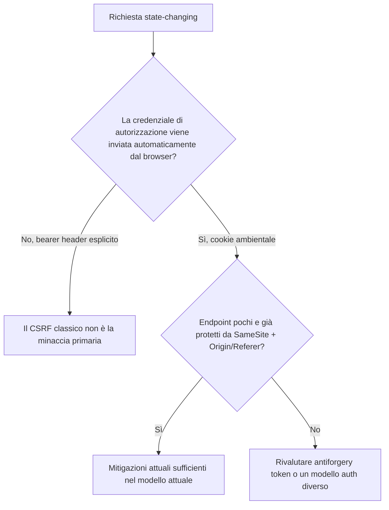

# Tutorial: Auth multi-container, refresh cookie HttpOnly e antiforgery in CineBase

Autore: OpenCode
Data: 2026-05-28
Stato: **Documento di supporto**

---

## 1. Scopo

Questo tutorial chiarisce in modo operativo quattro punti che diventano critici quando CineBase passa da backend singolo a backend con più repliche:

- perché il modello auth attuale non richiede `Data Protection` condivisa;
- perché non richiede `session affinity`;
- come funzionano login, chiamata API, refresh e logout in uno scenario a 2 repliche backend;
- perché oggi CineBase non usa una pipeline antiforgery globale e in quali casi avrebbe senso introdurla.

Il focus è sul modello auth reale oggi presente nel repository, non su una possibile evoluzione futura cookie-only o BFF.

---

## 2. Modello auth reale di CineBase

Il comportamento attuale è questo:

- l'`access token` è un JWT firmato con `JWT_SECRET`;
- il `refresh token` è una stringa random raw, non un cookie ASP.NET cifrato dal framework;
- nel database viene salvato solo l'hash del refresh token;
- il browser riceve il refresh token tramite cookie `HttpOnly` su `/api/auth`;
- il frontend conserva l'access token solo in memoria JavaScript;
- le API business usano `Authorization: Bearer ...`.

Nota importante: il contratto browser reale ormai è cookie-first, ma backend e frontend mantengono ancora un fallback legacy di migrazione in cui `refresh` e `logout` possono leggere `refreshToken` anche dal body JSON se il cookie non è presente. Questo fallback non cambia la conclusione architetturale su multi-replica, `Data Protection` o `session affinity`.

## 2.1 Ancoraggio al codice reale

| Area | File | Evidenza |
| --- | --- | --- |
| Secret JWT | `backend/FilmAPI/Services/JwtAuthSettings.cs` | `JWT_SECRET` è obbligatorio e condiviso via env tra repliche. |
| Firma access token | `backend/FilmAPI/Services/AuthService.cs` | `GenerateAccessToken(...)` firma il JWT con `JWT_SECRET`. |
| Refresh token hashato | `backend/FilmAPI/Services/AuthService.cs`, `backend/FilmAPI/Services/RefreshTokenProtector.cs` | Il raw refresh token viene hashato e persistito nel DB. |
| Refresh token non nel body JSON | `backend/FilmAPI/DTO/AuthDTO.cs` | `AuthResponseDTO.RefreshToken` ha `[JsonIgnore]`. |
| Cookie refresh | `backend/FilmAPI/Services/AuthCookieService.cs` | Cookie `HttpOnly`, host-only, `SameSite=Strict`, `Path=/api/auth`, `Secure` fuori da `Development`. |
| Guard CSRF leggero | `backend/FilmAPI/Services/AuthRequestGuard.cs` | `refresh` e `logout` verificano `Origin` o `Referer` allowlist. |
| Surface cookie-based | `backend/FilmAPI/Endpoints/AuthEndpoints.cs` | `login`, `refresh`, `logout`, `external/exchange` usano il cookie refresh. |
| `credentials: include` limitato | `frontend/CineBase.Web/wwwroot/js/api.js` | Il frontend lo applica solo agli endpoint auth cookie-based necessari. |
| Test del contratto | `tests/backend/Integration/AuthLifecycleSmokeTests.cs` | Copertura su rotation, logout, assenza di leak nel body e guard `Origin/Referer`. |

---

## 3. Che cosa vede davvero il browser con due repliche backend

Se il backend scala orizzontalmente, il browser non vede le singole repliche.

Per esempio:

- frontend pubblico: `https://app.cinebase.example`
- backend pubblico: `https://api.cinebase.example`
- repliche reali: `api-a` e `api-b`

Il browser vede solo l'origine pubblica `https://api.cinebase.example`.

Quindi:

- il cookie refresh viene memorizzato per l'host pubblico del backend;
- il load balancer decide a quale replica inoltrare ogni richiesta;
- ogni replica deve poter validare JWT e refresh token in autonomia, senza affidarsi a memoria locale del nodo precedente.

### 3.1 Diagramma architetturale

---

## 4. Che cosa va condiviso davvero tra repliche

| Componente | Va condiviso? | Perché |
| --- | --- | --- |
| `JWT_SECRET` | Sì | Tutte le repliche devono validare gli stessi JWT. |
| `JWT_ISSUER` / `JWT_AUDIENCE` | Sì | La validazione JWT deve restare coerente su tutte le repliche. |
| Database applicativo | Sì | Gli hash dei refresh token e la loro revoca vivono nel DB. |
| Storage media | Sì | Se il backend serve `/media/*`, ogni replica deve vedere gli stessi file. |
| CORS / URL pubblici | Sì | Tutte le repliche devono esporre la stessa semantica browser-facing. |
| Access token in memoria browser | No | Vive nel runtime JS del browser, non nel backend. |
| Refresh token raw nel browser | No | Vive nel cookie del browser, non in memoria replica. |
| Sessione ASP.NET in-process | No | Il modello auth attuale non la usa. |
| Chiavi `Data Protection` | No, non per il flusso auth attuale | Non stiamo proteggendo cookie auth ASP.NET o antiforgery token di framework. |

---

## 5. Perché `Data Protection` condivisa non è richiesta qui

È utile separare nettamente due famiglie di meccanismi.

### 5.1 Caso A - Cookie o token protetti dal framework ASP.NET Core

Qui il framework cifra o firma lui stesso dati come:

- cookie auth ASP.NET;
- session cookie;
- token antiforgery del framework;
- payload protetti tramite `IDataProtector`.

In questo caso, in multi-replica, le chiavi `Data Protection` condivise diventano importanti.

### 5.2 Caso B - JWT applicativi + refresh token random hashati nel DB

Questo è il caso di CineBase oggi:

- l'access token è un JWT firmato con `JWT_SECRET`;
- il refresh token è una stringa random raw;
- nel DB viene salvato solo il suo hash;
- il cookie contiene il raw token, non un payload cifrato da ASP.NET Core.

Quindi una replica valida il token perché:

- per il JWT usa lo stesso `JWT_SECRET` condiviso;
- per il refresh legge il raw token dal cookie, ne calcola l'hash e lo cerca nel DB condiviso.

### 5.3 Tabella di confronto

| Meccanismo | Usa `Data Protection`? | Richiede chiavi condivise tra repliche? |
| --- | --- | --- |
| JWT access token CineBase | No | No, ma richiede lo stesso `JWT_SECRET` |
| Refresh cookie raw + hash DB | No | No, ma richiede DB condiviso |
| Cookie auth ASP.NET | Sì | Sì |
| Token antiforgery ASP.NET | Tipicamente sì | Sì |

### 5.4 Conseguenza pratica

Se una replica ha un `JWT_SECRET` diverso dalle altre:

- i JWT firmati da una replica non vengono validati dall'altra;
- le richieste API protette falliscono a intermittenza;
- il problema è di configurazione dei secret delle repliche, non di `Data Protection`.

---

## 6. Perché la `session affinity` non è richiesta

La `session affinity` serve quando il nodo A possiede stato locale necessario e il nodo B non lo possiede.

Nel modello attuale di CineBase:

- la chiamata API protetta usa solo il bearer token e il secret condiviso;
- il refresh usa il cookie browser e il DB condiviso;
- il logout usa il cookie browser e il DB condiviso;
- nessuna parte del flusso dipende da una sessione auth in memoria della replica che ha gestito il login precedente.

Quindi qualunque replica può gestire:

- la richiesta business autenticata;
- il refresh;
- il logout.

La `session affinity` qui non è un requisito di correttezza.

Può solo mascherare temporaneamente problemi sbagliati, per esempio:

- repliche con `JWT_SECRET` diversi;
- repliche che non usano lo stesso DB;
- repliche che non vedono lo stesso storage media.

---

## 7. Flussi request-by-request in scenario a 2 repliche

## 7.1 Login

Sequenza concreta:

1. Il browser carica `/accedi` dal frontend.
2. Il frontend restituisce HTML, JS e `runtime-config.js`.
3. L'utente invia email e password.
4. Il browser chiama `POST /api/auth/login` con `credentials: 'include'`.
5. Il load balancer inoltra la richiesta, per esempio, a `api-a`.
6. `api-a` valida le credenziali sul DB.
7. `api-a` genera:
   - un access token JWT firmato con il `JWT_SECRET` condiviso;
   - un refresh token raw random;
   - la riga DB con hash del refresh token.
8. `api-a` restituisce:
   - body JSON con `accessToken`, `user`, `expiresAt`;
   - `Set-Cookie` del refresh token `HttpOnly`.
9. Il browser salva il cookie per l'host pubblico `api.cinebase.example` e il frontend conserva l'access token solo in memoria JS.

## 7.2 Chiamata API protetta

Sequenza concreta:

1. Il frontend legge l'access token dalla memoria JS.
2. Il browser chiama una API business protetta con `Authorization: Bearer ...`.
3. Il load balancer può inoltrare la richiesta a una replica diversa, per esempio `api-b`.
4. `api-b` valida il JWT usando lo stesso `JWT_SECRET` condiviso.
5. Se il token è valido, la richiesta prosegue normalmente.

Qui il refresh cookie non serve.

## 7.3 Refresh

Sequenza concreta:

1. L'access token in memoria è scaduto oppure la pagina è stata ricaricata e la memoria è vuota.
2. Il frontend chiama `POST /api/auth/refresh` con `credentials: 'include'`.
3. Il browser allega automaticamente il cookie refresh all'host pubblico del backend.
4. Il load balancer inoltra la richiesta, per esempio, a `api-b`.
5. `api-b` legge il raw refresh token dal cookie.
6. `api-b` calcola l'hash e cerca il token nel DB condiviso.
7. Se il token è attivo:
   - revoca il vecchio record;
   - genera un nuovo refresh token raw;
   - salva nel DB il nuovo hash;
   - genera un nuovo access token JWT.
8. `api-b` restituisce:
   - body JSON con il nuovo access token;
   - `Set-Cookie` con il refresh token ruotato.
9. Il browser sostituisce il cookie e il frontend aggiorna l'access token in memoria.

## 7.4 Logout

Sequenza concreta:

1. Il frontend chiama `POST /api/auth/logout` con `credentials: 'include'`.
2. Il browser allega automaticamente il cookie refresh.
3. Il load balancer inoltra la richiesta, per esempio, a `api-a`.
4. `api-a` legge il cookie, cerca il token nel DB condiviso e lo revoca.
5. `api-a` restituisce un `Set-Cookie` scaduto per cancellare il refresh cookie nel browser.
6. Il frontend cancella l'access token dalla memoria.
7. Se subito dopo il browser prova un refresh e viene servito da `api-b`, il refresh fallisce perché il token è già revocato nel DB.

## 7.5 Tabella riassuntiva

| Flusso | Credenziale principale | Stato condiviso richiesto | Serve session affinity? | Serve `Data Protection`? |
| --- | --- | --- | --- | --- |
| Login | password + risposta `Set-Cookie` | DB + `JWT_SECRET` condiviso | No | No |
| API business protetta | `Authorization: Bearer` | `JWT_SECRET` condiviso | No | No |
| Refresh | cookie `HttpOnly` + lookup DB | DB + `JWT_SECRET` condiviso | No | No |
| Logout | cookie `HttpOnly` + revoca DB | DB condiviso | No | No |

---

## 8. Perché oggi CineBase non usa antiforgery

Nel codice attuale non esiste una pipeline globale antiforgery:

- non ci sono `AddAntiforgery()` e `UseAntiforgery()`;
- l'unico `.DisableAntiforgery()` presente è su `POST /media/covers`;
- quel caso è un endpoint backoffice con bearer token, non il cuore del modello auth cookie-based.

La ragione architetturale è questa:

- le API business protette usano `Authorization: Bearer ...`;
- il browser non allega automaticamente il bearer token come fa con i cookie;
- quindi il CSRF classico non è la minaccia primaria sulle API business;
- il refresh cookie-based è confinato a pochi endpoint auth, non all'intera superficie applicativa.

### 8.1 Tabella di lettura della superficie CSRF

| Endpoint / famiglia | Come si autorizza davvero | CSRF classico rilevante? | Mitigazione principale oggi |
| --- | --- | --- | --- |
| `/api/auth/login` | credenziali utente esplicite nel body | Basso | HTTPS, validazione credenziali, cookie emesso solo in risposta |
| `/api/auth/external/exchange` | exchange code monouso esplicito | Basso | exchange code monouso + flow provider |
| `/api/auth/refresh` | refresh cookie inviato automaticamente | Sì | `SameSite=Strict`, `Path=/api/auth`, host-only, `Origin/Referer` allowlist |
| `/api/auth/logout` | refresh cookie inviato automaticamente | Sì | `SameSite=Strict`, `Path=/api/auth`, host-only, `Origin/Referer` allowlist |
| API business protette | bearer token in header `Authorization` | Molto più basso | bearer esplicito, access token in memoria, niente cookie auth generalizzato |

### 8.2 Diagramma decisionale

### 8.3 Sintesi pratica

Oggi non usiamo antiforgery perché:

- non siamo in una classica app MVC/Razor autenticata interamente via cookie;
- il frontend è `API-first` e chiama un backend separato;
- il cookie auth non governa tutta la superficie applicativa, ma soprattutto `refresh` e `logout`;
- su quei pochi endpoint la combinazione `SameSite=Strict` + `HttpOnly` + `Path` ristretto + controllo `Origin/Referer` è già coerente con la topologia approvata.

---

## 9. Quando antiforgery e `Data Protection` diventerebbero sensati

L'antiforgery diventerebbe molto più giustificato se CineBase evolvesse verso uno di questi scenari:

- molte più endpoint state-changing autorizzate da cookie ambientali;
- frontend same-origin/BFF che usa cookie auth per quasi tutte le API;
- form server-rendered o AJAX same-origin tipici di MVC/Razor Pages;
- necessità di allentare `SameSite` o di accettare topologie più deboli rispetto a quelle oggi approvate;
- uso reale di token antiforgery emessi e verificati direttamente dal framework ASP.NET Core.

In quel caso avrebbe senso introdurre un vero doppio meccanismo:

- cookie/token del framework protetti via `Data Protection`;
- request token esplicito in header o form field.

Ed è proprio in quel caso che chiavi `Data Protection` condivise tra repliche cominciano a diventare importanti.

---

## 10. Checklist operativa per deploy multi-container del backend

1. Tutte le repliche devono ricevere lo stesso `JWT_SECRET`.
2. Tutte le repliche devono usare lo stesso `JWT_ISSUER` e `JWT_AUDIENCE`.
3. Tutte le repliche devono puntare allo stesso DB condiviso.
4. Se il backend serve i media, tutte le repliche devono vedere lo stesso storage.
5. `FRONTEND_PUBLIC_BASE_URL` e `CORS_ALLOWED_ORIGINS` devono essere coerenti su tutte le repliche.
6. Il browser deve vedere HTTPS reale sul backend pubblico per usare correttamente il cookie `Secure` fuori da `Development`.
7. Non introdurre `session affinity` come toppa a una cattiva configurazione dei secret o del DB.
8. Rivalutare antiforgery e `Data Protection` solo se il modello auth diventa molto più cookie-centrico.

---

## 11. Conclusione

Nel modello auth attuale di CineBase:

- il problema corretto da risolvere in multi-container è la condivisione di secret applicativi e stato persistente reale;
- non la condivisione di sessione in memoria;
- non la `session affinity`;
- non `Data Protection`, finché il progetto resta su JWT bearer + refresh token random hashati nel DB.

Allo stesso modo, l'antiforgery non è oggi il meccanismo principale perché la superficie business protetta usa bearer token esplicito e la parte cookie-based è piccola e già mitigata in modo mirato.

---

## 12. Riferimenti

- `docs/project/dev_iteration/6/FASE0_AnalisiArchitetturaleEChiusuraDecisioni.md`
- `docs/project/dev_iteration/5.3/TutorialHardeningAutenticazioneApiFirst.md`
- `backend/FilmAPI/Services/JwtAuthSettings.cs`
- `backend/FilmAPI/Services/AuthService.cs`
- `backend/FilmAPI/Services/RefreshTokenProtector.cs`
- `backend/FilmAPI/Services/AuthCookieService.cs`
- `backend/FilmAPI/Services/AuthRequestGuard.cs`
- `backend/FilmAPI/Endpoints/AuthEndpoints.cs`
- `backend/FilmAPI/DTO/AuthDTO.cs`
- `frontend/CineBase.Web/wwwroot/js/api.js`
- `tests/backend/Integration/AuthLifecycleSmokeTests.cs`
