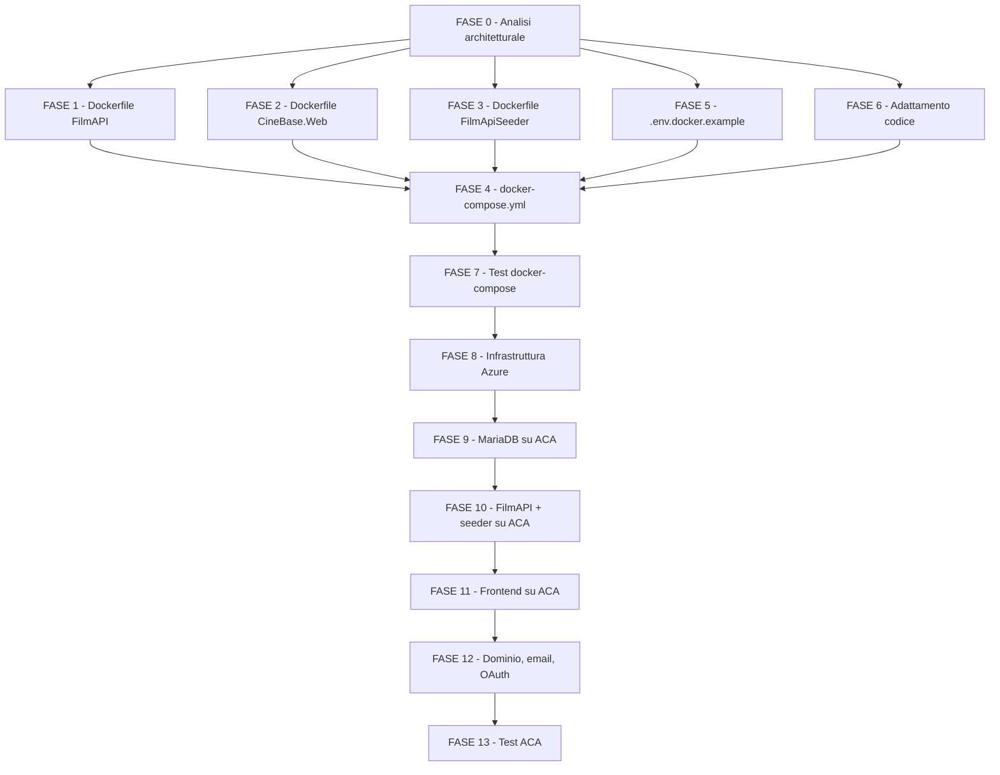

# Piano di Lavoro - Iterazione 6

Autore: Antigravity con Opus 4.6 Thinking

## Obiettivo

Portare l'applicazione CineBase da un setup di sviluppo locale con database containerizzato e backend/frontend eseguiti direttamente sulla macchina a:

1. **Una versione completamente containerizzata** gestita tramite `docker-compose`, in cui un utente possa clonare il repository, configurare un file `.env.docker`, eseguire `docker-compose up -d` e ottenere un'applicazione completamente funzionante con account admin, servizi email, autenticazione esterna, film del seeder e programmazione già configurati — senza dipendere dall'istanza locale di MariaDB né da dati preesistenti.

2. **Il deployment dell'applicazione su Azure Container Apps (ACA)**, seguendo un approccio analogo alla guida [EducationalGames su ACA](https://github.com/GreppiDev/Info5IA2526WebDev/blob/main/azure/containers/examples/educationalgames/aca/index.md), ma adattato all'architettura dual-container `direct-backend` di CineBase (backend FilmAPI separato dal frontend CineBase.Web).

## Architettura di Riferimento

L'applicazione CineBase ha un'architettura a 4 componenti:

| Componente | Progetto | Ruolo | Stack | Porta locale |
| --- | --- | --- | --- | --- |
| **Backend API** | `backend/FilmAPI` | Serve REST API sotto `/api`, media statici sotto `/media`, webhook Stripe, callback OAuth, DataSeeder al bootstrap | .NET 10 Minimal API + MariaDB + Pomelo EF Core | 5000 |
| **Frontend Web** | `frontend/CineBase.Web` | Serve file HTML/JS/CSS statici con clean URLs e security headers (CSP, X-Frame-Options, ecc.) | .NET 10 ASP.NET Core + Tailwind CSS build-time | 5001 |
| **Seeder** | `backend/scripts/FilmApiSeeder` | Popola il database con dati TMDB (50+ film, cinema, sale, show, categorie, registi) | .NET 10 console app (project reference a FilmAPI) | — |
| **Database** | MariaDB 11.4 (container) | Database relazionale | MariaDB | 3306 |

Il **browser** chiama direttamente FilmAPI per le API (architettura `direct-backend` con CORS e credenziali) e CineBase.Web per le pagine HTML. La configurazione dell'URL del backend nel frontend avviene tramite `runtime-config.js` che espone `window.CineBaseRuntimeConfig.apiBaseUrl` e `window.CineBaseRuntimeConfig.mediaBaseUrl`.

## Decisioni Guida della 6

- Il database MariaDB è già containerizzato in sviluppo; l'obiettivo è portare backend, frontend e seeder in container con Dockerfile multistage.
- docker-compose deve simulare uno scenario **clone-and-run**: database vuoto, migrazioni applicate automaticamente, DataSeeder crea admin/categorie/platform settings, FilmApiSeeder popola film e programmazione.
- **Non si monta il volume dati dell'istanza locale esistente**: il docker-compose parte da un volume Docker named pulito.
- I Dockerfile usano build multistage (SDK .NET 10.0 → ASP.NET 10.0) per minimizzare le dimensioni.
- Il frontend richiede anche una fase npm (`npm run build:assets` per Tailwind CSS, Font Awesome, Inter). Se gli asset build-time sono committati in `wwwroot/`, si può evitare npm nel Dockerfile, ma per robustezza è preferibile includerlo.
- L'URL del backend per il frontend viene iniettato sovrascrivendo `runtime-config.js` al startup del container frontend, leggendo una variabile d'ambiente.
- Per ACA: backend con ingress esterno HTTPS, frontend con ingress esterno HTTPS, MariaDB con ingress interno, Azure Files per persistenza DB e Data Protection Keys.
- Il seeder viene eseguito come container one-shot in docker-compose e come Container App Job su ACA.

## Stato Avanzamento Fasi

| Fase | Stato | Note |
| --- | --- | --- |
| FASE 0 - Analisi architetturale e decisioni containerizzazione | **Da avviare** | Analisi, decisioni su porte, volumi, healthcheck, strategia seeder, gestione `runtime-config.js`, Data Protection Keys |
| FASE 1 - Dockerfile FilmAPI (backend multistage) | **Da avviare** | Dockerfile multistage con healthcheck, Data Protection esternalizzabile, `.dockerignore` |
| FASE 2 - Dockerfile CineBase.Web (frontend multistage) | **Da avviare** | Dockerfile multistage con npm build assets, entrypoint che inietta `runtime-config.js` |
| FASE 3 - Dockerfile FilmApiSeeder (container one-shot) | **Da avviare** | Dockerfile con context di build che include FilmAPI, retry connessione DB |
| FASE 4 - docker-compose.yml e orchestrazione completa | **Da avviare** | 4 servizi orchestrati: mariadb → filmapi → cinebase-web + seeder |
| FASE 5 - File `.env.docker.example` e configurazione ambiente | **Da avviare** | Template completo di tutte le variabili, documentazione |
| FASE 6 - Adattamento codice per ambiente containerizzato | **Da avviare** | Modifiche a `Program.cs` backend/frontend per supporto container |
| FASE 7 - Test e verifica docker-compose (simulazione clone) | **Da avviare** | Test end-to-end del flusso clone → up → verifica funzionamento |
| FASE 8 - Guida deployment ACA: infrastruttura Azure | **Da avviare** | ACR, ACA Environment, Log Analytics, Azure Files, Storage Account |
| FASE 9 - Deployment ACA: MariaDB con Azure Files | **Da avviare** | MariaDB container app con ingress interno e storage persistente |
| FASE 10 - Deployment ACA: FilmAPI backend e seeder job | **Da avviare** | Backend con ingress esterno, Data Protection Keys su Azure Files, seeder come ACA Job |
| FASE 11 - Deployment ACA: CineBase.Web frontend | **Da avviare** | Frontend con ingress esterno, `runtime-config.js` che punta al backend ACA |
| FASE 12 - Configurazione dominio, email, OAuth e Stripe su ACA | **Da avviare** | Dominio personalizzato, certificati managed, redirect URI OAuth, webhook Stripe |
| FASE 13 - Test e verifica deployment ACA | **Da avviare** | Test end-to-end su ACA, scalabilità, resilienza, monitoraggio |

---

## FASE 0 - Analisi architetturale e decisioni containerizzazione

### Scopo

Fissare tutte le decisioni architetturali prima di scrivere codice o Dockerfile, garantendo coerenza con l'architettura esistente di CineBase e con le best practices Docker per .NET.

### Contesto

CineBase usa un'architettura `direct-backend`: il browser chiama direttamente il backend FilmAPI (via CORS con credenziali) e il frontend CineBase.Web per le pagine statiche. Il backend carica la configurazione da variabili d'ambiente (con fallback su file `.env` tramite `DotNetEnv`). Il frontend JS usa `window.CineBaseRuntimeConfig` (definito in `runtime-config.js`) per conoscere l'URL del backend.

### Attività

1. **Porte container**: decidere le porte interne dei container. Opzioni:
   - Convenzione .NET container: porta `8080` (default di ASP.NET in container senza `ASPNETCORE_URLS`).
   - Porte legacy: `5000` (backend), `5001` (frontend).
   - **Decisione proposta**: usare `8080` internamente ai container (convenzione .NET 8+), mappate su `5000:8080` e `5001:8080` in docker-compose per compatibilità con lo sviluppo locale.

2. **Immagini base**: confermare SDK e runtime.
   - Build stage: `mcr.microsoft.com/dotnet/sdk:10.0` (include `dotnet restore`, `dotnet publish`).
   - Runtime stage: `mcr.microsoft.com/dotnet/aspnet:10.0` (minimal, senza SDK).
   - Per il frontend: aggiungere Node.js al build stage per `npm run build:assets`.

3. **Strategia healthcheck**:
   - `mariadb`: `mysqladmin ping -h localhost` oppure `healthcheck` integrato nell'immagine MariaDB.
   - `filmapi`: endpoint dedicato `/api/health` (da creare) che verifica la connessione al DB.
   - `cinebase-web`: `curl` o `wget` su `/` che restituisce 200.
   - `seeder`: nessun healthcheck (container one-shot).

4. **Ordine di avvio e dipendenze**:
   - `mariadb` → `service_healthy` (healthcheck mysqladmin).
   - `filmapi` → `depends_on: mariadb: condition: service_healthy`. Al primo avvio, `DataSeeder.SeedAsync()` (in `Program.cs`) crea admin, categorie, platform settings e applica backfill. Le migrazioni EF **non** sono applicate automaticamente nel `Program.cs` del backend. Verificare se aggiungere `db.Database.MigrateAsync()` al bootstrap o se il seeder lo fa per primo.
   - `seeder` → `depends_on: filmapi: condition: service_healthy`. Il seeder chiama `dbContext.Database.MigrateAsync()` nel suo `Program.cs` (riga 47), quindi può applicare le migrazioni. Tuttavia, il backend deve essere avviato prima del seeder perché il `DataSeeder` del backend crea l'admin e i dati base che il seeder assume esistano.
   - `cinebase-web` → `depends_on: filmapi: condition: service_started`.

5. **Gestione `.env` in container**: il codice di `FilmAPI/Program.cs` cerca un file `.env` in tre percorsi e cade nel fallback `Env.Load()` se nessuno esiste. In container le variabili d'ambiente vengono iniettate dal runtime Docker. Verificare che `DotNetEnv` non crashi se non trova alcun file — il codice attuale chiama `Env.Load()` nel ramo `else`, che potrebbe lanciare un'eccezione se non esiste un `.env` nel CWD.

6. **Strategia `runtime-config.js`**: in container, l'URL del backend cambia (`http://filmapi:8080` per chiamate server-side, ma il **browser** deve raggiungere il backend su `http://localhost:5000` in locale o `https://backend.example.com` in ACA). Opzioni:
   - **Opzione A (proposta)**: modificare il `Program.cs` del frontend per servire `runtime-config.js` come endpoint dinamico che legge `API_BASE_URL` e `MEDIA_BASE_URL` da variabili d'ambiente e genera il JS al volo.
   - Opzione B: sovrascrivere il file `runtime-config.js` all'avvio del container tramite un entrypoint script.
   - Opzione C: mantenere il file statico e usare valori relativi (`/api`, `/media`) con un reverse proxy.

7. **Volume per dati MariaDB**: volume Docker named `mariadb-data` (non bind-mount), per simulare uno scenario pulito.

8. **Volume per media uploads**: il backend scrive i file cover caricati in `wwwroot/media/covers/`. In container, questi file sono nel filesystem del container e si perdono al restart. Decidere se montare un volume Docker named `media-uploads` su `/app/wwwroot/media/covers/`.

9. **Data Protection Keys**: per supportare lo scaling orizzontale su ACA e la persistenza dei cookie di autenticazione tra restart, le chiavi di Data Protection devono essere esternalizzate. Il backend attualmente non configura la persistenza delle chiavi; in container di default vengono generate in memoria e perse al restart. Aggiungere supporto per `PersistKeysToFileSystem` quando una variabile d'ambiente `DATA_PROTECTION_KEYS_PATH` è impostata.

10. **Seeder in docker-compose**: il `FilmApiSeeder` è un container one-shot con `restart: "no"`. Necessita del token TMDB per funzionare. Se il token non è fornito, il seeder deve fallire con un messaggio chiaro.

### Criteri di accettazione

- Esiste un documento `docs/project/dev_iteration/6/FASE0_AnalisiArchitetturaleContainerizzazione.md` che elenca tutte le decisioni con motivazioni.
- Le porte, i volumi, gli healthcheck, l'ordine di avvio e la strategia `runtime-config.js` sono documentati.
- Il ruolo di ogni container è chiaro e non ci sono ambiguità sull'ordine di inizializzazione.
- La strategia di gestione dei segreti è definita per entrambi gli ambienti (docker-compose locale e ACA).

### File coinvolti

| File | Tipo | Descrizione |
| --- | --- | --- |
| `docs/project/dev_iteration/6/FASE0_AnalisiArchitetturaleContainerizzazione.md` | **Nuovo** | Documento di analisi architetturale e decisioni |

---

## FASE 1 - Dockerfile FilmAPI (backend multistage)

### Scopo

Creare un Dockerfile multistage per il backend FilmAPI che produca un'immagine ottimizzata, sicura e pronta per l'esecuzione in container, con supporto per healthcheck e Data Protection Keys esternalizzate.

### Contesto

Il backend FilmAPI è un progetto `Microsoft.NET.Sdk.Web` con target `net10.0`. Ha dipendenze su numerosi pacchetti NuGet (Pomelo EF Core, QuestPDF, MailKit, Stripe, ZXing, ecc.) e contiene asset statici in `wwwroot/` (immagini di default per cover, template media). Il seeder ha una `ProjectReference` verso FilmAPI, ma i Dockerfile sono separati.

### Attività

1. **Creare `backend/FilmAPI/Dockerfile`** nella root `backend/FilmAPI/` con context di build = root del repository (per accedere alla `.slnx` se necessario):
   - **Build stage** (`FROM mcr.microsoft.com/dotnet/sdk:10.0 AS build`):
     - `WORKDIR /src`
     - Copiare `backend/FilmAPI/FilmAPI.csproj` → `dotnet restore`
     - Copiare tutto il codice sorgente del backend
     - `dotnet publish backend/FilmAPI/FilmAPI.csproj -c Release -o /app/publish --no-restore`
   - **Runtime stage** (`FROM mcr.microsoft.com/dotnet/aspnet:10.0 AS final`):
     - `WORKDIR /app`
     - Copiare i file pubblicati da `/app/publish`
     - `EXPOSE 8080`
     - `ENV ASPNETCORE_URLS=http://+:8080`
     - `ENV ASPNETCORE_ENVIRONMENT=Production`
     - `HEALTHCHECK --interval=30s --timeout=5s --start-period=10s --retries=3 CMD wget --no-verbose --tries=1 --spider http://localhost:8080/api/health || exit 1`
     - `ENTRYPOINT ["dotnet", "FilmAPI.dll"]`
   - Usare l'utente `$APP_UID` (non-root) per la sicurezza.

2. **Creare `backend/.dockerignore`** per escludere:
   - `**/bin/`, `**/obj/`
   - `.env`, `.env.*` (segreti)
   - `**/node_modules/`
   - `.git/`, `.vs/`, `.vscode/`
   - `**/test-results/`, `**/TestResults/`
   - File `.lscache`

3. **Endpoint healthcheck `/api/health`**: aggiungere un endpoint minimo nel `Program.cs` del backend che verifica la connessione al database. Usare `builder.Services.AddHealthChecks().AddDbContextCheck<FilmDbContext>()` e `app.MapHealthChecks("/api/health")`. Se `Microsoft.Extensions.Diagnostics.HealthChecks.EntityFrameworkCore` non è già presente tra i pacchetti, aggiungerlo.

4. **Supporto Data Protection Keys esternalizzate**: nel `Program.cs` del backend, aggiungere:
   ```csharp
   var dpKeysPath = Environment.GetEnvironmentVariable("DATA_PROTECTION_KEYS_PATH");
   if (!string.IsNullOrWhiteSpace(dpKeysPath))
   {
       var dpDir = new DirectoryInfo(dpKeysPath);
       if (!dpDir.Exists) dpDir.Create();
       builder.Services.AddDataProtection()
           .PersistKeysToFileSystem(dpDir);
   }
   ```
   Questo permette in ACA di montare un Azure File Share e in docker-compose di usare un volume Docker.

5. **Robustezza caricamento `.env`**: verificare che `DotNetEnv.Env.Load()` (nel ramo `else` del `Program.cs`) non lanci eccezione se non esiste un file `.env` nella directory corrente. Se lancia, proteggere con try/catch o verificare l'esistenza prima del caricamento.

6. **Testare la build**: `docker build -t cinebase-filmapi:latest -f backend/FilmAPI/Dockerfile .` dalla root del repository.

### Criteri di accettazione

- `docker build -t cinebase-filmapi:latest -f backend/FilmAPI/Dockerfile .` completa con successo dalla root del repository.
- L'immagine runtime ha dimensione sensibilmente inferiore a quella del build stage (verificare con `docker images`).
- Il container si avvia e, connesso a MariaDB, risponde su `http://localhost:8080/api/health` con status 200 (o `Healthy`).
- L'endpoint `/api/health` restituisce `Unhealthy` se il database non è raggiungibile.
- Non ci sono segreti hardcodati nell'immagine (verificare con `docker history`).
- Il container gira con utente non-root.
- `HEALTHCHECK` Docker funziona e il container viene marcato come `healthy`.

### Test strutturati

| ID | Test | Risultato atteso |
| --- | --- | --- |
| D1-1 | `docker build -t cinebase-filmapi:latest -f backend/FilmAPI/Dockerfile .` | Build completata senza errori |
| D1-2 | `docker images cinebase-filmapi` — dimensione immagine | < 500 MB |
| D1-3 | Avvio container senza MariaDB → `/api/health` | Risposta `Unhealthy` o connessione rifiutata gestita senza crash |
| D1-4 | Avvio container con MariaDB → `/api/health` | Risposta `Healthy` (200 OK) |
| D1-5 | `docker inspect cinebase-filmapi` → User | Non-root |
| D1-6 | `docker history cinebase-filmapi` | Nessun segreto nei layer |

### File da creare/modificare

| File | Tipo | Descrizione |
| --- | --- | --- |
| `backend/FilmAPI/Dockerfile` | **Nuovo** | Dockerfile multistage per il backend |
| `backend/.dockerignore` | **Nuovo** | Esclude bin, obj, .env, node_modules, .git |
| `backend/FilmAPI/Program.cs` | **Modifica** | Aggiunta healthcheck endpoint e Data Protection Keys esternalizzate; protezione caricamento `.env` |
| `backend/FilmAPI/FilmAPI.csproj` | **Modifica** | Aggiunta pacchetto `Microsoft.Extensions.Diagnostics.HealthChecks.EntityFrameworkCore` (se necessario) |

---

## FASE 2 - Dockerfile CineBase.Web (frontend multistage)

### Scopo

Creare un Dockerfile multistage per il frontend CineBase.Web che compili gli asset Tailwind CSS, serva i file statici con clean URLs e security headers, e supporti l'iniezione dinamica dell'URL del backend via variabili d'ambiente.

### Contesto

Il frontend è un progetto ASP.NET Core minimale che serve file HTML statici con routing clean URL. Ha una dipendenza build-time su Node.js per la compilazione di Tailwind CSS (`npm run build:assets` che esegue `build:vendor` e `build:css`). Gli asset compilati (`wwwroot/css/tailwind.css`, `wwwroot/vendor/inter/`, `wwwroot/vendor/fontawesome/`) sono committati nel repository, ma per robustezza è meglio rigenerarli nel Dockerfile.

Il frontend JS legge `window.CineBaseRuntimeConfig` da `runtime-config.js` per conoscere `apiBaseUrl` e `mediaBaseUrl`. Attualmente il file ha hardcodato `http://localhost:5000/api` e `http://localhost:5000/media`. In container, questi URL devono essere configurabili.

### Attività

1. **Creare `frontend/CineBase.Web/Dockerfile`** con tre stage:
   - **Stage node** (`FROM node:22-alpine AS node-build`):
     - `WORKDIR /src/frontend/CineBase.Web`
     - Copiare `package.json` e `package-lock.json` → `npm ci`
     - Copiare `tailwind.config.cjs`, `tailwind.input.css`, `copy-static-assets.mjs`, e le directory `wwwroot/` necessarie
     - `npm run build:assets`
   - **Stage .NET build** (`FROM mcr.microsoft.com/dotnet/sdk:10.0 AS dotnet-build`):
     - `WORKDIR /src`
     - Copiare il `.csproj` → `dotnet restore`
     - Copiare il codice sorgente del frontend
     - Copiare gli asset compilati dalla stage node nel `wwwroot/`
     - `dotnet publish frontend/CineBase.Web/CineBase.Web.csproj -c Release -o /app/publish --no-restore`
   - **Stage runtime** (`FROM mcr.microsoft.com/dotnet/aspnet:10.0 AS final`):
     - `WORKDIR /app`
     - Installare `wget` o `curl` per l'healthcheck (l'immagine `aspnet` potrebbe non averli; alternativa: usare un healthcheck .NET interno).
     - Copiare i file pubblicati.
     - Copiare lo script di entrypoint `docker-entrypoint.sh` (vedi punto 3).
     - `EXPOSE 8080`
     - `ENV ASPNETCORE_URLS=http://+:8080`
     - `ENV ASPNETCORE_ENVIRONMENT=Production`
     - `HEALTHCHECK --interval=30s --timeout=5s --start-period=5s --retries=3 CMD wget --no-verbose --tries=1 --spider http://localhost:8080/ || exit 1`
     - `ENTRYPOINT ["/app/docker-entrypoint.sh"]`

2. **Creare `frontend/CineBase.Web/docker-entrypoint.sh`**: script bash che:
   - Legge le variabili d'ambiente `API_BASE_URL` e `MEDIA_BASE_URL`.
   - Se presenti, sovrascrive il file `wwwroot/js/runtime-config.js` con i valori corretti:
     ```bash
     if [ -n "$API_BASE_URL" ] || [ -n "$MEDIA_BASE_URL" ]; then
       API_URL="${API_BASE_URL:-http://localhost:5000/api}"
       MEDIA_URL="${MEDIA_BASE_URL:-http://localhost:5000/media}"
       DEPLOY_MODE="${DEPLOYMENT_MODE:-direct-backend}"
       cat > /app/wwwroot/js/runtime-config.js <<EOF
     window.CineBaseRuntimeConfig = window.CineBaseRuntimeConfig || {
       apiBaseUrl: '${API_URL}',
       mediaBaseUrl: '${MEDIA_URL}',
       deploymentMode: '${DEPLOY_MODE}'
     };
     // ... (IIFE di normalizzazione)
     EOF
     fi
     exec dotnet CineBase.Web.dll "$@"
     ```
   - **Alternativa più pulita**: invece di rigenerare l'intero file, usare `sed` per sostituire solo le righe con `apiBaseUrl` e `mediaBaseUrl`.
   - **Alternativa ancora più pulita (proposta)**: modificare il `Program.cs` del frontend per servire `/js/runtime-config.js` come endpoint dinamico che legge le env var e genera il JS al volo, con le stesse logiche di normalizzazione dell'IIFE originale. Questo evita lo script bash e funziona anche senza shell.

3. **Se si sceglie l'approccio `Program.cs` dinamico** (proposta):
   - Nel `Program.cs` del frontend, aggiungere un endpoint `MapGet("/js/runtime-config.js", ...)` che:
     - Legge `API_BASE_URL`, `MEDIA_BASE_URL`, `DEPLOYMENT_MODE` dall'ambiente.
     - Se non impostate, usa i default (`http://localhost:5000/api`, `http://localhost:5000/media`, `direct-backend`).
     - Restituisce il contenuto JavaScript completo (la variabile iniziale + l'IIFE di normalizzazione) con `Content-Type: application/javascript` e `Cache-Control: no-cache, no-store`.
   - Questo endpoint intercetterebbe le richieste prima di `UseStaticFiles()`, quindi il file statico non verrebbe servito.
   - **Attenzione**: il file `runtime-config.js` è anche referenziato dal frontend hosted (ASP.NET) nella CSP come script `'self'`. L'endpoint dinamico deve essere compatibile con la CSP corrente.

4. **Creare `frontend/.dockerignore`** per escludere:
   - `**/bin/`, `**/obj/`
   - `node_modules/`
   - `.env`
   - `test-results/`
   - `edge/` (artefatti di deploy edge/Vercel)

5. **Testare la build**: `docker build -t cinebase-web:latest -f frontend/CineBase.Web/Dockerfile .` dalla root del repository.

### Criteri di accettazione

- `docker build -t cinebase-web:latest -f frontend/CineBase.Web/Dockerfile .` completa con successo.
- Il container serve la home page su `http://localhost:8080/` con Tailwind CSS applicato (no errori 404 su asset).
- I clean URLs funzionano (`/programmazione`, `/film/1`, `/accedi`, ecc.).
- I security headers (CSP, X-Frame-Options, ecc.) sono presenti nelle risposte.
- `runtime-config.js` contiene l'URL del backend configurato via variabile d'ambiente.
- L'immagine finale ha dimensione < 300 MB.

### Test strutturati

| ID | Test | Risultato atteso |
| --- | --- | --- |
| D2-1 | `docker build -t cinebase-web:latest -f frontend/CineBase.Web/Dockerfile .` | Build completata senza errori |
| D2-2 | `docker images cinebase-web` — dimensione | < 300 MB |
| D2-3 | `curl http://localhost:8080/` | HTML della home page con `tailwind.css` linkato |
| D2-4 | `curl http://localhost:8080/programmazione` | HTML della pagina programmazione (clean URL) |
| D2-5 | `curl -I http://localhost:8080/` | Header `Content-Security-Policy`, `X-Frame-Options: DENY` presenti |
| D2-6 | `curl http://localhost:8080/js/runtime-config.js` | Contiene `apiBaseUrl` con valore dalla env var `API_BASE_URL` |
| D2-7 | Container con `API_BASE_URL=http://backend:8080/api` → `runtime-config.js` | `apiBaseUrl: 'http://backend:8080/api'` |

### File da creare/modificare

| File | Tipo | Descrizione |
| --- | --- | --- |
| `frontend/CineBase.Web/Dockerfile` | **Nuovo** | Dockerfile multistage (node + .NET build + runtime) |
| `frontend/.dockerignore` | **Nuovo** | Esclude bin, obj, node_modules, test-results |
| `frontend/CineBase.Web/docker-entrypoint.sh` | **Nuovo** (se approccio script) | Script di iniezione `runtime-config.js` |
| `frontend/CineBase.Web/Program.cs` | **Modifica** (se approccio endpoint dinamico) | Endpoint `/js/runtime-config.js` dinamico |

---

## FASE 3 - Dockerfile FilmApiSeeder (container one-shot)

### Scopo

Creare un Dockerfile per il seeder `FilmApiSeeder` progettato come container one-shot: si avvia, attende che il database sia raggiungibile, applica le migrazioni, popola il database con dati TMDB e termina.

### Contesto

Il seeder `FilmApiSeeder` è un progetto console .NET 10 con una `<ProjectReference>` verso `backend/FilmAPI/FilmAPI.csproj`. Usa direttamente il `FilmDbContext` (non chiama API HTTP) per:
- Applicare migrazioni EF (`dbContext.Database.MigrateAsync()`).
- Creare categorie.
- Cercare e inserire film, registi, cinema, sale, posti, show e listini prezzo da TMDB.
- Gestire opzioni `--reset-shows`, `--reset-all`, `--force`.

Il seeder cerca i file `.env` risalendo la gerarchia di directory a partire dalla root del repository (`FindRepositoryRoot()`). In container, questa logica non troverà il file `.env`, quindi le variabili d'ambiente dovranno essere iniettate dal runtime Docker.

### Attività

1. **Creare il Dockerfile** in `backend/scripts/FilmApiSeeder/Dockerfile` con context di build = root del repository:
   - **Build stage** (`FROM mcr.microsoft.com/dotnet/sdk:10.0 AS build`):
     - `WORKDIR /src`
     - Copiare `backend/FilmAPI/FilmAPI.csproj` → `dotnet restore` (dipendenza del seeder)
     - Copiare `backend/scripts/FilmApiSeeder/FilmApiSeeder.csproj` → `dotnet restore`
     - Copiare tutto il codice sorgente di entrambi i progetti
     - `dotnet publish backend/scripts/FilmApiSeeder/FilmApiSeeder.csproj -c Release -o /app/publish --no-restore`
   - **Runtime stage** (`FROM mcr.microsoft.com/dotnet/aspnet:10.0 AS final`):
     - **Nota**: il seeder usa EF Core per applicare migrazioni (`MigrateAsync`) ma la dll EF tools non è necessaria in runtime; il metodo `Database.MigrateAsync()` funziona con il runtime ASP.NET. Tuttavia, verificare che tutte le dipendenze (incluso QuestPDF che è referenziato transitivamente) siano soddisfatte dall'immagine `aspnet`.
     - Se necessario, usare `mcr.microsoft.com/dotnet/sdk:10.0` come runtime (più pesante ma sicuramente compatibile).
     - **Decisione proposta**: usare `aspnet:10.0` per mantenere l'immagine leggera; le migrazioni code-first funzionano con il runtime.
     - `WORKDIR /app`
     - Copiare i file pubblicati
     - Nessuna porta esposta (one-shot).
     - `ENTRYPOINT ["dotnet", "FilmApiSeeder.dll"]`
     - L'entrypoint accetta parametri (es. `--force --reset-all`).

2. **Resilienza alla connessione DB**: il seeder attualmente chiama `dbContext.Database.MigrateAsync()` subito dopo aver creato il `DbContext`. In docker-compose con `depends_on: filmapi: condition: service_healthy`, il database dovrebbe essere già raggiungibile quando il seeder parte. Tuttavia, è buona pratica aggiungere un retry loop sulla connessione iniziale. Verificare se il codice attuale gestisce già i retry o se va aggiunto un wrapper:
   ```csharp
   // Esempio di retry semplice (senza Polly)
   for (int attempt = 1; attempt <= 30; attempt++)
   {
       try
       {
           await dbContext.Database.CanConnectAsync(cancellationToken);
           break;
       }
       catch
       {
           Console.WriteLine($"Tentativo {attempt}/30: database non raggiungibile, attendo 2 secondi...");
           await Task.Delay(2000, cancellationToken);
       }
   }
   ```

3. **Gestione `FindRepositoryRoot()` in container**: il codice del seeder cerca la root del repository risalendo le directory. In container, questa logica fallirà. Verificare che il seeder gestisca il caso con un fallback sulle variabili d'ambiente di sistema (senza file `.env`). Se `LoadEnvFiles` fallisce silenziosamente, non serve modifica; se lancia, proteggere con try/catch.

4. **Docker-compose**: il seeder avrà `restart: "no"` e `profiles: ["init"]` opzionale (per permettere di rieseguirlo a richiesta senza che parta a ogni `docker-compose up`). Alternativa: nessun profilo, semplicemente one-shot con `restart: "no"`.

### Criteri di accettazione

- `docker build -t cinebase-seeder:latest -f backend/scripts/FilmApiSeeder/Dockerfile .` completa con successo.
- Il container si avvia, attende che MariaDB sia raggiungibile, applica le migrazioni, popola il database e termina con exit code 0.
- Dopo l'esecuzione del seeder, il database contiene: ≥50 film, ≥3 cinema, sale con posti, show programmati per i prossimi 28 giorni, categorie, registi.
- L'account admin creato dal `DataSeeder` di FilmAPI (eseguito al bootstrap del backend) è ancora presente e funzionante.
- Il seeder accetta i parametri `--force --reset-all` tramite `CMD`/args del container.

### Test strutturati

| ID | Test | Risultato atteso |
| --- | --- | --- |
| D3-1 | `docker build -t cinebase-seeder:latest -f backend/scripts/FilmApiSeeder/Dockerfile .` | Build completata |
| D3-2 | Esecuzione seeder con MariaDB vuoto e token TMDB valido | Exit code 0, log indica ≥50 film creati |
| D3-3 | Esecuzione seeder senza token TMDB | Exit code 1, messaggio chiaro su TMDB_BEARER_TOKEN mancante |
| D3-4 | Esecuzione seeder con MariaDB non raggiungibile (inizialmente) | Retry fino a connessione, poi seeding regolare |
| D3-5 | Verifica idempotenza: doppia esecuzione seeder | Seconda esecuzione non duplica dati |

### File da creare/modificare

| File | Tipo | Descrizione |
| --- | --- | --- |
| `backend/scripts/FilmApiSeeder/Dockerfile` | **Nuovo** | Dockerfile multistage per il seeder |
| `backend/scripts/FilmApiSeeder/Program.cs` | **Modifica** (se necessario) | Aggiunta retry connessione DB e gestione fallback senza `.env` |

---

## FASE 4 - docker-compose.yml e orchestrazione completa

### Scopo

Creare il file `docker-compose.yml` che orchestra MariaDB, FilmAPI, CineBase.Web e FilmApiSeeder, garantendo che `docker-compose up -d` dalla root del repository produca un'applicazione completamente funzionante.

### Attività

1. **Creare `docker-compose.yml`** nella root del repository con i seguenti servizi:

   **a) `mariadb`**:
   - Immagine: `mariadb:11.4`
   - Volume: `mariadb-data:/var/lib/mysql`
   - Environment:
     - `MYSQL_ROOT_PASSWORD=${DB_PASSWORD}`
     - `MYSQL_DATABASE=${DB_NAME}`
   - Healthcheck: `mysqladmin ping -h localhost -u root -p${DB_PASSWORD}`
   - Network: `cinebase-net`
   - Porta: `3306:3306` (esposta per debug, rimuovibile in produzione)

   **b) `filmapi`**:
   - Build: `context: .`, `dockerfile: backend/FilmAPI/Dockerfile`
   - `depends_on: mariadb: condition: service_healthy`
   - Environment (da `env_file: .env.docker`):
     - `ASPNETCORE_ENVIRONMENT=Production` (o `Development` per i log dettagliati)
     - `ASPNETCORE_URLS=http://+:8080`
     - `DB_HOST=mariadb` (nome servizio Docker)
     - `DB_PORT=3306`
     - Tutte le variabili di `backend/.env.example`
     - `FRONTEND_PUBLIC_BASE_URL=http://localhost:5001`
     - `CORS_ALLOWED_ORIGINS=http://localhost:5001,http://127.0.0.1:5001`
   - Port mapping: `5000:8080`
   - Volume: `media-uploads:/app/wwwroot/media/covers` (persistenza cover caricate)
   - Volume: `dp-keys:/app/dp-keys` (Data Protection Keys, con env `DATA_PROTECTION_KEYS_PATH=/app/dp-keys`)
   - Healthcheck: endpoint `/api/health`
   - Network: `cinebase-net`

   **c) `cinebase-web`**:
   - Build: `context: .`, `dockerfile: frontend/CineBase.Web/Dockerfile`
   - `depends_on: filmapi: condition: service_started`
   - Environment:
     - `ASPNETCORE_URLS=http://+:8080`
     - `ASPNETCORE_ENVIRONMENT=Production`
     - `API_BASE_URL=http://localhost:5000/api` (URL che il **browser** usa per raggiungere il backend)
     - `MEDIA_BASE_URL=http://localhost:5000/media`
   - Port mapping: `5001:8080`
   - Network: `cinebase-net`

   **d) `seeder`**:
   - Build: `context: .`, `dockerfile: backend/scripts/FilmApiSeeder/Dockerfile`
   - `depends_on: filmapi: condition: service_healthy`
   - Environment (da `env_file: .env.docker`):
     - `DB_HOST=mariadb`
     - `DB_PORT=3306`
     - `DB_NAME=${DB_NAME}`
     - `DB_USER=${DB_USER}`
     - `DB_PASSWORD=${DB_PASSWORD}`
     - `TMDB_BEARER_TOKEN=${TMDB_BEARER_TOKEN}`
   - `restart: "no"`
   - Network: `cinebase-net`

2. **Volumi Docker named**:
   ```yaml
   volumes:
     mariadb-data:
     media-uploads:
     dp-keys:
   ```

3. **Network**:
   ```yaml
   networks:
     cinebase-net:
       driver: bridge
   ```

4. **Considerazioni sull'env_file**: il docker-compose referenzia `.env.docker` per le variabili condivise (DB, JWT, SMTP, OAuth, Stripe, TMDB). Le variabili specifiche di ogni servizio (es. `DB_HOST=mariadb`) possono essere inlinizzate nel `docker-compose.yml` nella sezione `environment` del singolo servizio, sovrascrivendo i valori del file `.env.docker`.

5. **Considerazione sul seeder con profilo**: valutare se usare `profiles: ["seed"]` per evitare che il seeder venga eseguito a ogni `docker-compose up`. In tal caso, il flusso sarebbe:
   - `docker-compose up -d` → avvia mariadb, filmapi, cinebase-web
   - `docker-compose run --rm seeder` → esegue il seeder una tantum
   Oppure mantenere il seeder nel compose standard con `restart: "no"`: parte una volta, termina, e non viene rieseguito ai successivi `docker-compose up` (a meno che non si faccia `docker-compose up --build seeder`).

   **Decisione proposta**: includere il seeder nel compose standard (senza profilo) con `restart: "no"`. Al primo `docker-compose up -d`, il seeder parte dopo il backend healthy, popola il database e si ferma. Ai successivi `up`, il container del seeder è già in stato `Exited` e non viene ricreato (a meno che `--build` non venga specificato).

### Criteri di accettazione

- `docker-compose up -d` dalla root del repository avvia tutti e 4 i servizi.
- `docker-compose ps` mostra: `mariadb` healthy, `filmapi` healthy, `cinebase-web` running, `seeder` exited (0).
- Dopo il completamento del seeder:
  - `http://localhost:5001/` mostra la home page con film.
  - `http://localhost:5001/programmazione` mostra i film in programmazione.
  - `http://localhost:5001/cinema` mostra i cinema (Roma, Milano, Napoli, ecc.).
  - `http://localhost:5000/api/films` restituisce JSON con ≥50 film.
  - Login con `admin@cinebase.it` / `Admin123!` funziona.
- `docker-compose down -v` rimuove tutto (inclusi volumi).
- Un successivo `docker-compose up -d` ricrea tutto da zero (idempotente).
- `docker-compose restart filmapi` non fa perdere i dati del database.

### Test strutturati

| ID | Test | Risultato atteso |
| --- | --- | --- |
| D4-1 | `docker-compose up -d` dalla root | Tutti i servizi avviati senza errori |
| D4-2 | `docker-compose ps` | mariadb: healthy, filmapi: healthy, cinebase-web: running, seeder: exited(0) |
| D4-3 | `curl http://localhost:5000/api/health` | 200 OK / Healthy |
| D4-4 | `curl http://localhost:5001/` | HTML home page con film |
| D4-5 | `curl http://localhost:5000/api/films` | JSON array con ≥50 film |
| D4-6 | Login admin via API | 200 OK con access token |
| D4-7 | `docker-compose down -v` + `docker-compose up -d` | Tutto ricreato correttamente |
| D4-8 | `docker-compose restart filmapi` + `curl /api/films` | Dati persistenti |

### File da creare/modificare

| File | Tipo | Descrizione |
| --- | --- | --- |
| `docker-compose.yml` | **Nuovo** | Orchestrazione Docker Compose |

---

## FASE 5 - File `.env.docker.example` e configurazione ambiente containerizzato

### Scopo

Creare un file template `.env.docker.example` con tutte le variabili d'ambiente necessarie per il funzionamento containerizzato, documentando ogni variabile.

### Attività

1. **Creare `.env.docker.example`** nella root del repository, strutturato per sezioni:
   ```env
   # ============================================
   # CineBase - Configurazione Docker Compose
   # ============================================
   # Copia questo file in .env.docker e personalizza i valori.
   # NON committare .env.docker nel repository.

   # === Database MariaDB ===
   DB_HOST=mariadb
   DB_PORT=3306
   DB_NAME=film-api-db
   DB_USER=root
   DB_PASSWORD=<password_sicura>
   DB_USE_AUTODETECT=true
   DB_SERVER_VERSION=11.4.0-mariadb

   # === JWT Authentication ===
   JWT_SECRET=<chiave_segreta_minimo_256_bit>
   JWT_ISSUER=CineBaseAPI
   JWT_AUDIENCE=CineBaseWeb
   JWT_ACCESS_TOKEN_EXPIRY_MINUTES=15
   JWT_REFRESH_TOKEN_EXPIRY_DAYS=7

   # === Admin Seed ===
   ADMIN_SEED_EMAIL=admin@cinebase.it
   ADMIN_SEED_PASSWORD=Admin123!
   LOCAL_EMAIL_VERIFICATION_ENFORCED_SINCE_UTC=2026-05-19T00:00:00Z

   # === SMTP Email ===
   SMTP_HOST=smtp.gmail.com
   SMTP_PORT=587
   SMTP_USER=<email@gmail.com>
   SMTP_PASSWORD=<google_app_password>
   SMTP_FROM_EMAIL=<email@gmail.com>
   SMTP_FROM_NAME=CineBase

   # === Stripe Payments ===
   STRIPE_SECRET_API_KEY=<sk_test_...>
   STRIPE_PUBLISHABLE_API_KEY=<pk_test_...>
   STRIPE_WEBHOOK_SECRET=<whsec_...>

   # === Google OAuth ===
   GOOGLE_OAUTH_CLIENT_ID=<google_client_id>
   GOOGLE_OAUTH_CLIENT_SECRET=<google_client_secret>
   GOOGLE_OAUTH_REDIRECT_URI=http://localhost:5000/auth/external/google/callback
   GOOGLE_REQUIRE_EMAIL_VERIFIED=true

   # === Microsoft OAuth / Entra ID ===
   MICROSOFT_OAUTH_CLIENT_ID=<microsoft_client_id>
   MICROSOFT_OAUTH_CLIENT_SECRET=<microsoft_client_secret>
   MICROSOFT_OAUTH_REDIRECT_URI=http://localhost:5000/auth/external/microsoft/callback
   MICROSOFT_AUTHORITY=common
   MICROSOFT_ACCEPT_PERSONAL_ACCOUNTS=true
   MICROSOFT_ACCEPT_WORK_SCHOOL_ACCOUNTS=true
   MICROSOFT_REQUIRE_EMAIL_CLAIM=true

   # === TMDB (per il seeder) ===
   TMDB_BEARER_TOKEN=<tmdb_bearer_token>

   # === URL e CORS ===
   FRONTEND_PUBLIC_BASE_URL=http://localhost:5001
   CORS_ALLOWED_ORIGINS=http://localhost:5001,http://127.0.0.1:5001
   TICKET_VALIDATION_BASE_URL=/admin/biglietti/validazione

   # === Ticketing ===
   DEFAULT_TICKET_PRICE=8.50
   HOLD_TTL_MINUTES=10
   MAX_SEATS_PER_ORDER=10

   # ... (tutte le altre variabili come da backend/.env.example)
   ```

2. **Aggiungere `.env.docker` a `.gitignore`** (il file reale con segreti non deve essere committato).

3. **Documentare** nel `README.md` o in un documento dedicato i passi per:
   - Copiare `.env.docker.example` → `.env.docker`
   - Generare un JWT secret sicuro: `openssl rand -base64 32`
   - Configurare SMTP, OAuth, Stripe, TMDB con le proprie credenziali

### Criteri di accettazione

- `.env.docker.example` contiene tutte le variabili necessarie, documentate per sezione.
- `.env.docker` è in `.gitignore`.
- Copiando `.env.docker.example` in `.env.docker` e inserendo i valori reali, `docker-compose up -d` funziona.
- Nessun segreto hardcodato nel `docker-compose.yml`.

### File da creare/modificare

| File | Tipo | Descrizione |
| --- | --- | --- |
| `.env.docker.example` | **Nuovo** | Template variabili d'ambiente per Docker |
| `.gitignore` | **Modifica** | Aggiungere `.env.docker` |

---

## FASE 6 - Adattamento codice per ambiente containerizzato

### Scopo

Modificare il codice sorgente di backend e frontend per garantire il funzionamento corretto in ambiente containerizzato, senza rompere il funzionamento in sviluppo locale.

### Attività

1. **Backend `Program.cs`** — protezione caricamento `.env`:
   - Il ramo `else` (nessun `.env` trovato) chiama `Env.Load()` che potrebbe fallire in container. Sostituire con:
     ```csharp
     if (!string.IsNullOrWhiteSpace(backendEnvPath))
     {
         Env.Load(backendEnvPath);
     }
     // In container le env vars sono già impostate dal runtime Docker.
     // Non chiamare Env.Load() senza argomenti per evitare errori.
     ```
   - Aggiungere il codice per healthcheck endpoint (FASE 1).
   - Aggiungere il codice per Data Protection Keys esternalizzate (FASE 1).

2. **Backend `Program.cs`** — migrazioni automatiche all'avvio:
   - Attualmente il `DataSeeder` non chiama `Database.MigrateAsync()`. Il seeder esterno lo fa, ma in ACA o quando si avvia il backend da solo (senza seeder), le migrazioni non vengono applicate automaticamente. Aggiungere:
     ```csharp
     using (var scope = app.Services.CreateScope())
     {
         var dbContext = scope.ServiceProvider.GetRequiredService<FilmDbContext>();
         await dbContext.Database.MigrateAsync();
         var seeder = new DataSeeder(dbContext);
         await seeder.SeedAsync();
     }
     ```
   - Questo garantisce che le migrazioni vengano applicate prima del `DataSeeder`, sia in locale sia in container.

3. **Frontend `Program.cs`** — endpoint dinamico `runtime-config.js` (se si sceglie l'Opzione A dalla FASE 2):
   - Aggiungere prima di `UseStaticFiles()`:
     ```csharp
     app.MapGet("/js/runtime-config.js", () =>
     {
         var apiBaseUrl = Environment.GetEnvironmentVariable("API_BASE_URL") ?? "http://localhost:5000/api";
         var mediaBaseUrl = Environment.GetEnvironmentVariable("MEDIA_BASE_URL") ?? "http://localhost:5000/media";
         var deploymentMode = Environment.GetEnvironmentVariable("DEPLOYMENT_MODE") ?? "direct-backend";
         // ... genera il JS completo
     }).ExcludeFromDescription();
     ```
   - **Alternativa**: se si sceglie l'approccio entrypoint script (Opzione B), non serve modificare il `Program.cs`.

4. **Seeder `Program.cs`** — resilienza caricamento env:
   - Il metodo `LoadEnvFiles` chiama `DotNetEnv.Env.Load()` dopo aver trovato i file `.env`. In container, il `FindRepositoryRoot()` potrebbe fallire perché non trova `.git/`. Verificare e gestire il caso con un try/catch che non blocca l'esecuzione.

### Criteri di accettazione

- Il backend si avvia correttamente sia in sviluppo locale (con file `.env`) sia in container (con env vars di sistema).
- Le migrazioni EF vengono applicate automaticamente all'avvio del backend.
- Il `DataSeeder` crea admin, categorie e platform settings idempotentemente.
- Il frontend serve `runtime-config.js` con l'URL del backend corretto in base alle env vars.
- Il seeder funziona in container senza file `.env` sul filesystem.

### Test strutturati

| ID | Test | Risultato atteso |
| --- | --- | --- |
| D6-1 | `dotnet run` del backend in locale con `.env` presente | Funziona come prima (regressione zero) |
| D6-2 | Backend in container senza file `.env` con env vars di sistema | Si avvia, applica migrazioni, crea admin |
| D6-3 | Frontend in container con `API_BASE_URL=http://backend:8080/api` | `runtime-config.js` contiene URL corretto |
| D6-4 | Frontend in locale senza `API_BASE_URL` | `runtime-config.js` usa default `localhost:5000` |
| D6-5 | Suite test backend (`dotnet test`) | Tutti i test passano (regressione zero) |

### File da creare/modificare

| File | Tipo | Descrizione |
| --- | --- | --- |
| `backend/FilmAPI/Program.cs` | **Modifica** | Protezione `.env`, healthcheck, Data Protection, migrazioni automatiche |
| `frontend/CineBase.Web/Program.cs` | **Modifica** | Endpoint dinamico `runtime-config.js` (se Opzione A) |
| `backend/scripts/FilmApiSeeder/Program.cs` | **Modifica** (se necessario) | Resilienza caricamento env e retry DB |

---

## FASE 7 - Test e verifica docker-compose (simulazione clone)

### Scopo

Simulare lo scenario di un nuovo sviluppatore che clona il repository e avvia l'applicazione con docker-compose, documentando i risultati e le eventuali correzioni.

### Attività

1. **Preparazione ambiente pulito**:
   - Rimuovere tutte le immagini e i volumi Docker di CineBase: `docker-compose down -v --rmi all`
   - Pulire il cache Docker se necessario: `docker builder prune`
   - Simulare un "fresh clone" (o usare `git clean -fdx` — attenzione ai file non tracciati).

2. **Configurazione**:
   - Copiare `.env.docker.example` → `.env.docker`
   - Inserire valori reali per: `DB_PASSWORD`, `JWT_SECRET`, `TMDB_BEARER_TOKEN`
   - Inserire credenziali SMTP di test (o usare un mail server locale come MailHog)
   - Inserire chiavi Stripe di test
   - OAuth: se non si hanno credenziali, inserire placeholder (l'app deve avviarsi senza crash anche con OAuth non configurato)

3. **Esecuzione**:
   - `docker-compose up -d --build`
   - Attendere che il seeder completi (monitorare con `docker-compose logs -f seeder`)

4. **Verifiche manuali**:
   - **Home page**: `http://localhost:5001/` mostra film
   - **Programmazione**: `http://localhost:5001/programmazione` mostra film in programmazione
   - **Cinema**: `http://localhost:5001/cinema` mostra i cinema
   - **Scheda film**: `http://localhost:5001/film/{id-slug}` mostra dettagli
   - **Login admin**: `http://localhost:5001/accedi` → `admin@cinebase.it` / `Admin123!`
   - **Dashboard admin**: `http://localhost:5001/admin` accessibile dopo login
   - **API diretta**: `http://localhost:5000/api/films` restituisce JSON
   - **Healthcheck**: `http://localhost:5000/api/health` → Healthy
   - **Security headers**: verificare CSP, X-Frame-Options nelle risposte del frontend
   - **CORS**: le chiamate API dal frontend funzionano (no errori CORS nel browser)

5. **Test di persistenza**:
   - `docker-compose restart filmapi` → i dati sono ancora presenti
   - `docker-compose restart mariadb` → i dati sono ancora presenti (volume named)

6. **Test di idempotenza**:
   - `docker-compose down -v` → tutto rimosso
   - `docker-compose up -d` → tutto ricreato correttamente
   - Il seeder riesegue il popolamento

7. **Documentare i risultati** in un report con screenshot/log.

### Criteri di accettazione

- Il flusso "clone → copia .env → docker-compose up" funziona senza errori.
- Tutte le pagine principali sono raggiungibili e mostrano dati reali.
- Login admin funziona.
- Il database è persistente tra restart.
- `docker-compose down -v` + `docker-compose up -d` ricrea tutto correttamente.
- Il tempo totale dal `docker-compose up -d` al seeder completato è documentato.

### File coinvolti

| File | Tipo | Descrizione |
| --- | --- | --- |
| `docs/project/dev_iteration/6/FASE7_ReportTestDockerCompose.md` | **Nuovo** | Report dei test con risultati e screenshot |

---

## FASE 8 - Guida deployment ACA: infrastruttura Azure

### Scopo

Documentare e preparare l'infrastruttura Azure necessaria per il deployment su Azure Container Apps: Resource Group, Azure Container Registry (ACR), ACA Environment, Log Analytics, Storage Account e Azure File Shares.

### Contesto

Il deployment segue l'approccio documentato nella [guida EducationalGames su ACA](https://github.com/GreppiDev/Info5IA2526WebDev/blob/main/azure/containers/examples/educationalgames/aca/index.md), adattato all'architettura dual-container di CineBase (backend API + frontend web separati, non un singolo progetto ASP.NET).

### Attività

1. **Definire le variabili di infrastruttura**:
   ```bash
   RESOURCE_GROUP="cinebase-aca-rg"
   LOCATION="italynorth"  # o westeurope
   ACR_NAME="cinebaseacr${RANDOM}"
   ACA_ENV_NAME="cinebase-aca-env"
   LOG_ANALYTICS_WORKSPACE_NAME="cinebase-logs-${RANDOM}"
   STORAGE_ACCOUNT_NAME="cinebasestorage${RANDOM}"
   ```

2. **Creare il Resource Group**:
   ```bash
   az group create --name $RESOURCE_GROUP --location $LOCATION
   ```

3. **Creare Azure Container Registry (ACR)**:
   ```bash
   az acr create --resource-group $RESOURCE_GROUP --name $ACR_NAME --sku Basic --admin-enabled true
   ACR_LOGIN_SERVER=$(az acr show --name $ACR_NAME --query loginServer --output tsv)
   ```

4. **Buildare e pushare le immagini**:
   ```bash
   az acr login --name $ACR_NAME
   # Backend
   docker build -t cinebase-filmapi:latest -f backend/FilmAPI/Dockerfile .
   docker tag cinebase-filmapi:latest $ACR_LOGIN_SERVER/cinebase-filmapi:latest
   docker push $ACR_LOGIN_SERVER/cinebase-filmapi:latest
   # Frontend
   docker build -t cinebase-web:latest -f frontend/CineBase.Web/Dockerfile .
   docker tag cinebase-web:latest $ACR_LOGIN_SERVER/cinebase-web:latest
   docker push $ACR_LOGIN_SERVER/cinebase-web:latest
   # Seeder (per ACA Job)
   docker build -t cinebase-seeder:latest -f backend/scripts/FilmApiSeeder/Dockerfile .
   docker tag cinebase-seeder:latest $ACR_LOGIN_SERVER/cinebase-seeder:latest
   docker push $ACR_LOGIN_SERVER/cinebase-seeder:latest
   ```

5. **Creare Log Analytics Workspace**:
   ```bash
   az monitor log-analytics workspace create \
     --resource-group $RESOURCE_GROUP \
     --location $LOCATION \
     --workspace-name $LOG_ANALYTICS_WORKSPACE_NAME
   ```

6. **Creare ACA Environment**:
   ```bash
   LOG_ANALYTICS_CLIENT_ID=$(az monitor log-analytics workspace show --query customerId -g $RESOURCE_GROUP -n $LOG_ANALYTICS_WORKSPACE_NAME --out tsv)
   LOG_ANALYTICS_CLIENT_SECRET=$(az monitor log-analytics workspace get-shared-keys --query primarySharedKey -g $RESOURCE_GROUP -n $LOG_ANALYTICS_WORKSPACE_NAME --out tsv)
   az containerapp env create \
     --name $ACA_ENV_NAME \
     --resource-group $RESOURCE_GROUP \
     --location $LOCATION \
     --logs-workspace-id $LOG_ANALYTICS_CLIENT_ID \
     --logs-workspace-key $LOG_ANALYTICS_CLIENT_SECRET
   ```

7. **Creare Storage Account e File Shares**:
   ```bash
   az storage account create \
     --name $STORAGE_ACCOUNT_NAME \
     --resource-group $RESOURCE_GROUP \
     --location $LOCATION \
     --sku Standard_LRS
   STORAGE_KEY=$(az storage account keys list --resource-group $RESOURCE_GROUP --account-name $STORAGE_ACCOUNT_NAME --query "[0].value" --output tsv)
   # File share per MariaDB
   az storage share create --name mariadb-data --account-name $STORAGE_ACCOUNT_NAME --account-key $STORAGE_KEY --quota 5
   # File share per Data Protection Keys
   az storage share create --name dp-keys --account-name $STORAGE_ACCOUNT_NAME --account-key $STORAGE_KEY --quota 1
   # File share per media uploads
   az storage share create --name media-uploads --account-name $STORAGE_ACCOUNT_NAME --account-key $STORAGE_KEY --quota 5
   ```

8. **Associare le file shares all'ambiente ACA**:
   ```bash
   az containerapp env storage set \
     --name $ACA_ENV_NAME \
     --resource-group $RESOURCE_GROUP \
     --storage-name cinebasestorage \
     --azure-file-account-name $STORAGE_ACCOUNT_NAME \
     --azure-file-account-key $STORAGE_KEY \
     --azure-file-share-name mariadb-data \
     --access-mode ReadWrite
   # Ripetere per dp-keys e media-uploads
   ```

### Criteri di accettazione

- Resource Group, ACR, ACA Environment, Log Analytics, Storage Account creati.
- Le 3 immagini Docker (filmapi, web, seeder) sono presenti in ACR.
- Le 3 Azure File Shares (mariadb-data, dp-keys, media-uploads) sono create e associate all'ambiente ACA.
- Tutti i comandi sono documentati nella guida di deployment.

### File da creare/modificare

| File | Tipo | Descrizione |
| --- | --- | --- |
| `docs/project/dev_iteration/6/GuidaDeploymentACA.md` | **Nuovo** | Guida step-by-step — Parte 1: Infrastruttura |

---

## FASE 9 - Deployment ACA: MariaDB con Azure Files

### Scopo

Distribuire MariaDB come container app su Azure Container Apps con ingress interno e persistenza dati tramite Azure Files.

### Attività

1. **Definire i segreti per MariaDB**:
   ```bash
   MARIADB_ROOT_PASSWORD="<password_sicura>"
   az containerapp create \
     --name mariadb-server \
     --resource-group $RESOURCE_GROUP \
     --environment $ACA_ENV_NAME \
     --image mariadb:11.4 \
     --cpu 0.5 --memory 1Gi \
     --min-replicas 1 --max-replicas 1 \
     --secrets mariadb-root-pwd="$MARIADB_ROOT_PASSWORD" \
     --env-vars \
       MYSQL_ROOT_PASSWORD=secretref:mariadb-root-pwd \
       MYSQL_DATABASE=film-api-db \
     --ingress internal --target-port 3306 --transport tcp
   ```

2. **Montare il volume Azure Files**:
   ```bash
   az containerapp update \
     --name mariadb-server \
     --resource-group $RESOURCE_GROUP \
     --set-env-vars ... \
     # Il montaggio del volume richiede la creazione con YAML o template ARM/Bicep
   ```
   **Nota**: il montaggio di volumi Azure Files su container apps richiede spesso la configurazione tramite YAML manifest. Documentare il YAML completo.

3. **Verificare la connessione**: usare `az containerapp exec` per connettersi al container MariaDB e verificare il database.

### Criteri di accettazione

- MariaDB è in esecuzione su ACA con stato "Running".
- Il database `film-api-db` è creato.
- I dati persistono dopo il restart del container.
- MariaDB è raggiungibile solo internamente (ingress internal).
- L'FQDN interno è documentato (es. `mariadb-server.internal.<env-suffix>.azurecontainerapps.io`).

### File da creare/modificare

| File | Tipo | Descrizione |
| --- | --- | --- |
| `docs/project/dev_iteration/6/GuidaDeploymentACA.md` | **Modifica** | Parte 2: MariaDB |

---

## FASE 10 - Deployment ACA: FilmAPI backend e seeder job

### Scopo

Distribuire il backend FilmAPI su ACA con ingress esterno, segreti gestiti, Data Protection Keys su Azure Files, e il seeder come Container App Job.

### Attività

1. **Definire i segreti ACA per il backend**:
   ```bash
   az containerapp secret set \
     --name cinebase-filmapi \
     --resource-group $RESOURCE_GROUP \
     --secrets \
       mariadb-root-pwd="$MARIADB_ROOT_PASSWORD" \
       jwt-secret="$JWT_SECRET" \
       smtp-password="$SMTP_PASSWORD" \
       stripe-secret-key="$STRIPE_SECRET_API_KEY" \
       stripe-webhook-secret="$STRIPE_WEBHOOK_SECRET" \
       google-client-secret="$GOOGLE_OAUTH_CLIENT_SECRET" \
       microsoft-client-secret="$MICROSOFT_OAUTH_CLIENT_SECRET" \
       tmdb-bearer-token="$TMDB_BEARER_TOKEN"
   ```

2. **Creare il container app FilmAPI**:
   - Immagine: `$ACR_LOGIN_SERVER/cinebase-filmapi:latest`
   - Ingress: esterno, HTTPS, porta target 8080
   - CPU: 0.5, memoria: 1 Gi
   - min-replicas: 1, max-replicas: 3
   - Session affinity: abilitata (per i cookie di refresh token)
   - Volume `dp-keys` montato su `/app/dp-keys`
   - Volume `media-uploads` montato su `/app/wwwroot/media/covers`
   - Env vars:
     - `DB_HOST=mariadb-server` (FQDN interno)
     - `DB_PORT=3306`
     - `DB_PASSWORD=secretref:mariadb-root-pwd`
     - `JWT_SECRET=secretref:jwt-secret`
     - `SMTP_PASSWORD=secretref:smtp-password`
     - `STRIPE_SECRET_API_KEY=secretref:stripe-secret-key`
     - `STRIPE_WEBHOOK_SECRET=secretref:stripe-webhook-secret`
     - `DATA_PROTECTION_KEYS_PATH=/app/dp-keys`
     - `FRONTEND_PUBLIC_BASE_URL=https://<frontend-fqdn>`
     - `CORS_ALLOWED_ORIGINS=https://<frontend-fqdn>`
     - ... tutte le altre variabili non-segrete

3. **Creare il Container App Job per il seeder**:
   ```bash
   az containerapp job create \
     --name cinebase-seeder-job \
     --resource-group $RESOURCE_GROUP \
     --environment $ACA_ENV_NAME \
     --image $ACR_LOGIN_SERVER/cinebase-seeder:latest \
     --registry-server $ACR_LOGIN_SERVER \
     --cpu 0.5 --memory 1Gi \
     --trigger-type Manual \
     --secrets mariadb-root-pwd="$MARIADB_ROOT_PASSWORD" tmdb-token="$TMDB_BEARER_TOKEN" \
     --env-vars \
       DB_HOST=mariadb-server \
       DB_PORT=3306 \
       DB_NAME=film-api-db \
       DB_USER=root \
       DB_PASSWORD=secretref:mariadb-root-pwd \
       TMDB_BEARER_TOKEN=secretref:tmdb-token
   ```

4. **Eseguire il seeder job**:
   ```bash
   az containerapp job start --name cinebase-seeder-job --resource-group $RESOURCE_GROUP
   ```

5. **Verificare**: il backend risponde su HTTPS e `/api/films` restituisce i dati dopo l'esecuzione del seeder.

### Criteri di accettazione

- FilmAPI è raggiungibile su HTTPS all'URL ACA.
- `/api/health` restituisce Healthy.
- `/api/films` restituisce dati JSON dopo l'esecuzione del seeder.
- L'account admin è configurato e funzionante.
- CORS funziona con il dominio del frontend.
- Data Protection Keys sono persistenti su Azure Files.
- Il seeder job completa con successo (Succeeded nei log Azure).

### File da creare/modificare

| File | Tipo | Descrizione |
| --- | --- | --- |
| `docs/project/dev_iteration/6/GuidaDeploymentACA.md` | **Modifica** | Parte 3: FilmAPI e seeder job |

---

## FASE 11 - Deployment ACA: CineBase.Web frontend

### Scopo

Distribuire il frontend CineBase.Web su ACA con ingress esterno e `runtime-config.js` che punta al backend ACA.

### Attività

1. **Creare il container app CineBase.Web**:
   - Immagine: `$ACR_LOGIN_SERVER/cinebase-web:latest`
   - Ingress: esterno, HTTPS, porta target 8080
   - CPU: 0.25, memoria: 0.5 Gi (il frontend è leggero)
   - min-replicas: 1, max-replicas: 3
   - Env vars:
     - `ASPNETCORE_URLS=http://+:8080`
     - `ASPNETCORE_ENVIRONMENT=Production`
     - `API_BASE_URL=https://<backend-fqdn>/api` (FQDN pubblico del backend)
     - `MEDIA_BASE_URL=https://<backend-fqdn>/media`

2. **Verificare**: il frontend è raggiungibile su HTTPS e le pagine vengono servite con CSS/JS corretti.

3. **Verificare `runtime-config.js`**: il file contiene l'URL corretto del backend ACA.

4. **Verificare CORS**: le chiamate API dal browser al backend funzionano senza errori CORS.

5. **Verificare security headers**: CSP, X-Frame-Options, ecc. sono presenti.

### Criteri di accettazione

- CineBase.Web è raggiungibile su HTTPS all'URL ACA.
- La home page mostra i film (dati dal backend).
- Le pagine di programmazione, cinema, scheda film funzionano.
- Login funziona (JWT in memoria, refresh cookie HttpOnly).
- Security headers sono presenti.
- `runtime-config.js` punta al backend ACA corretto.

### File da creare/modificare

| File | Tipo | Descrizione |
| --- | --- | --- |
| `docs/project/dev_iteration/6/GuidaDeploymentACA.md` | **Modifica** | Parte 4: Frontend |

---

## FASE 12 - Configurazione dominio, email, OAuth e Stripe su ACA

### Scopo

Configurare i servizi esterni (dominio personalizzato, email SMTP, OAuth Google/Microsoft, Stripe webhook) per l'ambiente ACA.

### Attività

1. **Dominio personalizzato e certificati TLS**:
   - Se disponibile un dominio, configurare i record DNS (CNAME e TXT).
   - Aggiungere il dominio personalizzato al frontend e/o backend in ACA.
   - Scegliere "Certificato gestito da Container Apps" per HTTPS automatico.
   - Configurare redirect HTTP → HTTPS.

2. **Aggiornare gli URI di redirect OAuth**:
   - **Google Cloud Console**: aggiungere `https://<backend-fqdn>/auth/external/google/callback`.
   - **Microsoft Entra ID**: aggiungere `https://<backend-fqdn>/auth/external/microsoft/callback`.
   - Aggiornare le env vars `GOOGLE_OAUTH_REDIRECT_URI` e `MICROSOFT_OAUTH_REDIRECT_URI` nel backend ACA.

3. **Configurazione email SMTP**:
   - Verificare le variabili SMTP nei segreti ACA.
   - **Nota ACA**: i container apps supportano connessioni SMTP in uscita sulla porta 587 (STARTTLS). La porta 25 potrebbe essere bloccata. Verificare compatibilità con Gmail SMTP.
   - Testare l'invio email (registrazione, reset password).

4. **Configurazione Stripe webhook**:
   - Creare un nuovo endpoint webhook in Stripe Dashboard puntando a `https://<backend-fqdn>/pagamento/webhook`.
   - Ottenere il nuovo `STRIPE_WEBHOOK_SECRET` e aggiornare il segreto ACA.
   - Testare il flusso di pagamento end-to-end.

5. **Aggiornare URL e CORS**:
   - `FRONTEND_PUBLIC_BASE_URL=https://<frontend-fqdn>` (o dominio personalizzato).
   - `CORS_ALLOWED_ORIGINS=https://<frontend-fqdn>`.

### Criteri di accettazione

- Il dominio personalizzato (se configurato) funziona con HTTPS e certificato valido.
- Login Google/Microsoft funzionano con i redirect URI aggiornati.
- Le email vengono inviate e ricevute (registrazione, notifiche, biglietti).
- I webhook Stripe vengono ricevuti correttamente.
- L'applicazione è completamente funzionante sull'URL ACA.

### File da creare/modificare

| File | Tipo | Descrizione |
| --- | --- | --- |
| `docs/project/dev_iteration/6/GuidaDeploymentACA.md` | **Modifica** | Parte 5: Dominio, email, OAuth, Stripe |

---

## FASE 13 - Test e verifica deployment ACA

### Scopo

Eseguire test end-to-end sull'applicazione distribuita su ACA per verificare il corretto funzionamento di tutte le funzionalità critiche, la resilienza e la scalabilità.

### Attività

1. **Test funzionali**:
   - Navigare tutte le pagine pubbliche (home, programmazione, cinema, scheda film).
   - Registrare un nuovo utente e verificare l'email di attivazione.
   - Login con credenziali locali.
   - Login con Google (se configurato).
   - Login con Microsoft (se configurato).
   - Prenotare un posto e completare un acquisto (Stripe test mode).
   - Verificare la ricezione dei biglietti via email.
   - Validare un biglietto dal pannello admin.
   - Verificare le CRUD principali dell'admin (film, cinema, registi, categorie, sale, show).
   - Verificare la dashboard admin (incassi, grafico, classifica film).
   - Importare un film da TMDB.
   - Verificare la pagina impostazioni piattaforma.

2. **Test di scalabilità**:
   - Verificare che il backend scala a più repliche senza perdere sessioni (session affinity + Data Protection Keys condivise).
   - Simulare un carico per verificare lo scaling automatico.

3. **Test di resilienza**:
   - Riavviare il backend e verificare che il frontend gestisca il disservizio temporaneo.
   - Riavviare MariaDB e verificare la riconnessione.
   - Verificare persistenza dati dopo restart.

4. **Monitoraggio**:
   - Controllare i log in Log Analytics.
   - Verificare metriche CPU, memoria, richieste HTTP.

5. **Documentare i risultati** nel report.

### Criteri di accettazione

- Tutti i flussi utente principali funzionano su ACA.
- L'autenticazione multi-provider funziona.
- Gli acquisti e i pagamenti funzionano con Stripe.
- Le email vengono inviate e ricevute.
- Il sistema è resiliente ai restart.
- I log sono accessibili e significativi.
- La scalabilità funziona senza rompere le sessioni.

### Test strutturati

| ID | Test | Risultato atteso |
| --- | --- | --- |
| ACA-1 | Home page su `https://<frontend-fqdn>/` | Film visibili, CSS/JS corretto |
| ACA-2 | Programmazione | Film in programmazione visibili |
| ACA-3 | Cinema | Lista cinema con dati seeder |
| ACA-4 | Registrazione utente | Email di verifica ricevuta |
| ACA-5 | Login admin | Accesso dashboard con dati |
| ACA-6 | Login Google | Redirect e login completato |
| ACA-7 | Login Microsoft | Redirect e login completato |
| ACA-8 | Prenotazione posti + pagamento Stripe | Biglietto emesso e ricevuto via email |
| ACA-9 | CRUD admin (film, cinema, show) | Operazioni CRUD funzionanti |
| ACA-10 | Import film da TMDB | Film importato con successo |
| ACA-11 | Restart backend → riconnessione | Frontend resiliente, backend riconnesso |
| ACA-12 | Restart MariaDB → riconnessione | Backend riconnesso, dati persistenti |
| ACA-13 | Scaling backend a 2+ repliche | Sessioni mantenute, no errori |
| ACA-14 | Log Analytics | Log backend visibili e navigabili |

### File da creare/modificare

| File | Tipo | Descrizione |
| --- | --- | --- |
| `docs/project/dev_iteration/6/FASE13_ReportTestACA.md` | **Nuovo** | Report test end-to-end su ACA |

---

## Riepilogo completo file da creare/modificare

| File | Fase | Tipo |
| --- | --- | --- |
| `docs/project/dev_iteration/6/FASE0_AnalisiArchitetturaleContainerizzazione.md` | 0 | Nuovo |
| `backend/FilmAPI/Dockerfile` | 1 | Nuovo |
| `backend/.dockerignore` | 1 | Nuovo |
| `backend/FilmAPI/Program.cs` | 1, 6 | Modifica |
| `backend/FilmAPI/FilmAPI.csproj` | 1 | Modifica |
| `frontend/CineBase.Web/Dockerfile` | 2 | Nuovo |
| `frontend/.dockerignore` | 2 | Nuovo |
| `frontend/CineBase.Web/docker-entrypoint.sh` | 2 | Nuovo (se approccio script) |
| `frontend/CineBase.Web/Program.cs` | 2, 6 | Modifica (se approccio endpoint dinamico) |
| `backend/scripts/FilmApiSeeder/Dockerfile` | 3 | Nuovo |
| `backend/scripts/FilmApiSeeder/Program.cs` | 3, 6 | Modifica (se necessario) |
| `docker-compose.yml` | 4 | Nuovo |
| `.env.docker.example` | 5 | Nuovo |
| `.gitignore` | 5 | Modifica |
| `docs/project/dev_iteration/6/FASE7_ReportTestDockerCompose.md` | 7 | Nuovo |
| `docs/project/dev_iteration/6/GuidaDeploymentACA.md` | 8-12 | Nuovo |
| `docs/project/dev_iteration/6/FASE13_ReportTestACA.md` | 13 | Nuovo |

---

## Dipendenze tra fasi


